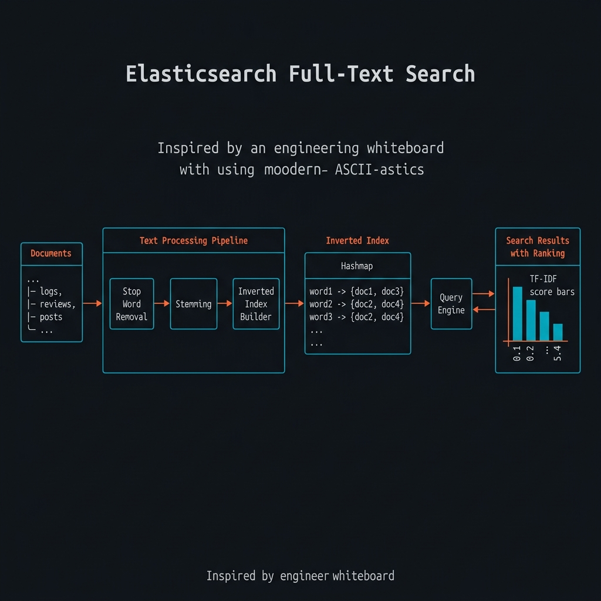
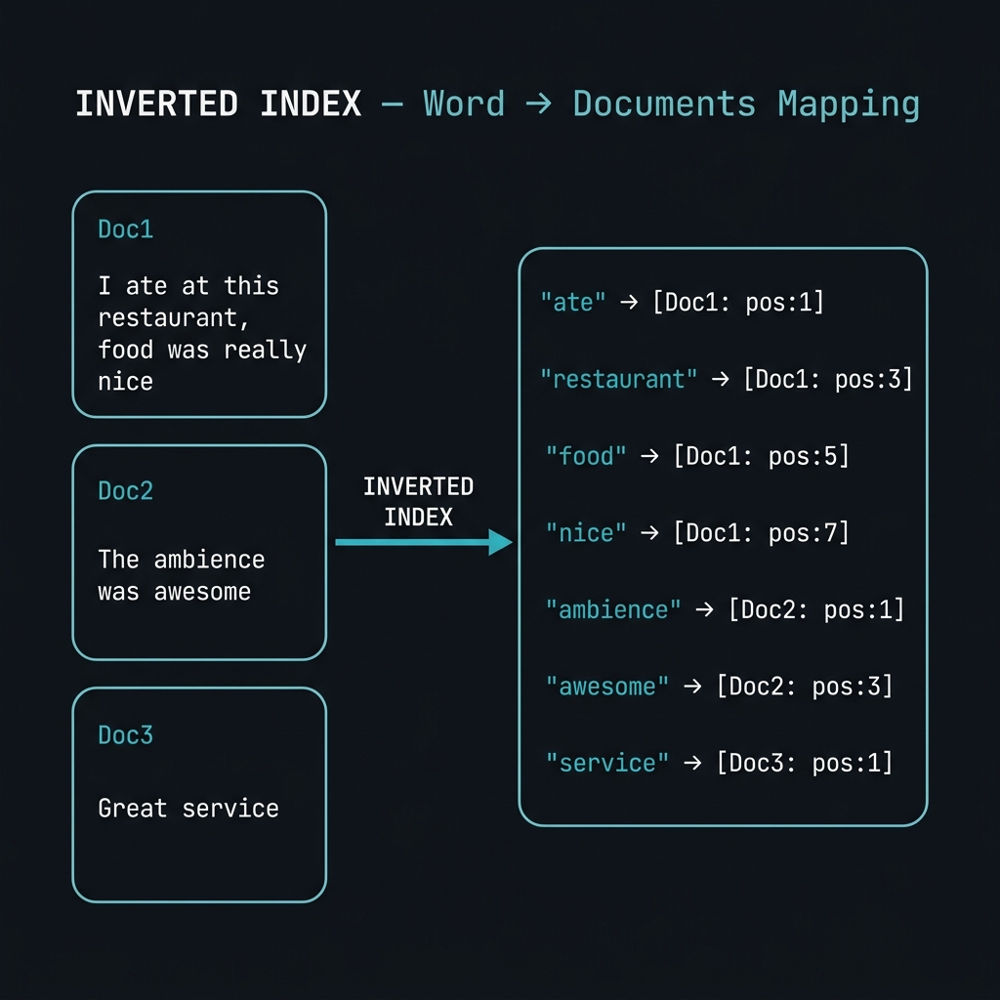
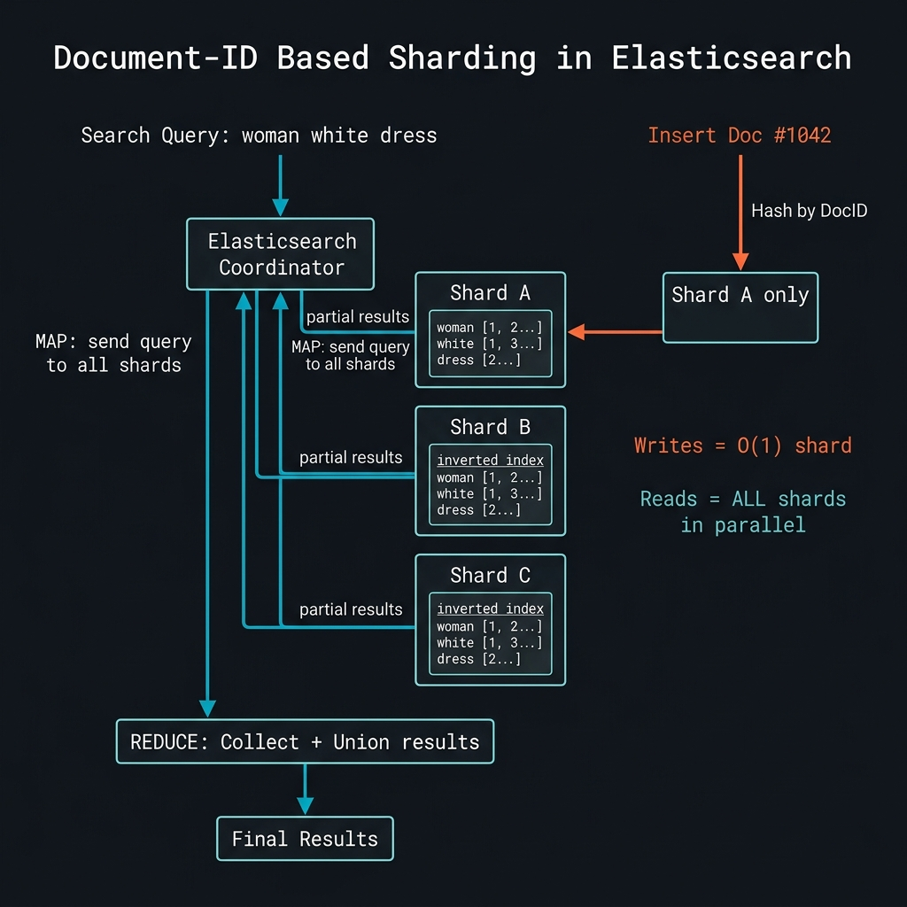

# 🔍 Elasticsearch & Full-Text Search — The Ultimate HLD Guide

> **Last Updated:** March 2026
> **Author:** System Design Study Notes (Scaler Academy — HLD Module)
> **Topics:** Full-Text Search, Inverted Index, Stop Words, Stemming, Lemmatization, Sharding, Map Reduce, Replication, TF-IDF Ranking, Elasticsearch Architecture

---



---

## 📋 Table of Contents

### Part 1: The Problem — Full-Text Search
1. [What Is Full-Text Search?](#-what-is-full-text-search)
2. [Real-World Use Cases](#-real-world-use-cases)
3. [Why SQL & NoSQL Databases Fail](#-why-sql--nosql-databases-fail)
4. [The Index Problem — Why Normal Indexes Don't Help](#-the-index-problem--why-normal-indexes-dont-help)

### Part 2: The Inverted Index — The Magic Data Structure
5. [What Is an Inverted Index?](#-what-is-an-inverted-index)
6. [Why Is It Called "Inverted"?](#-why-is-it-called-inverted)
7. [Storing Position Information](#-storing-position-information)
8. [Answering Single-Word Queries](#-answering-single-word-queries)
9. [Answering Multi-Word Queries](#-answering-multi-word-queries)

### Part 3: Text Processing Pipeline
10. [The Full Pipeline Overview](#-the-full-pipeline-overview)
11. [Stop Word Removal](#-stop-word-removal)
12. [Stemming — Fast but Imperfect](#-stemming--fast-but-imperfect)
13. [Lemmatization — Smart but Slow](#-lemmatization--smart-but-slow)
14. [Other Cleaning Steps](#-other-cleaning-steps)
15. [Applying the Pipeline to Queries Too](#-applying-the-pipeline-to-queries-too)

### Part 4: Scaling with Sharding
16. [Why We Need Sharding](#-why-we-need-sharding)
17. [CAP Theorem for Search Systems](#-cap-theorem-for-search-systems)
18. [Approach 1 — Document-ID Based Sharding (Recommended)](#-approach-1--document-id-based-sharding-recommended)
19. [Map Reduce — How Queries Run Across Shards](#-map-reduce--how-queries-run-across-shards)
20. [Pros of Document-ID Sharding](#-pros-of-document-id-sharding)
21. [Approach 2 — Word-Based Sharding](#-approach-2--word-based-sharding)
22. [Cons of Word-Based Sharding](#-cons-of-word-based-sharding)
23. [Zipf's Law — Why Word Sharding Is Structurally Broken](#-zipfs-law--why-word-sharding-is-structurally-broken)

### Part 5: Replication & Fault Tolerance
24. [Elasticsearch Replication Architecture](#-elasticsearch-replication-architecture)
25. [Master-Replica Placement Rules](#-master-replica-placement-rules)

### Part 6: Ranking & Relevance
26. [Beyond Matching — Why Ranking Matters](#-beyond-ranking--why-ranking-matters)
27. [TF-IDF — Term Frequency × Inverse Document Frequency](#-tf-idf--term-frequency--inverse-document-frequency)
28. [Other Ranking Signals](#-other-ranking-signals)
29. [Handling Misspellings & Synonyms](#-handling-misspellings--synonyms)

### Part 7: Summary & Interview Prep
30. [Elasticsearch vs Other Solutions](#-elasticsearch-vs-other-solutions)
31. [Complete Architecture Diagram](#-complete-architecture-diagram)
32. [Quick Reference Cheatsheet](#-quick-reference-cheatsheet)
33. [Practice Questions](#-practice-questions)
34. [References & Resources](#-references--resources)

---

# PART 1: THE PROBLEM — FULL-TEXT SEARCH

---

## 🎯 What Is Full-Text Search?

Full-text search is the ability to search **inside** the content of documents — not just match exact IDs or start-of-string prefixes.

```
THREE KINDS OF SEARCH (Different Complexity):
──────────────────────────────────────────────────────────────

  EXACT MATCH (Easy):
  → Query: "review_id = 10492"
  → Answer: a single row in the DB
  → Any database handles this ✅

  PREFIX MATCH (Medium):
  → Query: all products starting with "wom"
  → Answer: woman, women, wombat...
  → A sorted index (B+ tree) handles this ✅

  FULL-TEXT SEARCH (Hard — our problem today!):
  → Query: "value for money"
  → Answer: all documents that contain this ANYWHERE in the text
             beginning: "Value for money is great" ✅
             middle:    "This product gives great value for money" ✅
             end:       "I think it's good value for money" ✅
  → Normal indexes CANNOT handle this ❌
──────────────────────────────────────────────────────────────
```

> ⚠️ **What full-text search is NOT:**
> - **Ctrl+F in browser** — that scans one document for a string (a DSA problem)
> - **grep / regex** — a local file-system scan tool for developers
> - **Plagiarism detection** — fuzzy matching problem, not full-text search
> - **Google Search** — much more complex (PageRank, backlinks, etc.) though it does use full-text search internally

---

## 🌏 Real-World Use Cases

Any system where you store text and users need to search *within* that text:

| System | What Gets Searched |
|--------|-------------------|
| **Distributed Logs** (any large company) | Log message content — for debugging, security audits, tracing |
| **E-commerce** (Amazon, Flipkart) | Product titles + descriptions + **millions of reviews** |
| **Social Media** (Twitter, Quora, Reddit) | Posts, answers, profiles, comments |
| **Workplace Chat** (Slack, MS Teams) | All messages across all channels |
| **Cloud Storage** (Google Drive, Dropbox) | File contents — PDFs, Docs, Sheets |
| **Email** (Gmail) | Email subject + body |
| **Code Platforms** (GitHub, StackOverflow) | Code snippets, comments, answers |
| **Job Platforms** (LinkedIn, Naukri) | Profiles, job descriptions |
| **Scalar** | Problem descriptions, editorial content |

> 💡 **Key Insight:** In all these cases, you have a large collection of **documents** and a short **text query**. Your goal: find all (or top N) documents matching the query.

---

## 💥 Why SQL & NoSQL Databases Fail

Let's say Amazon reviews are stored in SQL:

```sql
CREATE TABLE product_reviews (
  review_id   BIGINT PRIMARY KEY,
  product_id  BIGINT,
  content     TEXT
);
```

A naive full-text search query would be:

```sql
SELECT * FROM product_reviews
WHERE content LIKE '%value for money%';
```

```
WHY THIS IS CATASTROPHICALLY SLOW:
──────────────────────────────────────────────────────────────
  If n = rows in table, m = average characters per review:

  → No index: O(n × m) — scans EVERY character of EVERY row
  → n = billions of reviews
  → m = hundreds of characters each
  → Result: query takes MINUTES TO HOURS
  → Amazon goes down for a single search request ❌
──────────────────────────────────────────────────────────────
```

The same problem exists for NoSQL — MongoDB, Cassandra, DynamoDB — **none of them support arbitrary mid-string text search efficiently**. They are key-value stores at heart.

---

## 📇 The Index Problem — Why Normal Indexes Don't Help

You might think "just add an index on the `content` column!"

```
WHAT A B+ TREE INDEX ON `content` GIVES YOU:
──────────────────────────────────────────────────────────────

  The index stores rows SORTED by the content column.
  
  ✅ It CAN answer: content LIKE 'value%'
     (prefix match — binary search works!)

  ❌ It CANNOT answer: content LIKE '%value for money%'
     (the % at the START means: could be ANYWHERE)
     → Binary search is impossible
     → Falls back to full table scan
     → Back to O(n × m) ❌

  KEY INSIGHT:
  "The moment you have a leading % in your LIKE query,
   the index becomes completely useless."
──────────────────────────────────────────────────────────────
```

Other data structures that **don't** help:
- **Tries** → Only prefix matches (same problem as sorted index)
- **Bloom Filters** → Only answer "does this string exist?" with YES/NO, can't retrieve documents
- **Hash Maps with exact keys** → Only exact lookups — no fuzzy/partial matching

We need something fundamentally different: an **Inverted Index**.

---

# PART 2: THE INVERTED INDEX — THE MAGIC DATA STRUCTURE

---

## 🗂️ What Is an Inverted Index?

An inverted index is a **hash map from word → list of documents that contain that word**.



```
BUILDING AN INVERTED INDEX:
──────────────────────────────────────────────────────────────

  DOCUMENTS:
  ┌─────────────────────────────────────────────────┐
  │ Doc 1: "I ate at this restaurant food was nice" │
  │ Doc 2: "The ambience was awesome"               │
  │ Doc 3: "Service was great"                      │
  └─────────────────────────────────────────────────┘

  STEP 1: Split every document into individual words
  STEP 2: For every unique word, record which docs contain it
  STEP 3: Store as a hashmap (word → document list)

  INVERTED INDEX:
  ┌──────────────┬─────────────────────────────────────────┐
  │   Word (Key) │  Documents (Value)                      │
  ├──────────────┼─────────────────────────────────────────┤
  │ "ate"        │ [Doc1: pos=1]                           │
  │ "restaurant" │ [Doc1: pos=3]                           │
  │ "food"       │ [Doc1: pos=5]                           │
  │ "nice"       │ [Doc1: pos=7]                           │
  │ "ambience"   │ [Doc2: pos=1]                           │
  │ "awesome"    │ [Doc2: pos=3]                           │
  │ "service"    │ [Doc3: pos=0]                           │
  │ "great"      │ [Doc3: pos=2]                           │
  │ "was"        │ [Doc1: pos=6, Doc2: pos=2, Doc3: pos=1] │
  └──────────────┴─────────────────────────────────────────┘

  Now to answer query "awesome":
  → Look up "awesome" in hashmap → O(1) → [Doc2] ✅
──────────────────────────────────────────────────────────────
```

> 💡 **This is just a hashmap.** That's it. The genius is in what you store as the key (the word) and the value (documents + positions).

---

## 🔁 Why Is It Called "Inverted"?

The name makes sense when you compare it to the *regular* index:

```
REGULAR INDEX (forward index):
  Key   = Document ID
  Value = List of words in that document
  → "Find all words in document #42"

INVERTED INDEX (reverse/inverted):
  Key   = Word
  Value = List of document IDs that contain this word
  → "Find all documents that contain the word 'awesome'"

  This is exactly like the GLOSSARY at the back of a book!
  ─────────────────────────────────────────────────────────
  Front of book = Table of Contents (document → topics)
  Back of book  = Glossary (topic/word → page numbers)
                  ↑ This is the inverted index!
```

---

## 📍 Storing Position Information

In addition to the document ID, we also store **the position** (character or word index) where the word appears:

```
INVERTED INDEX WITH POSITIONS:
──────────────────────────────────────────────────────────────

  Entry format: { docId: X, position: Y }

  "was" → [
    { docId: 1, position: 6 },   ← position in Doc 1
    { docId: 2, position: 2 },   ← position in Doc 2
    { docId: 3, position: 1 }    ← position in Doc 3
  ]

  WHY POSITIONS MATTER:
  If query = "value for money" (a phrase search):
  → Find all docs where "value" is at position i
  → AND "for" is at position i+1
  → AND "money" is at position i+2
  → This is a PHRASE SEARCH — only possible with positions!
──────────────────────────────────────────────────────────────
```

> 💡 **Phrase queries** (like Google's quoted search: `"value for money"`) require positional information. Product search sites like Amazon/Flipkart usually DON'T need this — they're happy with any-order matching.

---

## 🔎 Answering Single-Word Queries

Simple. A single hashmap lookup:

```
QUERY: "awesome"
──────────────────────────────────────────────────────────────

  1. Clean query → stem it → "awesome" (stays the same)
  2. Look up "awesome" in the inverted index hashmap → O(1)
  3. Return: [Doc2]

  TIME COMPLEXITY: O(1) for lookup ✅
  Compare to SQL LIKE '%awesome%': O(n × m) ❌
──────────────────────────────────────────────────────────────
```

---

## 🔎 Answering Multi-Word Queries

For a query like **"woman white dress"** (after cleaning → 3 stemmed words):

```
MULTI-WORD QUERY HANDLING:
──────────────────────────────────────────────────────────────

  INTERPRETATION 1 — AND query (all words must be present):
  → Fetch docs for "woman": [D1, D5, D9, D12, D44...]
  → Fetch docs for "white":  [D1, D3, D9, D22, D44...]
  → Fetch docs for "dress":  [D1, D9, D44, D88...]
  → Take SET INTERSECTION → [D1, D9, D44]
  → Return documents that contain ALL 3 words ✅

  INTERPRETATION 2 — OR query (any word present):
  → Take SET UNION of all three lists
  → Return documents that contain ANY of the words

  INTERPRETATION 3 — Phrase query (exact order):
  → Use positional information
  → Find docs where "woman" is at position i,
    "white" at position i+1, "dress" at position i+2
  → Stricter matching — exact phrase

  WHICH INTERPRETATION TO USE?
  → This is the service layer's responsibility.
  → Elasticsearch provides the raw results.
  → You decide the logic based on your business use case.
──────────────────────────────────────────────────────────────
```

---

# PART 3: TEXT PROCESSING PIPELINE

---

## 🔧 The Full Pipeline Overview

Before building the inverted index, raw text must go through a **cleaning pipeline**. The same pipeline is applied to both **documents when indexing** AND **queries when searching**.

```
TEXT PROCESSING PIPELINE:
──────────────────────────────────────────────────────────────

  Raw Text / Raw Query
       │
       ▼
  ┌────────────────────┐
  │ 1. Stop Word       │  Remove: "the", "a", "is", "at"...
  │    Removal         │
  └────────┬───────────┘
           │
           ▼
  ┌────────────────────┐
  │ 2. Special Char    │  Remove: !, @, #, /, ?, . etc.
  │    Removal         │
  └────────┬───────────┘
           │
           ▼
  ┌────────────────────┐
  │ 3. Stemming /      │  "running" → "run", "dresses" → "dress"
  │    Lemmatization   │
  └────────┬───────────┘
           │
           ▼
  ┌────────────────────┐
  │ 4. Custom Rules    │  Remove abusive/sensitive words,
  │    (Optional)      │  handle abbreviations, synonyms
  └────────┬───────────┘
           │
           ▼
  Cleaned tokens → Build / Query Inverted Index
──────────────────────────────────────────────────────────────
```

> ⚠️ **Critical Rule:** The SAME pipeline must be applied to BOTH documents AND queries. If they differ, the queries will return no results because the indexed tokens and the query tokens won't match.

---

## 🛑 Stop Word Removal

```
WHAT ARE STOP WORDS?
──────────────────────────────────────────────────────────────

  Stop words = very common words that carry almost no meaning.
  Examples: the, a, an, is, at, of, in, on, and, or, I, was...

  WHY REMOVE THEM?
  • "the" alone appears in ~18% of ALL English text
  • Corresponding doc list for "the" → nearly EVERY document
  • Searching "the" is useless: returns everything
  • Wastes enormous amounts of storage and query time

  EXAMPLE — before vs after stop word removal:
  ─────────────────────────────────────────────
  Original: "I ate at this restaurant, food was really nice"
  After SW: "ate restaurant food really nice"

  Original: "The ambience was awesome"  
  After SW: "ambience awesome"
  
  Same information. Much less storage. ✅

  WHAT IS REMOVED BY STOP WORD REMOVAL:
  • Prepositions: in, on, at, by, for, with, about, against
  • Conjunctions: and, or, but, because, so, yet
  • Articles: the, a, an
  • Pronouns: I, you, he, she, it, we, they
  • Common verbs: is, are, was, were, be, been, have, had
──────────────────────────────────────────────────────────────
```

> 💡 **What about searching for stop words?** If a user searches "the", after cleaning the query the word "the" is removed. Since "the" is not in the inverted index, the query returns results based on other words. This is intentional — "the" alone tells us nothing useful.

---

## ✂️ Stemming — Fast but Imperfect

Stemming reduces words to their **root form** using a rule-based if-else ladder. It's extremely fast but not grammatically correct.

```
STEMMING — HOW IT WORKS:
──────────────────────────────────────────────────────────────

  Rule-based system: strip common suffixes
  
  SUFFIX RULES:
  ─ing  →  remove   │  running → runn   (normalized: run)
  ─ed   →  remove   │  escaped → escap  (normalized correctly)
  ─s    →  remove   │  dresses → dress  ✅
  ─tion →  remove   │  nation  → nat    ❌ (broken!)
  ─ion  →  remove   │  lion    → l      ❌ (broken badly!)
  
  EXAMPLE (stemming in action):
  ───────────────────────────────
  "develop"    → "develop"
  "developing" → "develop"   ← both map to same root ✅
  "developer"  → "develop"   ← same root ✅
  
  STEMMING FAILURES (notorious examples):
  ───────────────────────────────────────
  "caring"      → "car"      ❌ (confused with 'car'!)
  "nation"      → "nat"      ❌ (not a real word)
  "lion"        → "l"        ❌ (completely wrong)
  "ration"      → "rat"      ❌ (confused with 'rat')

  VERDICT:
  ✅ Extremely fast (simple if-else ladder → O(L) where L=word len)
  ✅ Good enough for most common words
  ❌ Fails on edge cases, irregular words, ambiguous suffixes
──────────────────────────────────────────────────────────────
```

---

## 🧠 Lemmatization — Smart but Slow

Lemmatization uses an **NLP/ML pipeline** to understand the *meaning* of a word in context before reducing it to its root (lemma).

```
LEMMATIZATION vs STEMMING:
──────────────────────────────────────────────────────────────

  Word: "caring"
  ────────────────────────────────────────────
  Stemming:      "car"         ← WRONG ❌
  Lemmatization: "care"        ← CORRECT ✅
  
  Word: "better"
  ────────────────────────────────────────────
  Stemming:      "better"      ← unchanged (misses the pattern)
  Lemmatization: "good"        ← CORRECT (it's the comparative) ✅

  HOW LEMMATIZATION WORKS:
  1. Create word vectors (ML embedding) for the word in context
  2. Look at previous 5 words and next 5 words (context window)
  3. Determine the grammatical role of the word (verb? noun? adj?)
  4. Look up lemma in a dictionary/morphological database
  5. Return the correct root form
  
  COMPARISON TABLE:
  ┌─────────────────┬──────────────┬──────────────────────────┐
  │   Feature       │  Stemming    │  Lemmatization           │
  ├─────────────────┼──────────────┼──────────────────────────┤
  │ Speed           │ Very fast    │ Very slow (ML pipeline)  │
  │ Accuracy        │ ~80%         │ ~98%                     │
  │ Context-aware?  │ No           │ Yes                      │
  │ Requires ML?    │ No           │ Yes                      │
  │ Used in ES?     │ Yes (default)│ Optional (custom plugin) │
  └─────────────────┴──────────────┴──────────────────────────┘

  INDUSTRY CHOICE: Stemming by default.
  At billions of documents, lemmatization's slowness
  becomes completely unacceptable.
──────────────────────────────────────────────────────────────
```

---

## 🧹 Other Cleaning Steps

```
ADDITIONAL CLEANING (company-specific):
──────────────────────────────────────────────────────────────

  1. SENSITIVE WORD REMOVAL:
     • Hate speech, slurs, dangerous phrases
     • Example: Amazon/YouTube removing slurs from search index
     • Also: terrorist, bomb, kill (in certain contexts)

  2. LANGUAGE NORMALIZATION:
     • British vs American spelling: colour → color
     • These are usually handled by stemming rules

  3. ABBREVIATION EXPANSION:
     • "cat" might be an abbreviation for a product name
     • Company-specific mappings in a hashmap/config

  4. SPECIAL CHARACTER REMOVAL:
     • !, @, #, $, %, ^, &, *, (, ), /
     • Unicode control characters, box-drawing chars
     • Emojis (may keep or remove depending on use case)

  5. MISSPELLING CORRECTION:
     • hashmap of known_misspelling → correct_spelling
     • Or: NFA (Non-deterministic Finite Automaton) for fuzzy match
     • Applied during BOTH indexing and query time

  ⚠️ All these are configurable in Elasticsearch.
     You can bring your own cleaning pipeline.
──────────────────────────────────────────────────────────────
```

---

## 🔃 Applying the Pipeline to Queries Too

This is **critical**. The same pipeline that cleans documents must also clean queries.

```
EXAMPLE: Query "The woman with the white dress"
──────────────────────────────────────────────────────────────

  Raw Query:    "The woman with the white dress"
  
  Step 1 (stop words removed): "woman white dress"
  Step 2 (special chars):      "woman white dress"  (unchanged)
  Step 3 (stemming):           "woman white dress"  (unchanged here)
  
  Final query tokens: ["woman", "white", "dress"]

  WHY ESSENTIAL?
  If query wasn't cleaned but documents were:
  → "the" is NOT in the inverted index (removed from docs)
  → Searching "the" returns nothing ❌
  → "dresses" (unstemmed) won't match "dress" in index ❌
  → System returns WRONG results
──────────────────────────────────────────────────────────────
```

> 💡 **Where does query cleaning happen?** At the backend/service layer — NOT the client side. The client doesn't know about your stemming rules.

---

# PART 4: SCALING WITH SHARDING

---

## 📐 Why We Need Sharding

The inverted index can be **enormous**:

```
SCALE ESTIMATES FOR A LARGE SEARCH INDEX:
──────────────────────────────────────────────────────────────

  Unique words in corpus:
  → English vocabulary alone: ~200k–400k words
  → Including foreign languages: 10s of millions of words
  → Including slang, typos, abbreviations: even more

  Documents in system:
  → Amazon reviews: hundreds of billions
  → logs at large companies: trillions per day

  Per word in index:
  → List of ALL documents that contain that word
  → Each entry: (docId, position) — ~16 bytes minimum
  → A word like "great" could appear in 100 billion docs
  → Storage for "great" alone: ~1.6 TB

  CONCLUSION:
  No single machine can hold this index.
  No single machine can handle the read load.
  → We must SHARD the inverted index.
──────────────────────────────────────────────────────────────
```

---

## ⚖️ CAP Theorem for Search Systems

Before sharding, decide: do we need consistency or availability?

```
CAP THEOREM ANALYSIS FOR FULL-TEXT SEARCH:
──────────────────────────────────────────────────────────────

  STRONG CONSISTENCY would mean:
  → If a document is added, it's immediately reflected in search
  → If a document is deleted/updated, search never shows stale data
  → Every query returns a 100% complete and accurate result set

  EVENTUAL CONSISTENCY means:
  → New documents may take seconds/minutes to appear in search
  → Updated documents may briefly show old content
  → A few documents might be temporarily missing from results

  WHAT DO WE ACTUALLY NEED?
  → If a review is added to Amazon and doesn't show in search
    for 30 seconds: almost nobody notices ✅
  → If a couple of reviews are temporarily invisible: fine ✅
  → The system doesn't need to be transactionally consistent

  VERDICT: Eventual consistency is more than sufficient.
  In fact, even weaker guarantees are often acceptable.
  → Elasticsearch is EVENTUALLY consistent by design.
──────────────────────────────────────────────────────────────
```

---

## 📦 Approach 1 — Document-ID Based Sharding (Recommended)



This is what **Elasticsearch (and Apache Lucene) actually does**.

```
DOCUMENT-ID BASED SHARDING:
──────────────────────────────────────────────────────────────

  N shards are created. Each shard stores documents based on:
  shard_number = hash(document_id) % N

  EACH SHARD has its OWN inverted index, built on its subset of docs.

  Example: 3 shards, 12 docs total:
  
  ┌────────────────────────┐
  │       SHARD A          │
  │  Docs: 1, 4, 7, 10     │
  │  Inverted Index        │
  │  (for docs 1,4,7,10)   │
  └────────────────────────┘
  
  ┌────────────────────────┐
  │       SHARD B          │
  │  Docs: 2, 5, 8, 11     │
  │  Inverted Index        │
  │  (for docs 2,5,8,11)   │
  └────────────────────────┘

  ┌────────────────────────┐
  │       SHARD C          │
  │  Docs: 3, 6, 9, 12     │
  │  Inverted Index        │
  │  (for docs 3,6,9,12)   │
  └────────────────────────┘

  INSERT/UPDATE/DELETE QUERY:
  → hash(doc_id) → go to ONE shard → reindex content
  → Simple. Only 1 shard touched. ✅

  SEARCH QUERY: "woman white dress"
  → Send query to ALL shards in parallel
  → Each shard returns matching docs from ITS dataset
  → Collect (union) all results → return final result
──────────────────────────────────────────────────────────────
```

---

## 🔄 Map Reduce — How Queries Run Across Shards

Elasticsearch uses **Map Reduce** to distribute queries and collect results:

```
MAP REDUCE IN ELASTICSEARCH:
──────────────────────────────────────────────────────────────

  CONCEPT (from functional programming):

  MAP: apply(function, list_of_items)
  → Applies a function to every item in a list
  → In ES: apply(search_query, [Shard_A, Shard_B, Shard_C])
  → Every shard independently executes the query

  REDUCE: combine(results_from_all_shards)
  → Takes all partial results
  → Combines them into a final result
  → In ES: union of all returned document lists

  ──────────────────────────────────────────────────────────

  FLOW:
  Search query → ES Coordinator (Load Balancer)
                        │
          MAP operation: send query to all shards
                 ┌──────┼──────────┐
                 ▼      ▼          ▼
            Shard A   Shard B   Shard C
           (returns  (returns  (returns
           [D1,D9])  [D5,D44]) [D12,D88])
                 │      │          │
          REDUCE operation: collect + union all results
                        │
                        ▼
           Final Result: [D1, D5, D9, D12, D44, D88]

  No duplicate docs possible (each doc lives in ONE shard)
  → Simple concatenation (no deduplication needed) ✅
──────────────────────────────────────────────────────────────
```

---

## ✅ Pros of Document-ID Sharding

```
ADVANTAGES OF DOCUMENT-ID BASED SHARDING:
──────────────────────────────────────────────────────────────

  1. HIGHLY PREDICTABLE LATENCY:
     → Every shard has a RANDOM mix of documents
     → All shards look almost identical in terms of word distribution
     → All shards take roughly the same time to answer a query
     → Performance is HOMOGENEOUS across all shards
     → You can profile once and predict all queries ✅

  2. NO INTERSECTION NEEDED:
     → Each shard already gives you the matching docs
     → Just concatenate results — O(total results)
     → No expensive set intersection at query time ✅

  3. FAULT TOLERANCE WITH GRACEFUL DEGRADATION:
     → If one shard is slow/unresponsive: set a strict timeout
     → Example: "all shards must respond within 20ms"
     → If Shard C doesn't respond in 20ms → skip it
     → Still return results from Shards A and B ✅
     → Users get relevant results even during partial failures
     → (vs word-based: skipping a shard = catastrophically wrong results)

  4. SIMPLE WRITE PATH:
     → Insert = go to ONE shard (hash doc_id → one shard)
     → Delete = go to ONE shard
     → Update = go to ONE shard, reindex

  5. GRACEFUL SCALING:
     → Add more shards? Redistribute documents
     → Same query just fans out to more shards ✅
──────────────────────────────────────────────────────────────
```

---

## 🔡 Approach 2 — Word-Based Sharding

An alternative: each shard owns a group of words and their full document lists.

```
WORD-BASED SHARDING CONCEPT:
──────────────────────────────────────────────────────────────

  Shard 1: words "dress", "class", "design", "elastic"...
  Shard 2: words "woman", "system", "log", "review"...
  Shard 3: words "white", "drink", "cat", "fast"...

  INSERT QUERY for new document:
  → Process doc, extract all unique words
  → Go to EACH shard corresponding to EACH word in the doc
  → Update that shard's entry for the word
  → Writes touch MANY shards (one per word in the document)

  SEARCH QUERY: "woman white dress"
  → Go to Shard 2 (has "woman" → [D1, D3, D6, D8...])
  → Go to Shard 3 (has "white" → [D2, D5, D8, D11...])
  → Go to Shard 1 (has "dress" → [D1, D8, D44...])
  → Take INTERSECTION → [D8] ← documents with ALL 3 words
  
  Better than document sharding? Query touches only 3 shards
  (one per word in query) instead of ALL shards. Seems better!
──────────────────────────────────────────────────────────────
```

---

## ❌ Cons of Word-Based Sharding

```
WHY WORD-BASED SHARDING FAILS IN PRACTICE:
──────────────────────────────────────────────────────────────

  PROBLEM 1: MASSIVE RESULT SETS BEFORE INTERSECTION
  ───────────────────────────────────────────────────
  → Shard for "woman" returns: 20 BILLION document IDs
  → Shard for "white"  returns: 15 BILLION document IDs
  → Shard for "dress"  returns: 3 BILLION document IDs
  
  → Now take intersection of these massive lists
  → Final result: maybe 500 documents
  → ENORMOUS waste: process 38 billion entries to find 500 ❌
  → This is extremely CPU + memory intensive

  PROBLEM 2: UNPREDICTABLE LATENCY
  ──────────────────────────────────
  → If query has a rare word ("supercalifragilistic"):
    that shard returns tiny list → fast query ⚡
  → If query has a common word ("high"):
    that shard returns billions of docs → crawls 🐌
  → Latency is wildly unpredictable based on what words you search

  PROBLEM 3: CANNOT SKIP SLOW SHARDS
  ────────────────────────────────────
  → You NEED all 3 word shards to compute the intersection
  → If "dress" shard times out → you must wait OR return wrong results
  → If you skip it: you return docs with "woman" + "white" 
    (shoes! hair clips! everything except dresses!) → user confused ❌
  → Can't provide the graceful degradation that doc-sharding offers

  PROBLEM 4: WRITE COMPLEXITY
  ─────────────────────────────
  → A document with 200 unique words → touches 200 different shards on insert
  → Every write is a distributed multi-shard write operation
  → Much slower and more complex than doc-ID sharding's single-shard writes

  VERDICT: Word-based sharding sounds clever but fails at scale.
  Document-ID sharding is the industry standard.
──────────────────────────────────────────────────────────────
```

---

## 📉 Zipf's Law — Why Word Sharding Is Structurally Broken

Zipf's Law is a statistical law observed in all natural languages (and most datasets):

```
ZIPF'S LAW:
──────────────────────────────────────────────────────────────

  If the most frequent word appears N times,
  then the k-th most frequent word appears N/k times.

  Rank 1  (most frequent — "the"):  N occurrences
  Rank 2:                            N/2 occurrences
  Rank 3:                            N/3 occurrences
  ...
  Rank k:                            N/k occurrences

  This creates an extreme distribution:
  ┌──────────────────────────────────────────────────┐
  │ ████████████████████████████████  "the"          │
  │ ████████████████  "of"                           │
  │ ████████████  "and"                              │
  │ █████████  "to"                                  │
  │ ██  "awesome"                                    │
  │ █   "restaurant"                                 │
  │ .   "supercalifragilistic"                       │
  └──────────────────────────────────────────────────┘

  WHY THIS BREAKS WORD SHARDING:
  → Whichever shard contains "great" or "good" is MASSIVELY overloaded
  → Even after stop word removal, many common words remain
  → These words appear in billions of docs
  → Their shard becomes a hot spot — impossible to balance ❌

  Document-ID sharding avoids this entirely:
  → Documents are assigned uniformly by hash of doc ID
  → No shard is overloaded by popular words ✅
──────────────────────────────────────────────────────────────
```

> ⚠️ **Fun Fact:** Zipf's Law holds true even for completely random generated data. It's a universal statistical phenomenon, not just a language artifact.

---

# PART 5: REPLICATION & FAULT TOLERANCE

---

## 🔁 Elasticsearch Replication Architecture

Sharding handles capacity. Replication handles **fault tolerance** and **availability**.

```
ELASTICSEARCH REPLICATION MODEL:
──────────────────────────────────────────────────────────────

  Parameters (set ONCE at cluster creation — cannot change later!):
  → M = Number of shards
  → R = Replication factor (e.g., R=2 → 1 primary + 1 replica)
  → N = Number of server nodes

  Total data units = M × R
  Each server stores M × R / N shards/replicas

  EXAMPLE: M=3 shards, R=2 (1 master + 1 replica), N=3 nodes
  Total data units = 3 × 2 = 6

  Node 1 holds: [Shard A - PRIMARY], [Shard B - REPLICA]
  Node 2 holds: [Shard B - PRIMARY], [Shard C - REPLICA]
  Node 3 holds: [Shard C - PRIMARY], [Shard A - REPLICA]

  ┌──────────────────────────────────────────────────┐
  │  Node 1          │  Node 2          │  Node 3    │
  │  Shard A (P) ✅  │  Shard B (P) ✅  │  Shard C(P)│
  │  Shard B (R) 🔁  │  Shard C (R) 🔁  │  Shard A(R)│
  └──────────────────────────────────────────────────┘
  
  (P) = Primary/Master copy
  (R) = Replica copy
──────────────────────────────────────────────────────────────
```

---

## 🛡️ Master-Replica Placement Rules

```
ELASTICSEARCH PLACEMENT GUARANTEE:
──────────────────────────────────────────────────────────────

  RULE: The primary and all replicas of the SAME SHARD
        must NEVER be on the same server node.

  WHY?
  If Shard A primary and Shard A replica were both on Node 1:
  → Node 1 crashes → BOTH copies of Shard A are lost ❌
  → Replication factor = 2 but we lost BOTH copies

  WITH THE RULE ENFORCED:
  → Shard A primary (Node 1) + Shard A replica (Node 3)
  → Node 1 crashes → Shard A replica on Node 3 survives ✅
  → Node 3 replica is promoted to primary automatically ✅
  → System continues serving queries ✅

  REPLICATION SYNC:
  → Writes go to PRIMARY only
  → Primary syncs to replica asynchronously
  → Since ES is eventually consistent: async replication is fine ✅
  → Reads can go to EITHER primary or replica
  → (Replicas serve reads to distribute read load)

  ⚠️ ELASTICSEARCH LIMITATION:
  → You cannot change M (shard count) or R (replication factor)
     after the cluster is created without rebuilding the entire index.
  → Plan your cluster size carefully upfront.
──────────────────────────────────────────────────────────────
```

---

# PART 6: RANKING & RELEVANCE

---

## 🏆 Beyond Matching — Why Ranking Matters

Matching finds **all** documents. Ranking decides **which order** to show them.

```
THE RANKING PROBLEM:
──────────────────────────────────────────────────────────────

  Query: "quick"
  Matching returns:
  → Doc 1: "fire quick please quick call quick service"  (3 occurrences)
  → Doc 2: "quick brown fox"                             (1 occurrence)
  → Doc 3: "quick pain relief"                           (1 occurrence)

  All match. But which is most RELEVANT?
  → Doc 1: 3 occurrences → likely more about "quick"?
  → Or just padded text?

  For e-commerce, extra signals apply:
  → Title match > description match > review match
  → Recent reviews > old reviews
  → Verified purchases > unverified

  Elasticsearch provides TF-IDF scoring out of the box.
  You can add custom ranking signals on top.
──────────────────────────────────────────────────────────────
```

---

## 📊 TF-IDF — Term Frequency × Inverse Document Frequency

```
TF-IDF SCORING:
──────────────────────────────────────────────────────────────

  TERM FREQUENCY (TF):
  → How often does the word appear IN THIS document?
  → TF(word, doc) = count of word in this doc

  INVERSE DOCUMENT FREQUENCY (IDF):
  → How common is this word ACROSS ALL documents?
  → The rarer the word, the more informative it is
  → IDF(word) = 1 / (number of docs containing this word)
  → (in practice: log(N / df) + 1, where N=total docs, df=doc freq)

  FINAL SCORE:
  → score(doc, query_word) = TF × IDF

  ─────────────────────────────────────────────────────────

  EXAMPLE — Query: "quick"

  Corpus = 5 Documents. "quick" appears in D1, D2, D3.
  Document frequency for "quick" = 3
  IDF("quick") = 1/3

  Doc 1: "quick" appears 3 times → TF = 3
         Score = 3 × (1/3) = 1.0  ← HIGHEST

  Doc 2: "quick" appears 1 time  → TF = 1
         Score = 1 × (1/3) = 0.33

  Doc 3: "quick" appears 1 time  → TF = 1
         Score = 1 × (1/3) = 0.33

  Doc 1 ranks #1. Makes sense — most mentions of "quick".

  ─────────────────────────────────────────────────────────

  WHY IDF MATTERS — Multi-word queries:
  Query: "song supercalifragilistic"

  "song" → appears in billions of docs → IDF very low
  "supercalifragilistic" → appears in maybe 10 docs → IDF very high

  → Documents with "supercalifragilistic" get HIGH scores
  → Documents that only have "song" get LOW scores
  → The rare, specific word dominates the ranking ✅
  → The common, uninformative word is automatically down-weighted ✅
──────────────────────────────────────────────────────────────
```

---

## 🎯 Other Ranking Signals

Beyond TF-IDF, real production systems use many other signals:

```
ADDITIONAL RANKING SIGNALS (Industry):
──────────────────────────────────────────────────────────────

  FIELD IMPORTANCE:
  → Document field weights (configurable in ES)
  → Title match:       weight = 5.0  ← high importance
  → Description match: weight = 2.0
  → Review text match: weight = 1.0  ← lower importance
  
  TEMPORAL SIGNALS:
  → Newer documents get slightly higher scores (recency boost)
  → Trending topics get a boost

  USER SIGNALS:
  → Click-through rate: docs that users CLICK get ranked higher
  → Dwell time: docs that users READ FULLY rank higher
  → Purchase rate (for e-commerce)
  → Rating / review scores

  BUSINESS RULES:
  → Sponsored / promoted products always appear first
  → In-stock products rank above out-of-stock
  → Regional availability boosts (show local results)

  ML-BASED RANKERS:
  → Learning-to-Rank (LTR): train a model on click data
  → BM25: improved version of TF-IDF used in modern systems
  → BERT-based semantic ranking (understand meaning, not just words)

  EXAMPLE — Slack's Ranking (from engineering blog):
  → User-created content in subscribed channels ranks higher
  → Messages from people you interact with frequently rank higher
  → Recent messages rank higher than old messages
──────────────────────────────────────────────────────────────
```

---

## ✏️ Handling Misspellings & Synonyms

```
MISSPELLING HANDLING:
──────────────────────────────────────────────────────────────

  APPROACH 1 — Static Misspelling Dictionary:
  → Maintain a hashmap: { bad_spelling → correct_spelling }
  → "documnet" → "document"
  → "recieve"  → "receive"
  → "teh"      → "the"
  → Apply DURING cleaning pipeline before indexing/querying
  → PROS: O(1) lookup, simple to implement
  → CONS: Only catches known, pre-catalogued misspellings

  APPROACH 2 — NFA (Non-deterministic Finite Automaton):
  → Build a state machine for every word in vocabulary
  → State machine accepts not just the word, but all its
    1-character deletions, insertions, transpositions, substitutions
  → "documnet" — transposition of 'm' and 'e' → accepted ✅
  → More powerful than hashmap, handles arbitrary misspellings
  → CONS: Complex to implement and maintain

──────────────────────────────────────────────────────────────

  SYNONYM HANDLING:
  ──────────────────────────────────────────────────────────────

  APPROACH — Synonym Folding via Stemming Config:
  → Configure synonyms as a group with one canonical root
  → "good", "great", "awesome", "excellent" → all map to "good"
  → At index time: "awesome" in a doc → stored as "good"
  → At query time: "great" → stemmed to "good" → matches! ✅

  EXAMPLE in Elasticsearch config:
  synonyms: [
    "great, awesome, fantastic => good",
    "purchase, buy, order, checkout => buy",
    "cheap, affordable, budget => cheap"
  ]

  PROS: Automatic semantic matching without ML
  CONS: Must manually curate — misses context (not "great" as in "Great Wall")
──────────────────────────────────────────────────────────────
```

---

# PART 7: SUMMARY & INTERVIEW PREP

---

## 🛠️ Elasticsearch vs Other Solutions

| Solution | Type | Notes |
|----------|------|-------|
| **Apache Lucene** | Open Source | Core library; Elasticsearch is built on top of Lucene |
| **Apache Solr** | Open Source | Also built on Lucene; older, config-file-heavy |
| **Elasticsearch** | Proprietary (free tier) | Industry standard; REST API; scalable cluster mode |
| **OpenSearch** | Open Source | AWS fork of Elasticsearch |
| **Algolia** | Proprietary (paid) | Managed search-as-a-service; very fast; focus on UX |
| **Azure Cognitive Search** | Proprietary | Microsoft's managed search |
| **PostgreSQL FTS** | Open Source | Works for small to medium scale; not horizontally scalable |
| **Loki** | Open Source | Grafana's log aggregation and search |
| **Kibana** | Open Source | Dashboard UI on top of Elasticsearch |

---

## 🏗️ Complete Architecture Diagram

```
FULL ELASTICSEARCH ARCHITECTURE:
──────────────────────────────────────────────────────────────

  DATA INGESTION PATH (Write/Index):
  ─────────────────────────────────

  New Document (e.g., Amazon review)
       │
       ▼
  [Source DB — MongoDB/DynamoDB]
       │  change stream / event
       ▼
  [Kafka / Message Queue]         ← async decoupling
       │
       ▼
  [Indexer Service]
  1. Fetch document text
  2. Run cleaning pipeline:
     → Stop word removal
     → Stemming
     → Custom rules
  3. TokensSend to Elasticsearch API
       │
       ▼
  [Elasticsearch Cluster]
  → Coordinator node receives request
  → Routes to correct shard: hash(doc_id) % M
  → Shard updates its inverted index
  → Shard replicates to replica node (async)

  ─────────────────────────────────────────────────────────

  QUERY/SEARCH PATH (Read):
  ──────────────────────────

  User types search query "woman white dress"
       │
       ▼
  [API Gateway / Load Balancer]
       │
       ▼
  [Search Service Layer]
  1. Receive raw query string
  2. Run SAME cleaning pipeline on query:
     → Remove stop words
     → Stem tokens
  3. Send cleaned tokens to Elasticsearch
       │
       ▼
  [Elasticsearch Coordinator Node]
  → MAP: Fan out cleaned query to ALL shards in parallel
       │
       ├──► Shard A → runs inverted index lookup → returns doc IDs
       ├──► Shard B → runs inverted index lookup → returns doc IDs
       └──► Shard C → runs inverted index lookup → returns doc IDs
       │
  → REDUCE: Collect all doc IDs (union / concatenate)
  → RANK: Apply TF-IDF scores → sort by relevance
  → Return top-K results to Search Service
       │
       ▼
  [Search Service] → return ranked document IDs to API
       │
       ▼
  [Source DB] → fetch full document details from source DB
       │
       ▼
  User sees ranked results ✅
──────────────────────────────────────────────────────────────
```

---

## 📋 Quick Reference Cheatsheet

```
ELASTICSEARCH QUICK REFERENCE:
══════════════════════════════════════════════════════════════

  CORE CONCEPT:
  Inverted Index = hashmap { word → [(docId, position), ...] }

  CLEANING PIPELINE (ORDER MATTERS):
  1. Stop word removal  (the, a, is, at, and, of...)
  2. Special char removal (!, @, #, /, ?...)
  3. Stemming (running→run) OR Lemmatization (caring→care)
  4. Custom rules (synonyms, misspellings, sensitive words)
  Apply pipeline to BOTH documents and queries.

  SHARDING:
  Key:  hash(document_id) % num_shards → shard number
  NOT: word-based sharding (Zipf's law breaks it)
  Write: touches 1 shard (fast)
  Read:  fans out to ALL shards in parallel (predictable latency)

  QUERY EXECUTION:
  Map:    send query to all shards simultaneously
  Reduce: collect + union results from all shards
  Rank:   sort by TF-IDF (or BM25/custom) score
  Timeout: set strict timeout; ignore slow shards gracefully

  REPLICATION:
  Primary + R replicas per shard
  Rule: same shard's copies MUST be on DIFFERENT nodes
  ES is eventually consistent (async replication is fine)
  Writes go to PRIMARY only; reads can go to any replica

  CAP THEOREM:
  Elasticsearch = AP system (Available + Partition-tolerant)
  Consistency = eventual (acceptable for search use cases)

  TF-IDF SCORING:
  TF = occurrences of word in THIS document
  IDF = 1 / (documents containing this word)
  Score = TF × IDF  (higher = more relevant)
  Rare words carry MORE weight; common words less weight

  LIMITATIONS OF ELASTICSEARCH:
  - Shard count (M) cannot be changed after cluster init
  - Replication factor (R) cannot be changed after cluster init
  - Full cluster rebuild required to change either setting
══════════════════════════════════════════════════════════════
```

---

## ❓ Practice Questions

### Conceptual Questions

1. **Why does `SELECT * FROM reviews WHERE content LIKE '%value for money%'` not use the B+ tree index?**
   - *Hint: What does a leading `%` do to binary search?*

2. **What is an inverted index? How is it different from a regular (forward) index?**
   - *Hint: Think about the book analogy — table of contents vs glossary.*

3. **Why must you apply the same text cleaning pipeline to both documents and queries?**
   - *Hint: What happens if you stem documents but not queries?*

4. **What is stemming? What is lemmatization? When would you use each?**
   - *Hint: Think about speed vs accuracy tradeoff.*

5. **Explain TF-IDF. Why does a word that appears in many documents get a lower score?**

6. **What is Zipf's Law and why does it make word-based sharding impractical?**

7. **Why is eventual consistency sufficient for a full-text search system?**
   - *Hint: What would strong consistency mean in this context?*

### System Design Questions

8. **Design a log search system for a company with 10,000 microservices generating 1TB of logs per day.**
   - *How many shards? What's the cleaning pipeline? How do you index in real-time?*

9. **Amazon has 5 billion reviews. Design a review search system that supports queries like "best waterproof running shoes".**
   - *Think: inverted index, sharding, pipeline, ranking by rating + relevance.*

10. **Why does Elasticsearch shard by document ID rather than by word? Walk through both approaches and compare latency, write complexity, and fault tolerance.**

11. **A Shard in Elasticsearch is not responding. How does the system handle this for document-ID based sharding vs word-based sharding?**

12. **Explain Map Reduce in the context of Elasticsearch. What is the Map step? What is the Reduce step?**

---

## 📚 References & Resources

### Primary Sources
- **Apache Lucene** — The open-source foundation of Elasticsearch
  - https://lucene.apache.org/
- **Elasticsearch Documentation** — Official architecture docs
  - https://www.elastic.co/guide/en/elasticsearch/reference/current/index.html
- **OpenSearch** (AWS Elasticsearch fork)
  - https://opensearch.org/

### Engineering Blog Posts
- **[Slack Engineering — Search Architecture](https://slack.engineering/search-at-slack/)** — How Slack ranks and retrieves messages
- **[Elasticsearch Data Routing and Sharding](https://www.elastic.co/guide/en/elasticsearch/reference/current/scalability.html)**

### Concepts to Explore Further
- **BM25** — Modern successor to TF-IDF (default in newer Elasticsearch versions)
- **BERT-based Semantic Search** — Neural embeddings for meaning-based (not just keyword) search
- **Learning to Rank (LTR)** — ML models trained on click data for re-ranking
- **Zipf's Law video** — 3Blue1Brown / VSauce-style deep dive into why Zipf's law is universal
- **NFA / Automata Theory** — For understanding how misspelling correction works at scale
- **Apache Solr vs Elasticsearch** — Comparison of the two Lucene-based search platforms

---

*End of Elasticsearch & Full-Text Search — The Ultimate HLD Guide*
*Scaler Academy | HLD Module | Case Study 4*
