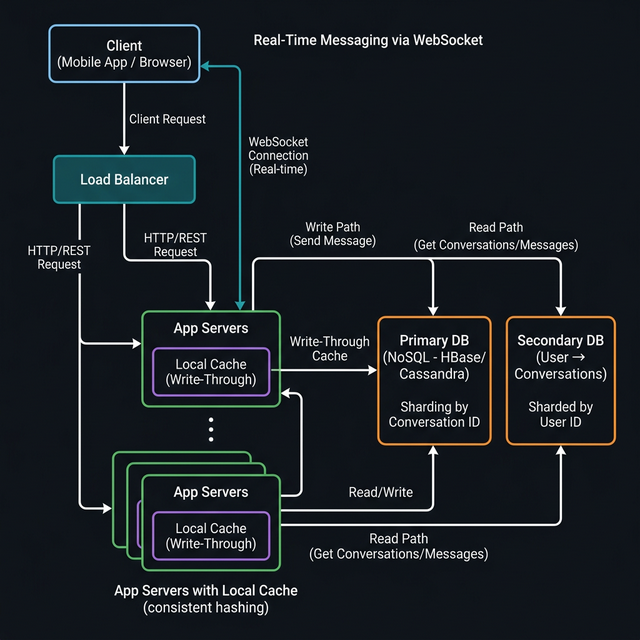

# 💬 Messaging System Design — The Ultimate HLD Guide

> **Last Updated:** March 2026
> **Author:** System Design Study Notes (Scaler Academy — HLD Module)
> **Topics:** Messaging, WhatsApp, Facebook Messenger, WebSockets, Sharding, Consistency, Caching, Idempotency, NoSQL

---



---

## 📋 Table of Contents

### Part 1: Introduction & Context
1. [What Are We Designing?](#-what-are-we-designing)
2. [Types of Messaging Apps](#-types-of-messaging-apps)
3. [How System Design Interviews Work](#-how-system-design-interviews-work)

### Part 2: Requirements Gathering (MVP)
4. [Functional Requirements (MVP)](#-functional-requirements-mvp)
5. [Features Deferred to V1 / V2](#-features-deferred-to-v1--v2)
6. [The Core Differentiator — Real-Time Chat vs Email](#-the-core-differentiator--real-time-chat-vs-email)

### Part 3: Capacity Estimation
7. [Traffic Estimation](#-traffic-estimation)
8. [Storage Estimation](#-storage-estimation)
9. [Read vs Write Analysis](#-read-vs-write-analysis)

### Part 4: Design Goals
10. [Availability vs Consistency](#-availability-vs-consistency)
11. [Latency Requirements](#-latency-requirements)
12. [Data Loss Tolerance](#-data-loss-tolerance)

### Part 5: API Design
13. [Core APIs](#-core-apis)
14. [Idempotency — Preventing Duplicate Messages](#-idempotency--preventing-duplicate-messages)

### Part 6: High-Level Architecture
15. [Overview](#-overview)
16. [WebSocket — Real-Time Communication](#-websocket--real-time-communication)

### Part 7: Sharding Strategies
17. [Option A — Sharding by User ID](#-option-a--sharding-by-user-id)
18. [Option B — Sharding by Conversation ID](#-option-b--sharding-by-conversation-id)
19. [Hybrid Strategy — One-to-One vs Group](#-hybrid-strategy--one-to-one-vs-group)
20. [Secondary Database — User to Conversation Mapping](#-secondary-database--user-to-conversation-mapping)

### Part 8: Consistency Challenges
21. [The Two-Shard Write Problem](#-the-two-shard-write-problem)
22. [Case 1 — Write to Sender First](#-case-1--write-to-sender-first)
23. [Case 2 — Write to Receiver First (Preferred)](#-case-2--write-to-receiver-first-preferred)

### Part 9: Caching Architecture
24. [Why Caching is Essential](#-why-caching-is-essential)
25. [Write-Through Cache](#-write-through-cache)
26. [Local Cache with Consistent Hashing](#-local-cache-with-consistent-hashing)
27. [Cold Start Problem](#-cold-start-problem)

### Part 10: Database Choice
28. [Why NoSQL?](#-why-nosql)
29. [HBase vs Cassandra](#-hbase-vs-cassandra)
30. [Attachment Storage — S3](#-attachment-storage--s3)

### Part 11: Summary & Interview Prep
31. [Quick Reference Cheatsheet](#-quick-reference-cheatsheet)
32. [Practice Questions](#-practice-questions)
33. [References & Resources](#-references--resources)

---

# PART 1: INTRODUCTION & CONTEXT

---

## 💬 What Are We Designing?

> We are designing a **large-scale real-time messaging application** — similar to **Facebook Messenger**.

The core requirements of a messaging app:
- Users can **register and log in**
- A **sender** can send text messages to a **receiver**
- Messages are delivered **in real time**
- **Message history is permanently stored** on servers (like Facebook Messenger, unlike original WhatsApp)
- Users can see their **recent conversations**, sorted by latest activity
- Users can view **message history** within a conversation

```
┌─────────────────────────────────────────────┐
│           MESSAGING APP — CORE FLOW          │
├─────────────────────────────────────────────┤
│                                             │
│  User opens app → sees recent conversations │
│         │                                   │
│         ▼                                   │
│  Clicks a conversation → sees message thread│
│         │                                   │
│         ▼                                   │
│  Types a message → hits Send               │
│         │                                   │
│         ▼                                   │
│  Message delivered to receiver in real-time │
│                                             │
└─────────────────────────────────────────────┘
```

---

## 📱 Types of Messaging Apps

Not all messaging apps are built the same. Before designing, it's important to clarify what type you're building.

| App | Message Storage | Group Size Limit | Key Characteristics |
|-----|----------------|-----------------|---------------------|
| **WhatsApp** | Client-side (originally) | 256 → 1024 users | Messages stored on device; lost if device wiped |
| **Facebook Messenger** | Server-side (permanent) | Large | Full history on servers; restore after reinstall |
| **Telegram** | Server-side | 200,000 users | Cloud-based, accessible from any device |
| **Slack** | Server-side | Unlimited (channels) | Started as gaming infra; channels, not just DMs |
| **Discord** | Server-side | Unlimited (servers) | Gaming-focused, very large servers |

> 💡 **Key Architectural Choice:** Will messages be stored permanently on servers (like Messenger/Telegram) or client-side only (like original WhatsApp)?
> **Our choice today: Server-side permanent storage**, like Facebook Messenger.

### Why WhatsApp Has a 256-User Group Limit

> ⚠️ WhatsApp's 256-user group limit is **not a UX decision** — it's a **system design constraint**.
> When sharding by user ID, sending a group message requires a **fan-out write to every member's shard**.
> With 256 members, this is expensive but manageable. Beyond that, it becomes impractical.

---

## 🎯 How System Design Interviews Work

Follow this structured approach every time. The **candidate should drive the conversation**, not the interviewer.

```
┌────────────────────────────────────────────────────────────┐
│              HLD INTERVIEW FRAMEWORK                        │
├────────────────────────────────────────────────────────────┤
│  STEP 1: Clarify the Problem Statement                      │
│    → What app are we designing? (Messenger? WhatsApp?)      │
│    → Client-side or server-side message storage?            │
│                                                             │
│  STEP 2: Define MVP (Functional Requirements)               │
│    → Keep scope focused! No feature suggestion spree.       │
│                                                             │
│  STEP 3: Estimate Scale                                     │
│    → DAU, messages/day, storage, QPS                        │
│    → Determines: do we need sharding?                       │
│                                                             │
│  STEP 4: Define Design Goals (Non-Functional)               │
│    → Availability vs Consistency?                           │
│    → Latency requirements? Data loss tolerance?             │
│                                                             │
│  STEP 5: API Design                                         │
│    → What endpoints exist? What are the parameters?         │
│    → Idempotency considerations?                            │
│                                                             │
│  STEP 6: High-Level System Design                           │
│    → Draw the architecture                                  │
│    → Sharding strategy, caching, databases                  │
│                                                             │
│  STEP 7: Deep Dive & Trade-offs                             │
│    → Consistency challenges; WebSockets; group chats        │
└────────────────────────────────────────────────────────────┘
```

> ⚠️ **Interview Red Flags to Avoid:**
> - Suggesting features beyond scope (delete messages, swipe-to-reply, timelines)
> - Not driving the conversation yourself — let the interviewer intervene minimally
> - Adding too many features to V0 when they belong in V1 or V2

---

# PART 2: REQUIREMENTS GATHERING (MVP)

---

## ✅ Functional Requirements (MVP)

These are the **V0 features** — what the system *must* support at launch.

```
┌──────────────────────────────────────────────────────────────┐
│              MESSAGING MVP — V0 FUNCTIONAL REQUIREMENTS       │
├──────────────────────────────────────────────────────────────┤
│                                                              │
│  FR1: User Registration & Login                              │
│       → Can be a separate auth service                       │
│       → Not strictly part of the messaging service           │
│                                                              │
│  FR2: Send Message (One-to-One)                              │
│       → Sender sends text message to a receiver              │
│       → Message delivered in real time                       │
│                                                              │
│  FR3: Get Recent Conversations                               │
│       → When user opens the app, see recent chats            │
│       → Sorted by most recent activity                       │
│       → Paginated                                            │
│                                                              │
│  FR4: Get Message History                                    │
│       → Click on a conversation → see all messages           │
│       → Messages permanently stored on the server            │
│       → Paginated                                            │
│                                                              │
│  FR5: Real-Time Chat                                         │
│       → Core differentiator from email                       │
│       → Messages delivered within seconds                    │
│                                                              │
└──────────────────────────────────────────────────────────────┘
```

---

## 🔄 Features Deferred to V1 / V2

These features are real but should **not** be proposed in the MVP discussion.

| Feature | Version | Reason for Deferral |
|---------|---------|---------------------|
| Read receipts (✓✓) | V1 | Not needed to get service running; separate tracking system |
| Online/offline status | V1 | Interesting but not core |
| Attachments (images, audio, video) | V1 | System works well with text only; storage complexity separate |
| Push notifications | V1 | Can be a separate notification service |
| Group conversations | V2 | Significant architectural complexity |
| End-to-end encryption | V3 | Advanced security feature |
| Message reactions | V2 | Fancy UX feature |
| Swipe-to-reply | ❌ Never | This is a UI/UX decision, not system design |
| Delete messages | ❌ Never (in interview) | Red flag to mention during HLD interview |
| Post on timeline | ❌ Never | Wrong scope entirely |

> 💡 **Why deferred features matter in interviews:** An interviewer gives you 60-90 minutes. If you spend 20 minutes discussing delete-message flows, you cannot finish the core architecture. Stay focused.

---

## ⚡ The Core Differentiator — Real-Time Chat vs Email

A key clarification question in any messaging interview: **How is this different from email?**

```
EMAIL vs MESSAGING — KEY DIFFERENCES:
──────────────────────────────────────────────────────────────
  Email:
  ✗ Asynchronous — delivery is NOT guaranteed to be fast
  ✗ OTP via email can arrive hours late (OTP expired!)
  ✗ No presence/real-time awareness
  ✓ Works for non-time-sensitive communication

  Messaging App:
  ✓ Synchronous (real-time) — delivery within seconds
  ✓ Both parties are "present" in the conversation
  ✓ Suitable for time-sensitive actions
  ✗ More complex infrastructure (WebSockets, consistency)
──────────────────────────────────────────────────────────────
```

> Real-time delivery is the **core reason messaging apps exist** as a separate category from email.

---

# PART 3: CAPACITY ESTIMATION

---

## 📊 Traffic Estimation

### Starting from Known Business Numbers

> Facebook Messenger (real numbers at scale):
> - **2 billion Monthly Active Users (MAU)**
> - **1 billion Daily Active Users (DAU)**
> - **70 billion messages per day** (current scale)
> - Started at **10 billion messages/day** at launch

### Back-of-Envelope Calculation

```
STEP 1: Establish DAU
  MAU = 2 billion
  DAU = 50% of MAU = 1 billion users/day

STEP 2: Messages per user per day
  Average = ~10 messages/user/day (conservative)
  Total = 1,000,000,000 × 10 = 10 billion messages/day (launch)
  Current Facebook scale = 70 billion messages/day

STEP 3: Convert to Messages Per Second (MPS)
  Seconds in a day = 24 × 60 × 60 = 86,400

  10 billion / 86,400 ≈ 115,000 messages/sec ≈ ~100K MPS
  70 billion / 86,400 ≈ 810,000 messages/sec ≈ ~1 million MPS
```

```
TRAFFIC SUMMARY:
┌─────────────────────────────────────────────────────────┐
│  Metric                         Value                    │
├─────────────────────────────────────────────────────────┤
│  Monthly Active Users           2 Billion                │
│  Daily Active Users             1 Billion                │
│  Messages per day (launch)      10 Billion               │
│  Messages per day (current)     70 Billion               │
│  Messages per second (current)  ~1 Million / sec         │
│  Sharding required?             YES (absolutely)         │
└─────────────────────────────────────────────────────────┘
```

> 💡 **Fun Anecdote from Lecture:** Facebook got no initial plans for a messenger. A single engineer built a primitive messaging prototype (no server-side persistence) during a hackathon in ONE day. It got **4 million messages on Day 1**. That proved messaging was critical, and the real system was then commissioned.

---

## 💾 Storage Estimation

### Size of One Message

```
MESSAGE SCHEMA (what we store per message):
──────────────────────────────────────────────────────────────
  Field              Size       Notes
  ─────────────────────────────────────────────────────────
  message_content    ~100 bytes  Average text (emojis are unicode chars in text)
  timestamp          8 bytes     When the message was sent
  sender_id          8 bytes     User ID of sender
  receiver_id        8 bytes     User ID of receiver (or conversation_id)
  message_id (UUID)  16 bytes    Unique ID for deduplication
  attachment_path    ~50 bytes   Optional: path to file in S3 (if attachments enabled)
  ─────────────────────────────────────────────────────────
  TOTAL              ~200 bytes per message
──────────────────────────────────────────────────────────────
```

> ⚠️ **Important:** Attachments (images, videos, audio) are **NEVER stored in the database**.
> They are stored in large file storage like **Amazon S3**. The database only stores the **URL / path** pointing to the file.

### Daily & Long-Term Storage

```
Daily storage:
  70 billion messages/day × 200 bytes/message
  = 14,000 billion bytes
  = 14 Terabytes per day

Long-term storage (20 years, accounting for growth):
  14 TB/day × 365 days × 20 years ≈ 100,000 TB
  = ~100 Petabytes of total historical data
```

```
STORAGE SUMMARY:
┌─────────────────────────────────────────────────────────┐
│  Metric                         Value                    │
├─────────────────────────────────────────────────────────┤
│  Average message size           ~200 bytes               │
│  Daily storage needed           ~14 TB / day             │
│  20-year total storage          ~100 Petabytes           │
│  Single machine sufficient?     NO — sharding required   │
└─────────────────────────────────────────────────────────┘
```

> 💡 No single machine in the world can hold 100 Petabytes AND handle 1 million messages/sec.
> **Sharding is non-negotiable** for a system at this scale.

---

## 📈 Read vs Write Analysis

```
IS THIS SYSTEM READ-HEAVY OR WRITE-HEAVY?

  WRITES: Every sent message (1M/sec) must be stored in the database.
          → 1,000,000 write operations per second

  READS:  Every sent message is read by the recipient (and sometimes re-read).
          → For every 1 write, there's roughly 1-3 reads
          → ~1,000,000 - 3,000,000 read operations per second

  VERDICT: Both read AND write heavy.
           Read:Write ratio ≈ 1:1 to 3:1

  CONTRAST WITH TYPICAL SYSTEMS:
    Typeahead:     Read:Write = 8:1  → Read-heavy, caching works well
    Social Feed:   Read:Write = 50:1 → Extremely read-heavy
    Messaging:     Read:Write = 1:1 to 3:1 → BOTH, very hard to design
```

> ⚠️ **Why "both heavy" systems are hard:**
> - Read-heavy systems: solve with caching
> - Write-heavy systems: solve with batching / sampling (if consistency not required)
> - **Both-heavy systems need consistency:** cannot batch writes (every message must be stored), cannot cache without write-through (data must be real-time). This is the fundamental challenge.

---

# PART 4: DESIGN GOALS

---

## ⚖️ Availability vs Consistency

This is the most nuanced design goal for messaging apps.

### The Instinctive (but Wrong) Answer

Most people initially say **"availability"** for messaging apps. The reasoning is:
- "It's not a bank — data doesn't have to be perfectly consistent"
- "If Messenger is down, we can use other ways to communicate"

### Why Immediate Consistency is Actually Correct

> 🎯 **The boss scenario:** Your boss messages you: *"Can you join a call at 10 PM?"*
> You immediately reply *"Yes!"* — your screen shows the message as **Delivered**.
> But due to eventual consistency, your boss actually receives it at **10:30 PM** — after the meeting started.
> Your boss has already cancelled the meeting assuming you didn't respond.
> **This is why eventual consistency is unacceptable for messaging.**

```
WHAT EVENTUAL CONSISTENCY MEANS FOR MESSAGING (BAD):

  Scenario 1: Message Delay
  ─────────────────────────
  Sender perspective:  Message shown as "Sent" at 10:00 PM ✓
  Receiver perspective: Message actually arrives at 10:30 PM ✗

  Scenario 2: Out-of-Order Delivery
  ───────────────────────────────────
  Messages sent: M1 → M2 → M3

  Receiver sees:
    10:00 PM  →  M1 arrives  ✓
    10:01 PM  →  M3 arrives  ✗ (M2 is still missing)
    10:05 PM  →  M2 finally arrives (inserted before M3 in UI) ✗
```

```
DESIGN GOAL — CONSISTENCY:
┌──────────────────────────────────────────────────────────────┐
│  CAP Theorem Choice: CP (Consistency + Partition Tolerance)   │
│                                                              │
│  → Prefer immediate consistency over availability            │
│  → If a message shows "Sent", it MUST actually be sent       │
│  → If availability and consistency conflict, choose           │
│    consistency (show an error rather than false confirmation) │
│                                                              │
│  Real-world behavior: Apps like WhatsApp / Messenger show    │
│  "Message not sent — tap to retry" rather than lying that    │
│  it was delivered.                                           │
└──────────────────────────────────────────────────────────────┘
```

> 💡 **Most production messaging applications** (WhatsApp, iMessage, Telegram, Facebook Messenger) **prefer immediate consistency**. A failed send is better than a message that appears sent-but-wasn't.

---

## ⏱️ Latency Requirements

Messaging does not need sub-millisecond latency like typeahead, but it must still be fast.

```
LATENCY COMPARISON:
──────────────────────────────────────────────────────────────
  System          Latency Target    Reason
  ─────────────────────────────────────────────────────────
  Typeahead       < 50 ms          Competing with typing speed
  Messaging       < 5 seconds      "Real-time" feel; still conversational
  Email           Minutes-hours    Async; no real-time expectation
──────────────────────────────────────────────────────────────

  Note: Typeahead is ~100x more latency-sensitive than messaging.
```

> 💡 **Consistency vs Latency (no partition):** If there are no network partition issues, we always prefer consistent, low-latency responses. Achieve low latency through: multiple shards, powerful machines, high-speed networks — not by relaxing consistency.

---

## 🛡️ Data Loss Tolerance

```
CAN WE AFFORD DATA LOSS?

  ✗ Messages lost after sending → UNACCEPTABLE
    (User hit send, message is gone? Catastrophic trust failure)

  ✗ Messages received out of order → UNACCEPTABLE
    (Changes the meaning of conversations)

  ✗ Message shown as "sent" but not delivered → UNACCEPTABLE
    (Eventual consistency failure — leads to real-world consequences)

  ✓ App temporarily unavailable → Acceptable (show retry error)
    (Better than showing fake "delivered" status)

  ✓ Slight delay in message delivery → Acceptable within reason
    (As long as within 5-second window)
```

---

# PART 5: API DESIGN

---

## 📡 Core APIs

### Think in Terms of User Journey

When designing messaging APIs, follow the **user journey**:
1. User opens app → needs recent conversations
2. User clicks a conversation → needs message history
3. User types and sends a message → needs send endpoint

### API 1: Send Message

```
POST /messages/send

Request Body:
{
  "sender_id":    "user_abc123",       // from JWT / auth token
  "receiver_id":  "user_xyz789",       // or conversation_id for groups
  "message_text": "Hello! Are you free tonight?",
  "message_id":   "550e8400-e29b-41d4-a716-446655440000",  // UUID v4
  "timestamp":    1708700000
}

Response (success):
{
  "status": "sent",
  "message_id": "550e8400-e29b-41d4-a716-446655440000",
  "delivered_at": 1708700001
}

Response (failure):
{
  "status": "error",
  "message": "Message could not be delivered. Please retry.",
  "message_id": "550e8400-e29b-41d4-a716-446655440000"
}
```

> ⚠️ **Key detail:** `sender_id` comes from the **JWT authentication token** — the messaging service doesn't receive the raw JWT, it gets the verified `sender_id` from the auth service. The message_id is a **UUID v4** generated on the **client side** at the moment of sending.

### API 2: Get Recent Conversations

```
GET /conversations

Query Parameters:
  user_id  (string, required)  — The logged-in user's ID
  offset   (integer, optional) — Pagination offset (default: 0)
  limit    (integer, optional) — Number of conversations to return (default: 20)

Response:
{
  "conversations": [
    {
      "conversation_id": "conv_abc_xyz",
      "other_user": { "user_id": "user_xyz789", "name": "Akash" },
      "last_message_snippet": "Hello! Are you free tonight?",
      "last_message_time": 1708700000,
      "unread_count": 2
    },
    ...
  ],
  "offset": 0,
  "limit": 20,
  "has_more": true
}
```

> 💡 **Sorted by recency:** Conversations are sorted by `last_message_time` descending.
> This sorting requirement has major implications for the **sharding strategy** (discussed in Part 7).

### API 3: Get Messages (from a Conversation)

```
GET /conversations/{conversation_id}/messages

Path Parameters:
  conversation_id  (string) — Unique ID for the conversation
                              (sender_id + receiver_id for 1:1, or group_id for groups)

Query Parameters:
  offset  (integer, optional) — Pagination offset (default: 0)
  limit   (integer, optional) — Number of messages to return (default: 20)

Response:
{
  "conversation_id": "conv_abc_xyz",
  "messages": [
    {
      "message_id": "550e8400-...",
      "sender_id":  "user_abc123",
      "text":       "Hello! Are you free tonight?",
      "timestamp":  1708700000,
      "status":     "read"
    },
    ...
  ],
  "offset": 0,
  "limit": 20
}
```

### API Summary Table

| API | Method | Purpose | Paginated? |
|-----|--------|---------|-----------|
| `/messages/send` | POST | Send a new message | No |
| `/conversations` | GET | Get recent conversations | Yes (offset + limit) |
| `/conversations/{id}/messages` | GET | Get messages in a conversation | Yes (offset + limit) |

---

## 🔑 Idempotency — Preventing Duplicate Messages

### The Problem

```
NETWORK FAILURE SCENARIO:
──────────────────────────────────────────────────────────────
1. User hits "Send" for message: "Hello Boss, I'll be there!"
2. App sends POST /messages/send to server
3. Server receives message, stores it, sends back "200 OK"
4. ❌ Network failure on the RETURN path — client never gets "200 OK"
5. Client thinks: "Message failed to send, let me retry..."
6. App retries the same POST request
7. Server receives it AGAIN → stores it AGAIN → duplicate message! ❌
──────────────────────────────────────────────────────────────
```

### The Solution — UUID Message ID

```
IDEMPOTENCY FIX:

  Client generates UUID v4 at the moment user hits "Send":
    message_id = "550e8400-e29b-41d4-a716-446655440000"

  This UUID is included in the POST body.

  Server logic:
    IF message_id already exists in DB:
      → Return success (already stored, don't store again)
    ELSE:
      → Store message → Return success

  Result: No matter how many times client retries the same
  message, it is stored EXACTLY ONCE. ✅
```

```
IMPORTANT DISTINCTION:
  Idempotency prevents the SAME message from being stored twice.
  It does NOT prevent TWO DIFFERENT "Hello" messages from being stored.

  Scenario A (prevented by idempotency):
    Retry → same UUID → only stored once ✅

  Scenario B (allowed — user sent it twice intentionally):
    Message 1: UUID = "abc..." → "Hello" stored
    Message 2: UUID = "def..." → "Hello" stored again ✅ (different UUID)
```

### Idempotency for POST vs PUT Requests

```
PUT  requests are ALWAYS idempotent by design:
  → Sending PUT /users/123 { name: "Akash" } 5 times = same result

POST requests are NOT idempotent by default:
  → Sending POST /messages 5 times = 5 messages stored (bad!)
  → FIX: Add unique message_id (UUID) to make POST idempotent

GET  requests cannot be idempotent:
  → GET is a read — same GET = same data returned (not applicable)
```

> 💡 **Mathematical definition of idempotency:**
> A function f is idempotent if: `f(x) = f(f(x))`
> Applying it multiple times gives the same result as applying it once.
> Example: `abs(-5) = 5`, `abs(abs(-5)) = abs(5) = 5` ✅

---

# PART 6: HIGH-LEVEL ARCHITECTURE

---

## 🏗️ Overview

```
                    ┌──────────────────────────────────────┐
                    │             CLIENTS                   │
                    │    (Mobile App / Browser)             │
                    └───────────┬──────────────────────────┘
                                │ WebSocket (persistent)
                    ┌───────────▼──────────────────────────┐
                    │        LOAD BALANCER                  │
                    │   (Consistent Hashing by User ID)     │
                    └───────────┬──────────────────────────┘
                                │
               ┌────────────────▼────────────────────┐
               │          APP SERVER CLUSTER          │
               │  (Each server has LOCAL CACHE)       │
               │  ┌──────────────────────────────┐   │
               │  │  App Server A                │   │
               │  │  Local Cache (User 1-10K)    │   │
               │  └──────────────────────────────┘   │
               │  ┌──────────────────────────────┐   │
               │  │  App Server B                │   │
               │  │  Local Cache (User 10K-20K)  │   │
               │  └──────────────────────────────┘   │
               └───────────────┬─────────────────────┘
                               │
          ┌────────────────────┴───────────────────────┐
          │                                            │
 ┌────────▼──────────┐                    ┌────────────▼──────────┐
 │  PRIMARY DATABASE │                    │  SECONDARY DATABASE    │
 │  (HBase/Cassandra)│                    │  (HBase/Cassandra)     │
 │  Sharded by:      │                    │  Sharded by:           │
 │  Conversation ID  │                    │  User ID               │
 │  (messages)       │                    │  (user→conversations)  │
 └───────────────────┘                    └───────────────────────┘
```

---

## 🌐 WebSocket — Real-Time Communication

### Why WebSocket and Not REST?

```
PROBLEM WITH HTTP (REST) FOR REAL-TIME MESSAGING:

  HTTP is a request-response protocol:
    Client → sends request → Server → sends response → connection closed

  For real-time messaging, the SERVER needs to PUSH new messages to
  the CLIENT without the client asking. HTTP doesn't support this natively.

  Alternatives:
    ✗ Polling:      Client asks server every 1 sec "Any new messages?"
                    → 1 billion users × 1 request/second = 1 billion req/sec
                    → Catastrophically expensive

    ✗ Long Polling:  Client sends request, server holds it open until
                    a new message arrives
                    → Better, but still high overhead

    ✓ WebSocket:    Persistent, bidirectional connection
                    → Server can push messages to client anytime
                    → Efficient: one connection, no repeated handshakes
```

### WebSocket Properties

```
WEBSOCKET CHARACTERISTICS:
──────────────────────────────────────────────────────────────
  ✓ Persistent connection        → Stays open as long as user is active
  ✓ Bidirectional                → Both client and server can send messages
  ✓ Operates over HTTP/HTTPS     → Works with existing web infrastructure
  ✓ Low overhead after handshake → No repeated HTTP headers per message
  ✓ Real scale: WhatsApp handles 2M+ WebSocket connections per server
──────────────────────────────────────────────────────────────
```

> 💡 **Interesting origin:** Slack started as a **gaming company** (peer-to-peer games require persistent WebSocket connections). When they pivoted to messaging, they reused the same WebSocket infrastructure. This is why Slack and Discord (both gaming-heritage) have particularly robust real-time messaging.

---

# PART 7: SHARDING STRATEGIES

---

## 🔑 Option A — Sharding by User ID

**Core idea:** All conversations for a given user live on the same shard.

```
SHARDING BY USER ID:

  Shard 1: All data for users 1 - 1,000,000
  Shard 2: All data for users 1,000,001 - 2,000,000
  ...and so on

  Guarantee: If you know a user's ID, you can find ALL their
  conversations on ONE shard.
```

### Evaluation Against Each API

| API | Performance | Notes |
|-----|-------------|-------|
| **Get Recent Conversations** | ✅ Easy | All user's conversations are on one shard |
| **Get Message History** | ✅ Easy | All messages for this user are on one shard |
| **Send Message (1:1)** | ⚠️ Moderate | Must write to BOTH sender's shard AND receiver's shard |
| **Send Message (Group)** | ❌ Impossible | Must write to ALL N members' shards → fan-out of N writes |

### The Group Chat Fan-Out Problem

```
GROUP MESSAGE FAN-OUT (User ID Sharding):

  Group has 256 members across 50 different shards.
  One message sent → 256 write operations across 50 shards.

  At scale:
    1M messages/sec × 256 writes/message = 256 MILLION writes/sec ❌

  This is catastrophically expensive.
  → User ID sharding CANNOT support group conversations at scale.
  → WhatsApp caps groups at 256 users partly because of this!
```

---

## 💬 Option B — Sharding by Conversation ID

**Core idea:** All messages in a given conversation live on the same shard.

```
SHARDING BY CONVERSATION ID:

  1:1 Conversation ID = hash(sender_id + receiver_id)
  Group Conversation ID = group_id

  Shard 1: Conversations with IDs hash → range 0-1000
  Shard 2: Conversations with IDs hash → range 1001-2000
  ...and so on

  Guarantee: All messages for a given conversation live on ONE shard.
```

### Evaluation Against Each API

| API | Performance | Notes |
|-----|-------------|-------|
| **Get Recent Conversations** | ❌ Hard | User's conversations span many shards — need secondary DB |
| **Get Message History** | ✅ Easy | All messages for the conversation are on ONE shard |
| **Send Message (1:1)** | ✅ Easy | Write to ONE shard (the conversation's shard) |
| **Send Message (Group)** | ✅ Easy | Write to ONE shard (the group's shard) — no fan-out! |

---

## 🔀 Hybrid Strategy — One-to-One vs Group

The optimal solution separates message types:

```
HYBRID SHARDING STRATEGY (Production Approach):

  ┌──────────────────────────────────────────────────────────┐
  │                  PRIMARY DATABASE                         │
  │                                                          │
  │  1:1 Messages      → Sharded by Conversation ID         │
  │                      (easier writes, no fan-out)         │
  │                                                          │
  │  Group Messages    → Sharded by Group/Conversation ID   │
  │                      (single shard per group)            │
  └──────────────────────────────────────────────────────────┘

  Both approaches write to ONE shard per send operation.
  No fan-out. No cross-shard consistency issues on write.
```

---

## 📋 Secondary Database — User to Conversation Mapping

Since the primary DB is sharded by Conversation ID, we **cannot efficiently get a user's conversations**.

The solution: maintain a **secondary database** sharded by User ID.

```
SECONDARY DATABASE STRUCTURE:
──────────────────────────────────────────────────────────────
  Sharding Key: user_id

  Each user has a list of conversations they participate in:
  {
    user_id: "user_abc123",
    conversations: [
      {
        conversation_id: "conv_abc_xyz",
        last_message_time: 1708700000,
        last_message_snippet: "Hello! Are you free tonight?",
        unread_count: 2,
        other_participant: "user_xyz789"
      },
      ...
    ]
  }
──────────────────────────────────────────────────────────────
```

### The Cost of Sorted Secondary DB (Group Messages)

> ⚠️ **Critical trade-off:** If the secondary DB stores conversations **sorted by recency**, then every new message in a group must **update the secondary DB entry for all N group members**.

```
SORTED SECONDARY DB + GROUP MESSAGE:

  Group has 1,000 members.
  One new message arrives → must update recency for 1,000 users.
  At 1M messages/sec → could mean 1 Billion secondary DB writes/sec ❌

SOLUTION OPTIONS:
  1. Don't sort by recency in secondary DB for group messages
     (Slack does this — group channels not sorted by recency)

  2. Limit group size (WhatsApp: 256 members)
     (Makes fan-out to secondary DB affordable)

  3. Use a separate DB for group vs 1:1 conversations
     (1:1: sorted by recency, group: not sorted)
```

> 💡 **Why Slack doesn't show channel conversations sorted by recent activity:** This is a deliberate architectural decision — sorting by recency for large channels would require updating every member's secondary DB on every message. Too expensive at scale.

---

# PART 8: CONSISTENCY CHALLENGES

---

## ⚠️ The Two-Shard Write Problem

When using **user ID sharding for 1:1 messages**, sending a message requires writing to:
1. The **sender's shard** (so the sender sees the message in their history)
2. The **receiver's shard** (so the receiver can read the message)

```
TWO-SHARD WRITE:
──────────────────────────────────────────────────────────────
  ✅ Both writes succeed → Data consistent → Done

  ✅ Both writes fail    → Data consistent → Return error to user

  ❌ Write 1 succeeds, Write 2 fails → INCONSISTENT STATE
     → Sender's shard has the message
     → Receiver's shard does NOT have the message
     → What do we do?
──────────────────────────────────────────────────────────────
```

---

## 📝 Case 1 — Write to Sender First

```
STRATEGY: Sender shard first → if success → receiver shard

FLOW:
  Step 1: Write to sender shard
          → FAIL: Return error → done (no rollback needed, nothing was written)
          → SUCCESS: Proceed to Step 2

  Step 2: Write to receiver shard
          → SUCCESS: Done! Both written. Consistent. ✅
          → FAIL: Retry 3 times?

  Step 3 (if receiver shard keeps failing):
          → Must ROLLBACK the sender shard write
          → Wait: sender shard has the message, receiver doesn't
          → Sender's UI shows message as "sent" — but it wasn't

  ROLLBACK OPERATION:
          → Delete from sender shard
          → Return error to client: "Message not sent"
```

```
PROBLEMS WITH CASE 1:
  ❌ High latency: Each step is sequential and dependent
  ❌ Rollback is complex and error-prone
  ❌ During rollback, the user's app is blocked (waiting)
  ❌ If server goes down mid-rollback → data stuck in inconsistent state
  ❌ Giving up availability for consistency
```

---

## ✅ Case 2 — Write to Receiver First (Preferred)

```
STRATEGY: Receiver shard first → if success → sender shard

FLOW:
  Step 1: Write to receiver shard
          → FAIL: Return error → done (nothing was written anywhere) ✅
          → SUCCESS: Proceed to Step 2

  Step 2: Write to sender shard
          → SUCCESS: Both written. Consistent. ✅
          → FAIL: KEEP RETRYING (don't rollback!)
                  Retry immediately, then after 3s, 1min, 5min, 1hr...
                  (Exponential backoff)

  Meanwhile:
          → Receiver HAS the message (can read it)
          → Sender's UI shows "message sending..." (in progress)
          → No false "delivered" confirmation to sender
          → Sender's local app cache shows the message in a pending state
```

```
WHY CASE 2 IS BETTER:
  ✅ No rollback needed — if receiver write succeeds, we never undo it
  ✅ Lower latency for successful cases (receiver gets message quickly)
  ✅ Sender's UI accurately reflects state (pending, not falsely "sent")
  ✅ System is eventually consistent on the SENDER side only
     (not on receiver — receiver always has the true state)
  ✅ App cache on sender device shows pending state correctly

  KEY INSIGHT: The "commitment" of sending a message happens when the
  RECEIVER's shard is written. After that, we keep retrying to update
  the sender's shard until it succeeds (shards don't stay down forever).
```

### What Does the Sender See?

```
SENDER EXPERIENCE (Case 2):
──────────────────────────────────────────────────────────────
  Scenario A: Both writes succeed immediately
    → Message appears in sender's chat with "✓ Sent" status ✅

  Scenario B: Receiver write succeeds, sender write pending
    → Message appears in sender's local cache as "⏳ Sending..."
    → Once sender shard write succeeds (may retry several times)
    → Status updates to "✓ Sent"

  Scenario C: Receiver write fails
    → Message appears with "❌ Not sent — tap to retry"
    → User knows to retry ✅
──────────────────────────────────────────────────────────────
```

> 💡 **The "write receiver first" strategy is used by most modern messaging apps.** The receiver's delivery is the actual commitment; the sender's copy is secondary and can be retried without harm.

---

# PART 9: CACHING ARCHITECTURE

---

## 💨 Why Caching is Essential

```
THE FUNDAMENTAL PROBLEM:
  No database is optimized for BOTH reads AND writes at 1M ops/sec.

  READ-heavy solution:  → Cache most data (reads never hit DB)
  WRITE-heavy solution: → Batch/sample writes (reduce DB writes)

  For messaging:
    → Cannot sample/batch writes (consistency required)
    → Cannot just cache reads (writes are too frequent)

  SOLUTION: Make the system WRITE-heavy by absorbing reads into cache.
    → Cache stores "recent messages" (last 10 days)
    → Most reads are served from cache (microseconds)
    → DB only receives writes (and cache-miss reads)
    → DB is effectively write-heavy → use write-optimized NoSQL
```

---

## 🔄 Write-Through Cache

```
WRITE-THROUGH vs WRITE-BACK (WRITE-BEHIND) CACHE:

  WRITE-BACK cache:
    → Write goes to cache first → acknowledge to client
    → Cache asynchronously writes to DB
    ❌ If cache crashes before writing to DB → DATA LOSS
    ❌ Unacceptable for messaging (we said no data loss!)

  WRITE-THROUGH cache:
    → Write goes to cache AND DB simultaneously (or DB first)
    → Only acknowledge to client after BOTH are written
    ✅ No data loss — DB always has the data
    ✅ Cache stays consistent with DB
    ✅ Reads from cache are always fresh
```

```
WRITE-THROUGH CACHE FLOW:
──────────────────────────────────────────────────────────────
  1. Send Message request arrives
  2. Acquire LOCK on user/conversation in CACHE
  3. Write message to CACHE
  4. Write message to DATABASE
  5. Release lock
  6. Acknowledge "Message Sent" to client

  Read:
  1. Check cache → CACHE HIT → serve from cache (microseconds)
  2. CACHE MISS → read from DB → populate cache → serve
──────────────────────────────────────────────────────────────
```

---

## 🖥️ Local Cache with Consistent Hashing

### Why Not a Global (Shared) Cache?

```
GLOBAL CACHE PROBLEM:
  A single global cache (like Redis) can be sharded.
  If you shard it by user_id → app servers route to correct cache shard.

  BUT: The app server is just a proxy — it's not doing much.
  AND: You still need to acquire locks in the cache for consistency.
  AND: Cross-network cache calls add latency.

  BETTER APPROACH: Local cache embedded in the app server itself.
```

### Local Cache Architecture

```
LOCAL CACHE ARCHITECTURE:

  ┌──────────────────────────────────────────────────────┐
  │  CLIENT                                              │
  │    │                                                │
  │    ▼ (HTTP/WebSocket)                               │
  │  LOAD BALANCER — Consistent Hashing by user_id      │
  │    │                                                │
  │    ▼ (routes to correct app server for this user)   │
  │  APP SERVER A (has local cache for users 1-10K)     │
  │    │ ← can acquire local locks (no distributed lock)│
  │    ▼                                                │
  │  DATABASE SHARD (via conversation_id routing)       │
  └──────────────────────────────────────────────────────┘

  Key Properties:
  ✓ Stateful app server (user's requests always go to same server)
  ✓ Lock acquisition is LOCAL (no distributed lock needed)
  ✓ Horizontal scaling: add more app servers
  ✓ Each server: handles ~1000 users (estimated)
  ✓ Total app servers needed: ~1 million / 1000 = ~1000 servers
```

### Lock Acquisition for Concurrency

```
RACE CONDITION SCENARIO:
  User sends a message from phone AND laptop simultaneously.
  Both requests hit the same app server (consistent hashing).

  WITHOUT LOCK:
    → Both write to cache at same time
    → Race condition → one message may overwrite the other
    → Messages appear out of order ❌

  WITH LOCAL LOCK (in app server):
    → Request 1 acquires lock on conversation_id
    → Request 2 waits
    → Request 1 writes to cache + DB → releases lock
    → Request 2 acquires lock → writes → releases
    → Perfect ordering guaranteed ✅
```

---

## 🥶 Cold Start Problem

When an app server goes down, the new replacement server has **no cache**.

```
COLD START SCENARIO:
──────────────────────────────────────────────────────────────
  App Server A goes down (handles users 1-10,000)
  
  System detects failure → assigns users to App Server B (new/backup)

  Problem: App Server B has no cached data for users 1-10,000.

  Impact:
    → Initial requests fall through to DB (slow: seconds vs microseconds)
    → Users 1-10,000 see ~5-10 second delay
    → After warmup, cache populates → performance returns to normal

  Scope:
    → Only affects users who were on the failed server
    → Other users: unaffected
    → Duration: 5-10 seconds
    → Users perceive it as "Facebook is a bit slow today"
    → Global service availability: NOT affected ✅
──────────────────────────────────────────────────────────────
```

> 💡 **User perception insight:** When Google goes down, 90% of users think their internet is broken — not that Google is down. Similarly, a 5-10 second slowdown for a small subset of users during an app server failover goes completely unnoticed at the product level.

---

# PART 10: DATABASE CHOICE

---

## 🗄️ Why NoSQL?

```
REQUIREMENTS vs DATABASE TYPE:
──────────────────────────────────────────────────────────────
  Requirement                    SQL        NoSQL
  ─────────────────────────────────────────────────────────
  Massive horizontal sharding    ❌ Hard   ✅ Native
  100 Petabytes of storage       ❌ No     ✅ Yes
  1M writes/second               ❌ Dies   ✅ Handles
  Flexible schema (message types)❌ Rigid  ✅ Flexible
  Billion+ users                 ❌ No     ✅ Yes
──────────────────────────────────────────────────────────────

  VERDICT: SQL databases cannot handle billion-user, 100PB-scale systems.
           NoSQL (specifically column-family stores) is required.
```

> 💡 **Rule of thumb:** The moment "billion users" appears in the requirements, SQL is off the table for the primary message store. SQL can still be used for less-scaled metadata stores (user profiles, auth, etc.)

---

## 📊 HBase vs Cassandra

Both are **column-family NoSQL databases** suitable for messaging at scale.

| Property | HBase | Cassandra |
|----------|-------|-----------|
| **Write performance** | ✅ Extremely high | ✅ Very high |
| **Consistency model** | Strong (CP) | Tunable (CAP flexible) |
| **Architecture** | Master-slave (HDFS) | Masterless (peer-to-peer) |
| **Scalability** | Excellent | Excellent |
| **Used by** | Facebook Messenger | Discord, Apple iMessage |
| **Best for** | Write-heavy, CP systems | AP systems or tunable |
| **Recommendation for messaging** | ✅ Preferred | ✅ Also valid |

```
COLUMN-FAMILY MODEL FOR MESSAGES:

  Row Key: conversation_id (sharding key)

  Columns:
    message_1708700000_uuid: { sender, text, timestamp }
    message_1708699900_uuid: { sender, text, timestamp }
    message_1708699800_uuid: { sender, text, timestamp }
    ...

  → All messages for a conversation are in ONE row
  → Sorted by timestamp (column key)
  → Efficient range scans for "get page of messages"
  → HBase is optimized for exactly this pattern
```

---

## 📦 Attachment Storage — S3

```
ATTACHMENT HANDLING:
──────────────────────────────────────────────────────────────
  ❌ DO NOT store image/video/audio binary data in the DB
     → Databases are not optimized for large blob storage
     → Would bloat DB size enormously
     → Slow write and read performance

  ✅ Store attachments in Amazon S3 (or equivalent object storage)
     → S3 handles unlimited blob storage
     → CDN can front S3 for fast delivery
     → Database only stores the S3 URL or file path (~50 bytes)

  MESSAGE WITH ATTACHMENT FLOW:
    1. Client uploads photo to S3 directly (pre-signed URL)
    2. S3 returns a CDN URL: "https://cdn.messenger.com/img/abc123.jpg"
    3. Client includes this URL in the message text or attachment_path field
    4. Message stored in DB with the URL only
    5. Receiver's app fetches the image via the CDN URL
    6. Frontend renders as  tag
──────────────────────────────────────────────────────────────
```

> 💡 Emojis are also **not special storage cases** — they're just unicode characters (e.g., `\u2764` for ❤️) stored as part of the message text. The frontend renders them as emoji images.

---

# PART 11: SUMMARY & INTERVIEW PREP

---

## 📋 Quick Reference Cheatsheet

```
┌────────────────────────────────────────────────────────────────┐
│           MESSAGING SYSTEM DESIGN — QUICK REFERENCE            │
├────────────────────────────────────────────────────────────────┤
│  Scale                                                         │
│    MAU: 2B | DAU: 1B | Messages: 70B/day | ~1M/sec            │
│    Storage: 14 TB/day | ~100 PB total (20 years)              │
│    Sharding: Required (no single machine can handle this)      │
├────────────────────────────────────────────────────────────────┤
│  Design Goals                                                  │
│    Consistency: Immediate (CP, not AP)                         │
│    Latency: < 5 seconds for message delivery                   │
│    Data Loss: Zero tolerance                                   │
│    Read/Write: Both heavy (unlike most systems)                │
├────────────────────────────────────────────────────────────────┤
│  APIs                                                          │
│    POST /messages/send         → sender_id, receiver_id, text, │
│                                   message_id (UUID for idempot.)│
│    GET  /conversations         → user_id, offset, limit        │
│    GET  /conversations/{id}/messages → offset, limit           │
├────────────────────────────────────────────────────────────────┤
│  Sharding                                                      │
│    Primary DB: Conversation ID (messages)                      │
│    Secondary DB: User ID (user → conversation mapping)         │
│    Hybrid: ConvID for 1:1 AND groups (no fan-out)             │
├────────────────────────────────────────────────────────────────┤
│  Consistency Strategy                                          │
│    Write receiver shard FIRST                                  │
│    If receiver succeeds → keep retrying sender shard           │
│    If receiver fails → return error (nothing written)          │
├────────────────────────────────────────────────────────────────┤
│  Caching                                                       │
│    Strategy: Write-through (not write-back)                    │
│    Type: Local cache per app server                            │
│    Sharding: Consistent hashing by user_id at load balancer    │
│    Locking: Local locks for concurrency control                │
├────────────────────────────────────────────────────────────────┤
│  Database                                                      │
│    Type: NoSQL Column-Family (HBase for primary)               │
│    Attachments: Amazon S3 (URL stored in DB, not blob)         │
│    Secondary: Cassandra / HBase (user→conversations)           │
├────────────────────────────────────────────────────────────────┤
│  Real-Time                                                     │
│    Protocol: WebSocket (persistent, bidirectional, over HTTPS) │
│    Capacity: ~2M WebSocket connections per server possible      │
└────────────────────────────────────────────────────────────────┘
```

---

## 🎯 Key Decision Trade-offs Summary

| Decision | Choice | Reason |
|----------|--------|--------|
| Message storage | Server-side (permanent) | Like Facebook Messenger; users can restore history |
| CAP theorem | CP (Consistency + Partition Tolerance) | Messages must be reliably delivered; no false "sent" |
| Sharding key (primary DB) | Conversation ID | Enables single-shard writes; works for groups |
| Sharding key (secondary DB) | User ID | Enables fast "get recent conversations" queries |
| Cache type | Write-through, local per app server | No data loss; lower latency; local locking for concurrency |
| Write order (consistency) | Receiver shard first | No rollback needed; cleaner failure modes |
| Database technology | HBase / Cassandra (NoSQL) | SQL cannot handle billion-user, 100PB scale |
| Attachment storage | Amazon S3 (not in DB) | Databases not suited for large blob storage |
| Real-time protocol | WebSocket | Only protocol that supports server-push efficiently |
| Group message size limit | Limited (e.g., 256 for WhatsApp) | Prevents catastrophic fan-out in secondary DB updates |

---

## ❓ Practice Questions

### Q1: Why does WhatsApp have a 256-user group limit?

> **Answer:** When sharding by user ID, every group message must update the secondary database (user → conversations) for all N members. With N=256 across potentially 50+ different shards, each message requires 256 secondary DB writes. Increasing the limit multiplies this fan-out linearly, making it too expensive. Slack avoids this by **not sorting channels by recency** (no secondary DB update needed on every message).

### Q2: What is idempotency and why is it critical for the Send Message API?

> **Answer:** Idempotency means the same operation applied multiple times produces the same result as applying it once. For Send Message: if the server stores a message but the network fails before returning the response, the client retries the same request. Without idempotency, this creates duplicate messages. The fix: client generates a UUID for each message; server checks if that UUID exists before storing — if it does, it returns success without re-storing.

### Q3: Why is "write to receiver first" better than "write to sender first"?

> **Answer:** If we write to the sender's shard first and the receiver write fails, we must rollback the sender write — which is complex, slow, and error-prone (especially if the server crashes mid-rollback). By writing to the receiver first: if receiver write fails → return error (nothing to rollback); if receiver write succeeds → keep retrying the sender write with exponential backoff (no rollback needed, receiver already has the message). This eliminates the need for complex distributed transactions.

### Q4: Why is a write-back (write-behind) cache unacceptable for messaging?

> **Answer:** A write-back cache acknowledges writes to the client before persisting to the database. If the cache crashes before flushing to the database, the data is lost permanently. Since our design goal is **zero data loss** (messages that appear sent must never be lost), we must use a write-through cache that confirms persistence before acknowledging to the client.

### Q5: Why use HBase/Cassandra instead of MySQL/PostgreSQL?

> **Answer:** The scale requirements — 100 Petabytes of storage and 1 million messages/second — cannot be handled by SQL databases. SQL databases have rigid schemas, limited horizontal sharding support, and degrade severely under these write loads. HBase and Cassandra are designed for horizontal sharding, high write throughput, and petabyte-scale storage. The column-family model also maps naturally to the message storage pattern (rows keyed by conversation_id, columns keyed by timestamp).

### Q6: Explain the cold start problem and why it is acceptable.

> **Answer:** When an app server fails, the replacement server has no cached data. For the few seconds it takes to warm up the cache (pulling data from DB), users assigned to that server experience slower responses. This is acceptable because: (1) only a small subset of users is affected (not all users), (2) the delay is short (~5-10 seconds), (3) performance returns to normal after cache warmup, and (4) the global service remains available. Users perceive this as "a bit slow" rather than an outage.

---

## 📚 References & Resources

- **Facebook Engineering Blog** — "The Infrastructure Behind Messenger": Early FB Messenger architecture by Aditya Agarwal (Anum)
- **Slack Engineering Blog** — "Scaling Slack's backend with Vitess and MySQL" - how Slack handles millions of messages
- **WhatsApp Engineering** — Technical talks on their scaling architecture (EPFL talk by Jan Koum)
- **Martin Kleppmann — Designing Data-Intensive Applications** — The definitive book on distributed systems
- **Martin Kleppmann's YouTube Lectures** — "Distributed Systems" (Cambridge lecture series, free on YouTube) — especially the lecture on clock synchronization
- **CAP Theorem** — Gilbert & Lynch (2002) original paper — "Brewer's Conjecture and the Feasibility of Consistent, Available, Partition-Tolerant Web Services"

---

*This guide covers the complete HLD Case Study 3: Messaging System Design, as taught in the Scaler Academy HLD module. For more case studies in this series, see the Typeahead System Design guide and the CAP Theorem Ultimate Guide in this repository.*
