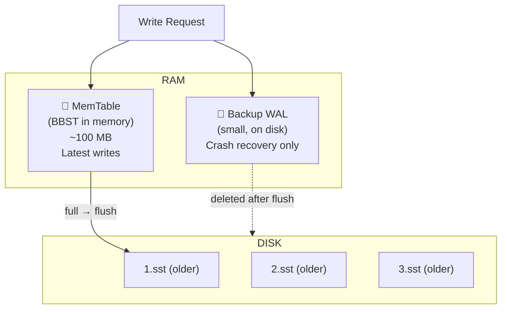
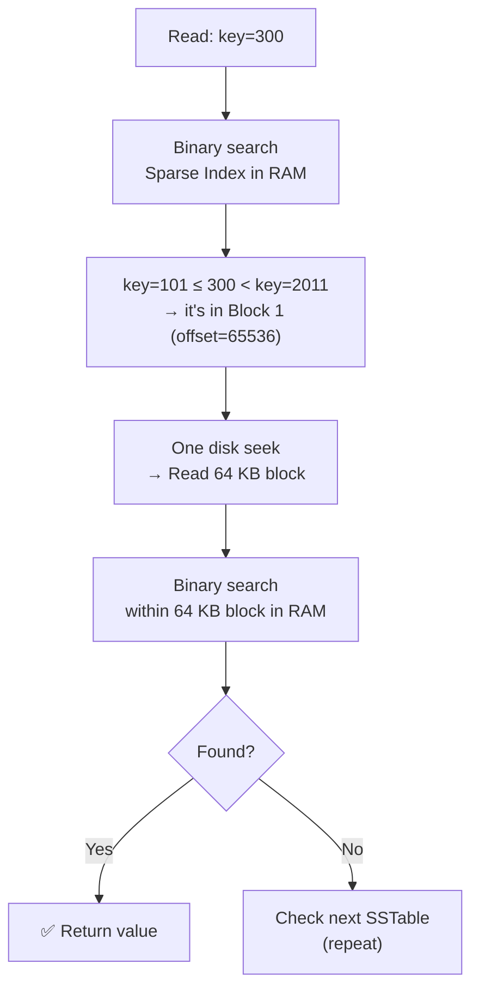
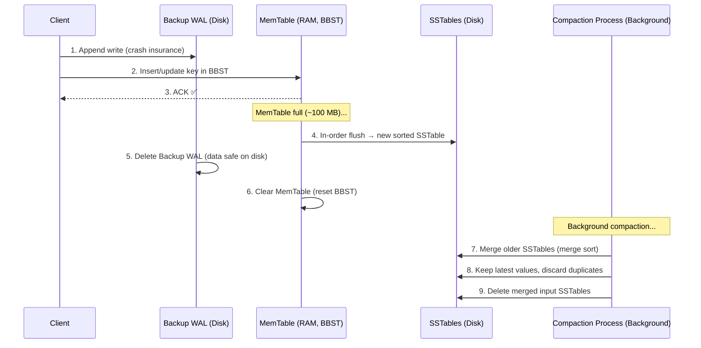
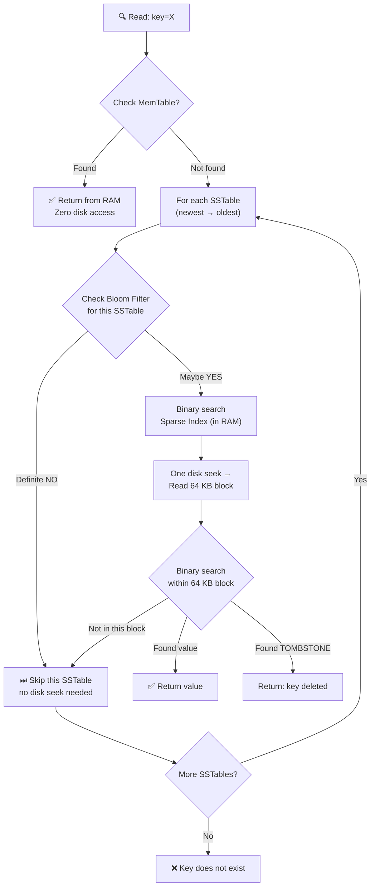

# 🌳 NoSQL Internals: LSM Trees, WAL & Bloom Filters

> **Source:** [HLD Multi Master 11 – YouTube](https://youtu.be/qSMB6nUloNE) by Scaler
> **Lecture Series:** Scaler HLD — Class 11
> **Last Updated:** March 2026
> **Goal:** Understand exactly how NoSQL databases store, retrieve, and manage data on disk — using the exact examples from the lecture.

---

## 📋 Table of Contents

1. [The Problem: Why SQL's Approach Breaks for NoSQL](#1-the-problem-why-sqls-approach-breaks-for-nosql)
2. [Brute Force: Flat File Storage](#2-brute-force-flat-file-storage)
3. [Write-Ahead Log (WAL)](#3-write-ahead-log-wal)
4. [In-Memory Hashmap: Key → Offset](#4-in-memory-hashmap-key--offset)
5. [MemTable: Latest Chunk in Memory](#5-memtable-latest-chunk-in-memory)
6. [SSTables: Sorted String Tables](#6-sstables-sorted-string-tables)
7. [Full Dry Run: Keys 1–5](#7-full-dry-run-keys-15)
8. [LSM Tree: The Full Architecture](#8-lsm-tree-the-full-architecture)
9. [Sparse Index: Memory-Efficient Lookup](#9-sparse-index-memory-efficient-lookup)
10. [Bloom Filters: Skip Unnecessary Reads](#10-bloom-filters-skip-unnecessary-reads)
11. [Tombstones: How Deletion Works](#11-tombstones-how-deletion-works)
12. [Full Read & Write Flow](#12-full-read--write-flow)
13. [Summary Cheat Sheet](#13-summary-cheat-sheet)

---

## 1. The Problem: Why SQL's Approach Breaks for NoSQL

### SQL: Fixed Schema → Safe In-Place Updates

In SQL, every column has a known **data type** and every table has a **fixed schema**. Because the size of every row is exactly known, you can safely update values in-place.

```
SQL Table: users
  Column: id    → BIGINT  (8 bytes)
  Column: name  → VARCHAR(50)
  Row size = 58 bytes, always.

Row 1:  id=20, name="nikl"        → 58 bytes exactly
Row 2:  id=5,  name="nl"          → 58 bytes exactly

Update: "nikl" → "nikl abra"
  Still fits in VARCHAR(50) → overwrite safely. ✅
  Size does not change.
```

SQL uses **B+ Trees** internally:
- Every node in the B+ tree is exactly **one disk block** in size
- Tree height = `log(N)` → reading/writing = `log(N)` disk seeks
- Safe because row size is fixed — no overflow risk when updating

### NoSQL: Variable-Size Data → In-Place Updates Are Dangerous

In a NoSQL document or key-value store, sizes are arbitrary:

```
Key   → any string (variable length)
Value → any string / JSON (variable length)
```

**From the lecture — the exact example:**

```
Disk layout:
  [Doc ID=10  |  { "name": "someone" }   ]  ← 100 bytes at offset 0
  [Doc ID=30  |  { "name": "N" }         ]  ← 80 bytes at offset 104

Update Doc ID=10:
  New value: { "name": "someone", "favorite_color": "red" }
  New size = 140 bytes > original 100 bytes

  If we blindly overwrite:
  → 40 bytes overflow into Doc ID=30's space ❌
  → Doc ID=30 data is CORRUPTED
```

**Two bad options when data grows:**

| Option | What Happens | Why It's Bad |
|---|---|---|
| Overwrite in-place (carelessly) | New data bleeds into the adjacent document | **Data corruption** |
| Split document across disk | Doc stored in multiple non-contiguous locations | **Fragmentation → multiple disk seeks** |

> *"The only safe solution for variable-size data: never update in-place. Just append at the end."* — Instructor

**Why disk seeks are expensive:**

```
Hard Disk Architecture:
  ┌────────────────────────────────────────┐
  │  Read/Write Head (physical arm)        │
  │         ┌──────────────────┐           │
  │         │   Spinning Disk  │ ← 6800 RPM│
  │         │  ●─────────────► │           │
  │         └──────────────────┘           │
  │   Track = one ring on the disk         │
  └────────────────────────────────────────┘

  Sequential read:  Disk spins, head stays → FAST ✅
  Changing track:   Head physically moves  → 100ms+ ❌
  (Called a "disk seek")
```

> Even for SSDs — sequential I/O is ~100x faster than random I/O. This holds for pretty much any memory model.

**NoSQL Design Goals (from lecture):**
- Optimise for **heavy write loads** (SQL is slow at writes due to B-tree overhead)
- Never corrupt adjacent data when values change size
- Avoid fragmentation (avoid multiple disk seeks per read)

---

## 2. Brute Force: Flat File Storage

**Approach:** Write key-value pairs sequentially to a flat file.

```
file.db (flat file on disk, variable-size entries):
  ──────────────────────────────────────────────────────
  key=001  value="V Prasad"    ← 100 bytes, offset=0
  key=002  value="N"           ← 50 bytes,  offset=100
  key=100  value="Bit"         ← 60 bytes,  offset=150
  key=060  value="Bishujit"    ← 40 bytes,  offset=210
  key=030  value="Shashank"    ← 50 bytes,  offset=250
  ──────────────────────────────────────────────────────
```

| Operation | Performance | Reason |
|---|---|---|
| Read key=60 | O(N) | Must linearly scan the entire file |
| Write/Update key=60 | O(N) + dangerous | Scan to find it, then overwrite risks corruption |

**Adding Append-Only Writes:**

Instead of updating in-place, just **append** a new entry. If key=060 changes to "Shashank":

```
file.db (append-only):
  key=001  value="V Prasad"
  key=002  value="N"
  key=100  value="Bit"
  key=060  value="Bishujit"    ← old entry, still here
  key=030  value="Shashank"
  key=060  value="Shashank"    ← NEW entry appended at the end ✅

  → To read: scan from BOTTOM TO TOP, first hit = most recent value
```

| Operation | Performance | Notes |
|---|---|---|
| Write | **O(1)** | Sequential append — no disk seek ✅ |
| Read  | O(N) | Still a linear scan (bottom to top) ❌ |
| Duplicates | Accumulate | Both "Bishujit" and "Shashank" are on disk |

---

## 3. Write-Ahead Log (WAL)

Every database — especially NoSQL — maintains a **Write-Ahead Log (WAL)**: a purely **append-only file on disk** that records every change ever made.

```
WAL File (on disk, append-only):
  ────────────────────────────────────────────────────
  SET  key=001  value="V Prasad"
  SET  key=002  value="N"
  SET  key=060  value="Bishujit"
  SET  key=060  value="Shashank"   ← update appended, not overwritten
  DEL  key=030
  ────────────────────────────────────────────────────
  ← only appends; existing entries NEVER changed
```

### Why WAL Exists

| Use Case | How WAL Helps |
|---|---|
| **Crash Recovery** | On restart, replay the WAL to restore any in-memory state that was lost |
| **Replication** | Slave asks the master: "What changed in the WAL?" and applies those changes |
| **Point-in-Time Recovery** | Keep 7–30 days of WAL → restore the database to any exact moment in the past |
| **DB Backups** | Back up WAL periodically; prune old sections after backup is confirmed |

### WAL Properties

- Stored **on disk** — survives power failures
- **Immutable** — existing entries never changed; only new entries appended
- Any entry once written to WAL **stays there** until explicitly purged
- Used by: Cassandra, PostgreSQL, SQLite, RocksDB, LevelDB

> **WAL ≠ Database Snapshot.** The database stores the *current state*. WAL stores the *entire event history* of all changes.

---

## 4. In-Memory Hashmap: Key → Offset

**Problem:** Reads are still O(N) — scanning the whole WAL to find a key.

**Solution:** Maintain an **in-memory hashmap** that maps every key to its **byte offset** in the WAL file.

```
    WAL File (on disk)                  Hashmap (in RAM)
  ────────────────────────────────    ────────────────────────────
  offset=0:   001 → "V Prasad"       001  →  offset 0
  offset=100: 002 → "N"              002  →  offset 100
  offset=150: 100 → "Bit"            100  →  offset 150
  offset=210: 060 → "Bishujit"       060  →  offset 310  ← updated to latest
  offset=250: 030 → "Shashank"       030  →  offset 250
  offset=310: 060 → "Shashank"
  ────────────────────────────────
```

```python
def read(key):
    offset = hashmap[key]              # O(1) — RAM lookup
    buffer = file.read(n, offset)      # One disk seek to exact location
    key, value = parse(buffer)
    return value

def write(key, value):
    offset = wl.current_size           # End of WAL file
    wl.append(key, value)              # O(1) — sequential append, no seek
    hashmap[key] = offset              # O(1) — update RAM hashmap
```

**Why can't we just update in-place?**

```
WAL has:  [060 | "Bishujit" | 40 bytes]  [030 | "Shashank" | 50 bytes]

We want:  [060 | "Shashank" | 50 bytes]

"Shashank" (8 chars) doesn't fully fit in "Bishujit"'s (8 chars) space
because "Bishujit" was only 40 bytes — the value "Shashank" might need 50 bytes.
If it overflows, it corrupts "030 | Shashank" right after it. ❌

Rule: NEVER overwrite. ALWAYS append.
```

**Performance:**
- Writes: **O(1)** — append to WAL + hashmap update
- Reads: **O(1)** — hashmap lookup + one disk seek

### 🚨 Big Problem: Hashmap Gets Too Large

With **billions or trillions of keys**, the hashmap won't fit in RAM.

```
1 billion keys × (avg key 50 bytes + offset 8 bytes) ≈ 58 GB hashmap

Typical server RAM: 32–256 GB (shared with everything else)
→ Trillions of keys? Impossible.
→ Putting hashmap on disk? Makes reads slow again. ❌
```

> *"If you have trillions of keys and you put the hashmap on disk — life becomes slow again."* — Instructor

---

## 5. MemTable: Latest Chunk in Memory

**Big Idea:** Instead of one giant WAL file, split it into **chunks**. Store the **latest (current) chunk in memory** as a structured in-memory buffer called the **MemTable**.



### Why Balanced BST (BBST) — Not a Hashmap?

| Data Structure | Read/Write | Sorted Output When Dumped? | Space Waste |
|---|---|---|---|
| **Hashmap** | O(1) | ❌ No — flat unordered file, reads become O(N) | High (empty slots) |
| **Balanced BST** | O(log N) | ✅ Yes — in-order traversal is automatically sorted | Minimal (just pointers) |

> **MemTable = Balanced Binary Search Tree (Red-Black Tree / AVL Tree / Skip List) in memory.**

```
MemTable (RAM, BBST):

           key=3 (value=Y)
          /               \
     key=1 (val=W)     key=5 (val=C)
          \
       key=2 (val=X)

In-order traversal → [key=1, key=2, key=3, key=5]  ← sorted ✅
Flush to disk        → SSTable is automatically sorted ✅
```

### MemTable Write Flow

```
Write request: SET key=3, value=X

Step 1: Append to Backup WAL on disk (crash recovery insurance)
        backup.wal:  | ... | SET key=3 value=X |

Step 2: Insert/Update key=3 in the BBST (in memory)
        No duplicates — existing node updated directly.

Step 3: ACK client ✅  (ultra fast — all in memory)
```

### MemTable as Read Cache

The MemTable is the **hottest read cache** in the system:
- Recently written data is also often recently read
- If key is in MemTable → return from RAM, **zero disk access**

```
Read key=3:
  ① Check MemTable → FOUND (key=3 → X) → return X ✅  (microseconds)

Read key=060 (old data, not in MemTable):
  ① Check MemTable → NOT FOUND
  ② Must look in SSTables on disk (covered in Section 9)
```

### When MemTable is Full → Flush to Disk

When MemTable exceeds the configured threshold (~100 MB):

```
MemTable FULL → flush in-order traversal → new SSTable file on disk
             → delete Backup WAL (data safely persisted)
             → clear MemTable (reset)
             → begin new empty MemTable + new Backup WAL
```

Because MemTable was a BBST, its in-order dump is **automatically sorted**.

---

## 6. SSTables: Sorted String Tables

When the MemTable flushes, it creates an **SSTable (Sorted String Table)**: an immutable, sorted file on disk. These are no longer called "WAL chunks" — they have their own name because they are sorted and serve a different purpose.

```
SSTable File (on disk, immutable):
  ──────────────────────────────────────────────
  key=1  →  value=A
  key=2  →  value=B
  key=3  →  value=C
  ──────────────────────────────────────────────

  ✅  Sorted by key (from in-order BBST dump)
  ✅  No duplicates WITHIN this file
  ✅  Immutable — never modified after creation
  ✅  Binary search possible (sorted!)
  ❌  Duplicates CAN exist ACROSS different SSTable files
```

### Multiple SSTables Over Time

As writes continue, MemTable fills and flushes repeatedly (from the lecture's dry run):

```
Disk:
  1.wl  [key=1→A, key=2→B, key=3→C]            ← oldest flush
  2.wl  [key=1→X, key=4→D, key=5→C, key=2→W]   ← second flush (sorted)
  3.wl  [key=1→Y, key=2→W, key=3→X]            ← newest flush

MemTable (RAM, current):
         { key=2→X, key=3→Y, key=1→W }          ← latest writes

Observation: key=1 appears in ALL three places.
             Most recent = latest SSTable or MemTable.
```

### Background Compaction

A background process periodically merges older SSTables using **merge sort**:

```
Before compaction:
  1.wl  [key=1→A, key=2→B, key=3→C]
  2.wl  [key=1→X, key=4→D, key=5→C, key=2→W]

Compaction (merge sort, keep latest value for duplicates):
  key=1: both files have it → keep latest (2.wl) → 1→X
  key=2: both files have it → keep latest (2.wl) → 2→W
  key=3: only 1.wl                              → 3→C
  key=4: only 2.wl                              → 4→D
  key=5: only 2.wl                              → 5→C

XL1.sst: [key=1→X, key=2→W, key=3→C, key=4→D, key=5→C]
Delete 1.wl and 2.wl. Update hashmap. ✅
```

> ⚠️ **Tuning Compaction is Critical in Production.**
> When deploying Cassandra or any LSM-based store, poorly tuned compaction directly hurts performance.
> Tune: chunk size, compaction frequency, time of day (run during lowest traffic — e.g., 3 AM).

---

## 7. Full Dry Run: Keys 1–5

This is the exact dry run from the lecture. Chunk size = 3 (MemTable can hold 3 key-value pairs).

**Initial State:**

```
Disk (SSTables):
  1.wl: [1→A, 2→B, 3→C]       ← oldest
  2.wl: [1→X, 4→D, 5→C]       ← second  (note: 2→W and others)
  3.wl: [1→Y, 2→W, 3→X]       ← newest

MemTable (RAM, BBST): empty

Hashmap (RAM):
  key=1 → "3.wl"   (latest location for key=1)
  key=2 → "3.wl"
  key=3 → "3.wl"
  key=4 → "2.wl"
  key=5 → "2.wl"

Backup WAL (disk): empty
```

---

**Operation: WRITE key=3, value=X**

```
① Append to Backup WAL:   backup.wal → | SET 3=X |
② Update MemTable (BBST): key=3 → X
③ ACK client ✅

MemTable now: { key=3 → X }
```

---

**Operation: READ key=1**

```
① Check MemTable → key=1 NOT in MemTable
② Look at Hashmap → key=1 → "3.wl"
③ 3.wl is sorted → binary search for key=1 → FOUND: value=Y ✅

Return: Y
```

---

**Operation: WRITE key=3, value=Y**

```
① Append to Backup WAL:   backup.wal → | SET 3=X | SET 3=Y |
② Update MemTable (BBST): key=3 → Y   (updates the node, no duplicate)
③ ACK client ✅

MemTable now: { key=3 → Y }
```

---

**Operation: WRITE key=2, value=X**

```
① Append to Backup WAL.
② Insert key=2→X into MemTable BBST.
③ ACK client ✅

MemTable now: { key=2→X, key=3→Y }
```

---

**Operation: READ key=2**

```
① Check MemTable → key=2 FOUND → return X ✅
   (No disk access at all — pure RAM speed)
```

---

**Operation: WRITE key=1, value=W**

```
① Append to Backup WAL.
② Insert key=1→W into MemTable.
③ ACK client ✅

MemTable now: { key=1→W, key=2→X, key=3→Y }  ← FULL (chunk size = 3)
```

---

**MemTable Full → Flush**

```
MemTable BBST in-order traversal: [1→W, 2→X, 3→Y]  ← sorted automatically

Flush to disk as 4.wl: [key=1→W, key=2→X, key=3→Y]

Update Hashmap:
  key=1 → "4.wl"   (was "3.wl")
  key=2 → "4.wl"   (was "3.wl")
  key=3 → "4.wl"   (was "3.wl")
  key=4 → "2.wl"   (unchanged)
  key=5 → "2.wl"   (unchanged)

Clear MemTable → empty BBST
Delete Backup WAL → create new empty one
```

---

**Background Compaction: 1.wl + 2.wl + 3.wl → XL1.sst**

```
Merge 1.wl, 2.wl, 3.wl using merge sort, keep latest:

  key=1: present in all three → latest is 3.wl → 1→Y
  key=2: present in 1.wl, 3.wl → latest is 3.wl → 2→W
  key=3: present in 1.wl, 3.wl → latest is 3.wl → 3→X
  key=4: only in 2.wl → 4→D
  key=5: only in 2.wl → 5→C

XL1.sst: [key=1→Y, key=2→W, key=3→X, key=4→D, key=5→C]

Delete 1.wl, 2.wl, 3.wl.
Update Hashmap:
  key=1 → "XL1.sst"   (was "3.wl", defer to 4.wl if needed)
  key=2 → "XL1.sst"
  ...

Final disk state:
  XL1.sst: [1→Y, 2→W, 3→X, 4→D, 5→C]   ← compacted
  4.wl:    [1→W, 2→X, 3→Y]              ← most recent flush
```

---

## 8. LSM Tree: The Full Architecture

Multiple levels of SSTables, growing in size as they get compacted downward, form a **Log-Structured Merge Tree (LSM Tree)**.

```
                    ┌──────────────────────────────────┐
                    │      MemTable  (RAM, BBST)        │  ← ALL writes go here
                    │      ~100 MB                      │
                    └─────────────────┬────────────────┘
                                      │ flush when full
                    ┌─────────────────▼────────────────┐
    Level 0         │  sst1  sst2  sst3  sst4          │  ← small, ~100 MB each
    (disk)          │  sorted, may have overlapping keys│
                    └─────────────────┬────────────────┘
                                      │ compaction (merge sort)
                    ┌─────────────────▼────────────────┐
    Level 1         │      sst_A          sst_B        │  ← larger, ~200–500 MB
    (disk)          │      sorted, non-overlapping      │
                    └─────────────────┬────────────────┘
                                      │ compaction
                    ┌─────────────────▼────────────────┐
    Level 2         │             sst_XL               │  ← largest, 1 GB+
    (disk)          │         fully de-duplicated       │
                    └──────────────────────────────────┘

    WAL (disk):         only for MemTable crash recovery
                        deleted after each MemTable flush
```

**Complexity:**
- **Write: O(1)** — append to backup WAL + BBST insert in MemTable
- **Read: O(log N)** — MemTable check + linear scan over small # of SSTables + binary search per SSTable
- **Number of SSTables** is always small (O(log N)) because compaction keeps merging them

> *"The number of SS tables is kept small by the compaction process — it's order log(N)."* — Instructor

---

## 9. Sparse Index: Memory-Efficient Lookup

**Problem:** The hashmap storing `key → SSTable name` has one entry per unique key. With billions of keys this is enormous and won't fit in RAM.

**Solution:** For each SSTable, keep a **Sparse Index** in memory — store only the **first key of every 64 KB block**, not every key.

### Building the Sparse Index (from the lecture's exact example)

```
SSTable on disk (1 GB, sorted):

  Block 0  (offset=0,       64 KB): key=0    ... key=100
  Block 1  (offset=65536,   64 KB): key=101  ... key=2010
  Block 2  (offset=131072,  64 KB): key=2011 ... key=5000
  ...
  Block 16383 (last block,  64 KB): key=...  ... key=N

Sparse Index (in RAM, for this one SSTable):
  ┌─────────────────────────────────────────┐
  │  key=0    → offset 0                   │
  │  key=101  → offset 65,536              │
  │  key=2011 → offset 131,072             │
  │  ...                                   │
  └─────────────────────────────────────────┘
```

**How many entries?**

```
Total chunks = 1 GB / 64 KB = 2^30 / 2^16 = 2^14 ≈ 16,000 chunks

Average key size = 64 bytes
Sparse Index size = 16,000 × 64 bytes ≈ 1 MB

vs. full key index for all values in 1 GB → ~100 MB or more

→ 1000× reduction in memory! 🎉
```

> *"If this SS table is 1 GB, this sparse index is only 1 MB — a 1000x reduction!"* — Instructor

### Reading with Sparse Index (2-Step Binary Search)

**Example: Read key=300**

```
Step 1: Binary search the Sparse Index (in RAM — very fast):
        Entries: key=0(offset=0), key=101(offset=65536), key=2011(offset=131072)

        key=101 ≤ 300 < key=2011
        → key=300 must be in Block 1, starting at offset=65536

Step 2: One disk seek to offset=65536
        Read the 64 KB block into RAM

Step 3: Binary search within the 64 KB block (in RAM):
        Block 1: [key=101, key=150, key=200, key=300, key=400...]
        → Found: key=300 → return value ✅

Total cost: 1 disk seek per SSTable checked
```

> *"Reading a 64 KB block = 1 disk seek. 64 KB is exactly one track on a spinning disk — the most efficient read possible."*

**If key=300 is not in this SSTable:**
→ Move to the next SSTable's sparse index and repeat

The number of SSTables to check = small (O(log N)) due to compaction.



---

## 10. Bloom Filters: Skip Unnecessary Reads

**Problem:** If a read request arrives for a key that **doesn't exist**, we still scan all SSTable sparse indexes and do a disk seek per SSTable — only to find nothing. Wasted work.

**Solution:** A **Bloom Filter** — a probabilistic, fixed-size bit array that tells you, with high probability, whether a key was ever inserted.

### Bloom Filter Guarantees

```
If key IS present     → ALWAYS returns TRUE   (zero false negatives) ✅
If key IS NOT present → returns FALSE (mostly) ✅
                        with small probability returns TRUE (false positive) ⚠️
                        → tunable rate (e.g., 1%)
```

> *"In case of a set or hashmap, as you insert more data, the size will grow. In case of a bloom filter, the size does not change at all. That is magic."* — Instructor

### How a Bloom Filter Works — The Exact Lecture Example

**Setup:**

```
Bloom Filter = bit array of size M=12, all zeros initially:

  [ 0  0  0  0  0  0  0  0  0  0  0  0 ]
    0  1  2  3  4  5  6  7  8  9  10  11

K = 3 hash functions: h1, h2, h3
```

---

**INSERT "Nikl":**

```
h1("Nikl") = 2  → set bit[2] = 1
h2("Nikl") = 3  → set bit[3] = 1
h3("Nikl") = 9  → set bit[9] = 1

[ 0  0  1  1  0  0  0  0  0  1  0  0 ]
         ↑  ↑              ↑

Did the size of the bloom filter change? ❌ No.
Size is always M=12, regardless of how many keys we insert.
```

---

**INSERT "Vishal":**

```
h1("Vishal") = 2  → bit[2] already 1 (no change)
h2("Vishal") = 5  → set bit[5] = 1
h3("Vishal") = 11 → set bit[11] = 1

[ 0  0  1  1  0  1  0  0  0  1  0  1 ]
```

---

**CHECK "V Prasad" (never inserted): h → {1, 3, 7}**

```
bit[1] = 0 → IMMEDIATE: "V Prasad" DEFINITELY NOT present ✅

→ Skip this SSTable entirely — no disk seek needed! 🎉
```

---

**CHECK "Abhishek" (never inserted): h → {3, 9, 11}**

```
bit[3] = 1 ✓
bit[9] = 1 ✓
bit[11]= 1 ✓
→ All bits set → Bloom Filter says "MAYBE EXISTS" ⚠️

→ Must search the SSTable → key not found → FALSE POSITIVE
  (Rare, tunable to ≤1%)
```

### False Positive Formula

```
P(false positive) ≈ (1 - e^(-k·n/m))^k

Where:
  k = number of hash functions
  n = number of keys inserted
  m = number of bits in the filter

From the lecture's calculator demo:
  n = 1,000,000,000  (1 billion keys)
  k = 7 hash functions
  m = 1 GB = 8 × 10^9 bits (approximately)

  → False positive rate ≈ 1%

vs. storing 1 billion keys explicitly:
  1 billion × 100 bytes/key = 100 GB ← won't fit in RAM ❌
  Bloom filter: just 1 GB ← trivially manageable ✅
```

### CDN Use Case (Akamai / Cloudflare) — From the Lecture

> *"70% of URLs on the internet are only visited once. CDNs like Akamai cache a URL only after it has been visited twice."*

```
Problem:
  To know if a URL was seen before → need to store all seen URLs
  Trillion URLs × 500 bytes/URL average = 500 TB ← impossible as hashmap ❌

Solution with Bloom Filter:
  First visit → insert URL into bloom filter (don't cache yet)
  Second visit → bloom filter says "seen before" → cache it ✅

  Bloom filter stores 1 trillion URL presence checks in:
  Just a few GB (with ~1% false positive rate) ✅

  Savings: 500 TB → a few GB  (massive reduction!)
```

---

## 11. Tombstones: How Deletion Works

**Problem:** SSTables are immutable — you can't remove an entry from them. And Bloom Filters **never forget** — once a key's bits are set, you cannot unset them.

**How do you delete a key?**

### Deletion = Write a Tombstone

A **tombstone** is a special sentinel value meaning "this key has been deleted":

```
DELETE key=060

Step 1: Write a tombstone to MemTable:
        MemTable: key=060 → TOMBSTONE

Step 2: Tombstone flushes to SSTable like any normal write:
        sst_X: [..., key=060 → TOMBSTONE, ...]

Step 3: On read — if tombstone found:
        value = TOMBSTONE → return "key not found" to client
```

### Why Not Delete Directly from SSTable?

```
SSTable is immutable. You cannot remove an entry.

What if you just delete from the MemTable and don't add a tombstone?
  Next read for key=060:
    ① Not in MemTable (just deleted)
    ② Bloom Filter: says "maybe exists" (it will always say this!)
    ③ Must scan ALL SSTables — wastes a lot of I/O just to find nothing ❌
```

### Why Not Delete from the Bloom Filter?

```
Bloom Filter has NO delete operation. It's a one-way door.

"Bloom filter never forgets."  — Instructor

When key=060 was first written → bits 2, 5, 11 were set (for example).
Even after deleting key=060 → those bits stay set.
The Bloom Filter will ALWAYS say "key=060 maybe exists".

With tombstone:
  Bloom filter says "maybe" → seek into newest SSTable
  → Find TOMBSTONE immediately → return "not found" ✅
  → No need to check older SSTables!
```

### Tombstone During Compaction

```
Before compaction:
  sst1 (older): key=060 → "Bishujit"    ← original value
  sst2 (newer): key=060 → TOMBSTONE     ← delete marker

Compaction (keep latest):
  key=060 → TOMBSTONE   ← "Bishujit" discarded

  much later (after tombstone fully propagated across all nodes):
  key=060 entry removed entirely → true physical deletion
```

---

## 12. Complete Read & Write Flow

### Write Flow



### Read Flow



### Performance Summary

| Operation | Complexity | Detail |
|---|---|---|
| **Write** | **O(1)** | Append to backup WAL + BBST insert in MemTable |
| **Read (hit MemTable)** | O(log N_mem) | BBST lookup — tiny structure, essentially free |
| **Read (hit SSTable)** | O(log N) | Bloom filter → sparse index → 1 disk seek per SSTable |
| **Read (key absent)** | Near O(1) | Bloom filter eliminates almost all SSTable checks |
| **Delete** | O(1) | Write tombstone — same as a normal write |

---

## 13. Summary Cheat Sheet

```
┌──────────────────────────────────────────────────────────────────────────┐
│          NoSQL Internals — LSM Tree Architecture at a Glance             │
├──────────────────────┬───────────────────────────────────────────────────┤
│ Component            │ Summary                                           │
├──────────────────────┼───────────────────────────────────────────────────┤
│ WAL                  │ Append-only log on disk. Crash recovery,          │
│ (Write-Ahead Log)    │ replication, point-in-time recovery.              │
│                      │ Immutable. Deleted after each MemTable flush.     │
├──────────────────────┼───────────────────────────────────────────────────┤
│ MemTable             │ BBST in RAM. Absorbs ALL writes. Acts as read     │
│                      │ cache. No duplicates. In-order dump = sorted.     │
│                      │ Flushed to SSTable when full (~100 MB).           │
├──────────────────────┼───────────────────────────────────────────────────┤
│ SSTable              │ Sorted String Table. Immutable sorted file on     │
│ (Sorted String Table)│ disk. No duplicates within one file. Created      │
│                      │ from MemTable flush. Never appended to again.     │
├──────────────────────┼───────────────────────────────────────────────────┤
│ LSM Tree             │ Multi-level hierarchy of SSTables. Small at top,  │
│ (Log-Structured      │ large merged files at bottom. Compaction keeps    │
│  Merge Tree)         │ SSTable count at O(log N).                        │
├──────────────────────┼───────────────────────────────────────────────────┤
│ Compaction           │ Background merge of SSTables via merge sort.      │
│                      │ Keeps latest value per key. Removes duplicates.   │
│                      │ Critical to tune in production (timing, size).    │
├──────────────────────┼───────────────────────────────────────────────────┤
│ Sparse Index         │ Per-SSTable in-memory index. Stores first key of  │
│                      │ every 64 KB block. 1 GB SSTable → 1 MB index.    │
│                      │ Enables: binary search sparse index → 1 disk seek │
├──────────────────────┼───────────────────────────────────────────────────┤
│ Bloom Filter         │ Fixed-size bit array (M bits, K hash functions).  │
│                      │ Zero false negatives. ~1% false positive rate.    │
│                      │ 1 billion keys → 1 GB filter. Skips disk reads   │
│                      │ for absent keys. Size NEVER grows on insert.      │
├──────────────────────┼───────────────────────────────────────────────────┤
│ Tombstone            │ Special delete marker value.                      │
│                      │ DELETE key → write(key, TOMBSTONE).               │
│                      │ Needed because: SSTable is immutable,             │
│                      │ Bloom Filter never forgets.                       │
│                      │ Physically removed during later compaction.       │
└──────────────────────┴───────────────────────────────────────────────────┘
```

### Databases That Use LSM Trees (mentioned in lecture)

| Database | LSM Tree | WAL | Bloom Filter | Notes |
|---|---|---|---|---|
| **Apache Cassandra** | ✅ | ✅ | ✅ | Compaction tuning is critical |
| **Amazon DynamoDB** | ✅ | ✅ | ✅ | AWS managed, auto-scaling |
| **RocksDB** | ✅ | ✅ | ✅ | Embedded engine, used inside many DBs |
| **LevelDB** | ✅ | ✅ | ✅ | Google-built library |
| **HBase** | ✅ | ✅ | ✅ | Hadoop ecosystem (Google BigTable inspired) |
| **ScyllaDB** | ✅ | ✅ | ✅ | Cassandra-compatible |
| **SQLite** | ✅ (optional) | ✅ | — | WAL mode for write speed improvement |

---

> 📚 **Related Topics:**
> - [SQL vs NoSQL Ultimate Guide](../SQL%20vs%20NoSQL/SQL_vs_NoSQL_Ultimate_Guide.md)
> - **Assignment from this class:** Bloom Filter implementation
> - **Next class:** Case Study — Designing a Messaging App

---

*Notes based on Scaler HLD Class 11 — [YouTube: HLD Multi Master 11](https://youtu.be/qSMB6nUloNE)*
