# 🗄️ SQL vs NoSQL: The Simplified System Design Guide

> **Last Updated:** February 2026
> **Author:** System Design Study Notes 
> **Goal:** Understand Databases, Sharding, and Orchestrators easily using analogies, flowcharts (Mermaid), and real-world scenarios.

---

## 🗺️ 1. The Big Picture: SQL vs NoSQL

<p align="center">
  
</p>

Choosing the right database is one of the **most critical decisions** in system design. It affects scalability, performance, consistency, developer productivity, and long-term maintainability.

This guide breaks down **SQL (Relational)** and **NoSQL (Non-Relational)** databases in depth, giving you the knowledge needed for both real-world architecture and system design interviews.

---

## 📋 Table of Contents

1. [What is SQL?](#what-is-sql)
2. [What is NoSQL?](#what-is-nosql)
3. [Core Differences at a Glance](#core-differences-at-a-glance)
4. [Deep Dive: Data Model](#deep-dive-data-model)
5. [Deep Dive: Schema Design](#deep-dive-schema-design)
6. [Deep Dive: Scalability](#deep-dive-scalability)
7. [Deep Dive: ACID vs BASE](#deep-dive-acid-vs-base)
8. [Deep Dive: CAP Theorem](#deep-dive-cap-theorem)
9. [Types of NoSQL Databases](#types-of-nosql-databases)
10. [NoSQL Indexing & Query Mechanisms](#nosql-indexing--query-mechanisms)
11. [Column Family DB — Deep Dive](#column-family-db--deep-dive)
12. [Query Language & Flexibility](#query-language--flexibility)
13. [Performance Considerations](#performance-considerations)
14. [SQL Database Limitations](#sql-database-limitations)
15. [Sharding Key Selection Strategies](#sharding-key-selection-strategies)
16. [Distributed Transactions & Cross-Shard Operations](#distributed-transactions--cross-shard-operations)
17. [When to Use SQL](#when-to-use-sql)
18. [When to Use NoSQL](#when-to-use-nosql)
19. [Real-World System Design Examples](#real-world-system-design-examples)
20. [Group Chat Systems Architecture](#group-chat-systems-architecture)
21. [Caching Strategies](#caching-strategies)
22. [Notification System Scaling](#notification-system-scaling)
23. [Hybrid Approaches (Polyglot Persistence)](#hybrid-approaches-polyglot-persistence)
24. [Migration Strategies](#migration-strategies)
25. [Decision Framework Flowchart](#decision-framework-flowchart)
26. [Common Interview Questions](#common-interview-questions)
27. [Summary & Cheat Sheet](#summary--cheat-sheet)
28. [Orchestrators & Managing Hardware](#orchestrators--managing-hardware)
29. [Consistent Hashing & Load Distribution](#consistent-hashing--load-distribution)
30. [Hot Shard Detection & Capacity Planning](#hot-shard-detection--capacity-planning)
31. [Multi-Master Replication & Tunable Consistency](#multi-master-replication--tunable-consistency)
32. [Write-Ahead Logs (WAL)](#write-ahead-logs-wal)
33. [Data Migration Process (Two-Phase)](#data-migration-process-two-phase)
34. [Architecture Evolution Principles](#architecture-evolution-principles)

---

## What is SQL?

**SQL (Structured Query Language)** databases are **relational databases** that store data in **predefined tables** with **rows and columns**. They enforce a strict schema and use SQL as the query language.

### Key Characteristics

| Feature              | Description                                              |
|----------------------|----------------------------------------------------------|
| **Structure**        | Tables with rows and columns                             |
| **Schema**           | Fixed, predefined schema (schema-on-write)               |
| **Relationships**    | Enforced via foreign keys and JOINs                      |
| **Query Language**   | SQL (Structured Query Language)                          |
| **Transactions**     | Full ACID compliance                                     |
| **Data Integrity**   | Strong — constraints, triggers, cascades                 |

### Popular SQL Databases

| Database         | Best Known For                                    |
|------------------|---------------------------------------------------|
| **PostgreSQL**   | Advanced features, extensibility, JSONB support   |
| **MySQL**        | Web applications, widespread adoption             |
| **Oracle DB**    | Enterprise-grade, financial systems               |
| **SQL Server**   | Microsoft ecosystem integration                   |
| **SQLite**       | Embedded, lightweight, mobile/desktop apps        |
| **CockroachDB**  | Distributed SQL, global consistency               |
| **Amazon Aurora** | Cloud-native, MySQL/PostgreSQL compatible        |

### Example: SQL Table Structure

```sql
-- Users Table
CREATE TABLE users (
    id          SERIAL PRIMARY KEY,
    username    VARCHAR(50) UNIQUE NOT NULL,
    email       VARCHAR(100) UNIQUE NOT NULL,
    created_at  TIMESTAMP DEFAULT CURRENT_TIMESTAMP
);

-- Orders Table (relationship via foreign key)
CREATE TABLE orders (
    id          SERIAL PRIMARY KEY,
    user_id     INTEGER REFERENCES users(id) ON DELETE CASCADE,
    product     VARCHAR(100) NOT NULL,
    amount      DECIMAL(10,2) NOT NULL,
    status      VARCHAR(20) DEFAULT 'pending',
    ordered_at  TIMESTAMP DEFAULT CURRENT_TIMESTAMP
);

-- Query with JOIN
SELECT u.username, o.product, o.amount
FROM users u
JOIN orders o ON u.id = o.user_id
WHERE o.status = 'completed'
ORDER BY o.ordered_at DESC;
```

---

## What is NoSQL?

**NoSQL (Not Only SQL)** databases are non-relational databases designed for flexible schemas, horizontal scalability, and specific data model optimizations. They do not require a fixed table structure.

### Key Characteristics

| Feature              | Description                                              |
|----------------------|----------------------------------------------------------|
| **Structure**        | Documents, key-value, columns, or graphs                 |
| **Schema**           | Dynamic / flexible schema (schema-on-read)               |
| **Relationships**    | Typically denormalized; no native JOINs                  |
| **Query Language**   | Database-specific APIs and query languages               |
| **Transactions**     | Varies — eventual consistency to strong consistency      |
| **Data Integrity**   | Application-level enforcement                            |

### Popular NoSQL Databases

| Database         | Type          | Best Known For                                      |
|------------------|---------------|-----------------------------------------------------|
| **MongoDB**      | Document      | Flexible schema, developer experience               |
| **Redis**        | Key-Value     | In-memory caching, real-time data                   |
| **Cassandra**    | Wide-Column   | Write-heavy, time-series, high availability         |
| **DynamoDB**     | Key-Value/Doc | Serverless, AWS integration, auto-scaling           |
| **Neo4j**        | Graph         | Relationship-heavy data, social networks            |
| **HBase**        | Wide-Column   | Hadoop ecosystem, big data                          |
| **Couchbase**    | Document      | Mobile sync, caching + persistence                  |
| **Elasticsearch**| Search Engine | Full-text search, log analytics                     |

### Example: NoSQL Document (MongoDB)

```json
// Single document in "users" collection
{
    "_id": "ObjectId('64a1b2c3d4e5f6g7h8i9j0k1')",
    "username": "john_doe",
    "email": "john@example.com",
    "created_at": "2024-01-15T10:30:00Z",
    "profile": {
        "first_name": "John",
        "last_name": "Doe",
        "age": 30,
        "interests": ["coding", "hiking", "photography"]
    },
    "orders": [
        {
            "order_id": "ORD-001",
            "product": "Laptop",
            "amount": 999.99,
            "status": "completed",
            "ordered_at": "2024-02-10T14:20:00Z"
        },
        {
            "order_id": "ORD-002",
            "product": "Mouse",
            "amount": 29.99,
            "status": "shipped",
            "ordered_at": "2024-03-05T09:15:00Z"
        }
    ]
}
```

```javascript
// MongoDB Query
db.users.find(
    { "orders.status": "completed" },
    { username: 1, "orders.$": 1 }
).sort({ "orders.ordered_at": -1 });
```

---

## Core Differences at a Glance

| Criteria               | SQL (Relational)                 | NoSQL (Non-Relational)                 |
|------------------------|----------------------------------|----------------------------------------|
| **Data Model**         | Relational (tables)              | Document/KV/Column/Graph               |
| **Schema**             | Rigid, predefined                | Flexible, dynamic                      |
| **Scalability**        | Vertical (scale-up)              | Horizontal (scale-out)                 |
| **Transactions**       | ACID                             | BASE (mostly)                          |
| **Query Language**     | SQL (standardized)               | Varies per database                    |
| **Relationships**      | JOINs, Foreign Keys              | Embedded / Denormalized                |
| **Data Integrity**     | Database-enforced                | Application-enforced                   |
| **Best For**           | Complex queries, transactions    | Big data, real-time, flexible structure|
| **Learning Curve**     | Moderate (SQL standard)          | Varies by type                         |
| **Maturity**           | 40+ years                        | ~15 years                              |
| **Community/Tooling**  | Vast, mature                     | Growing rapidly                        |

---

## Deep Dive: Data Model

### SQL: Normalized Relational Model

Data is broken into separate related tables to minimize redundancy.

```
┌──────────────┐     ┌──────────────────┐     ┌──────────────┐
│   USERS      │     │     ORDERS       │     │   PRODUCTS   │
├──────────────┤     ├──────────────────┤     ├──────────────┤
│ id (PK)      │◄────│ user_id (FK)     │     │ id (PK)      │
│ username     │     │ id (PK)          │     │ name         │
│ email        │     │ product_id (FK)  │────►│ price        │
│ created_at   │     │ quantity         │     │ category     │
└──────────────┘     │ total_amount     │     └──────────────┘
                     │ status           │
                     │ ordered_at       │
                     └──────────────────┘

Normalization Levels:
  1NF → No repeating groups
  2NF → No partial dependencies
  3NF → No transitive dependencies
```

**Advantages of Normalization:**
*   No data duplication
*   Easier updates (update in one place)
*   Data integrity via constraints
*   Storage efficient

**Disadvantages:**
*   Complex JOINs for reads
*   Performance overhead at scale
*   Rigid schema changes

### NoSQL: Denormalized Model

Data is stored together as it's accessed, optimizing for read performance.

**User Document (Embedded Data):**
```
┌─────────────────────────────────────────────────────┐
│                  USER DOCUMENT                       │
├─────────────────────────────────────────────────────┤
│ {                                                    │
│   "_id": "user_123",                                │
│   "username": "john_doe",                           │
│   "email": "john@example.com",                      │
│   "profile": {                                      │
│     "name": "John Doe",                             │
│     "avatar": "https://..."                         │
│   },                                                │
│   "orders": [                    ◄── Embedded       │
│     {                                               │
│       "product": {               ◄── Denormalized   │
│         "name": "Laptop",                           │
│         "price": 999.99                             │
│       },                                            │
│       "quantity": 1,                                │
│       "status": "completed"                         │
│     }                                               │
│   ]                                                 │
│ }                                                   │
└─────────────────────────────────────────────────────┘


  → Single read fetches everything needed
  → No JOINs required
  → Data may be duplicated across documents

```
**Advantages of Denormalization:**
*   Faster reads (single query)
*   Simpler queries
*   Better horizontal scalability
*   Flexible schema evolution

**Disadvantages:**
*   Data duplication
*   Harder updates (update in multiple places)
*   Larger storage footprint
*   Potential inconsistency

---

## Deep Dive: Schema Design

### SQL: Schema-on-Write

The schema is defined before writing data. Every row must conform.

```sql
-- Schema is enforced at write time
CREATE TABLE employees (
    id          SERIAL PRIMARY KEY,
    name        VARCHAR(100) NOT NULL,        -- Required
    department  VARCHAR(50) NOT NULL,         -- Required
    salary      DECIMAL(10,2) CHECK (salary > 0),  -- Constraint
    hire_date   DATE NOT NULL,                -- Required
    manager_id  INTEGER REFERENCES employees(id)  -- Self-referencing FK
);

-- This will FAIL ✗
INSERT INTO employees (id, name) VALUES (1, 'Alice');
-- Error: column "department" violates not-null constraint

-- This will SUCCEED ✓
INSERT INTO employees (name, department, salary, hire_date)
VALUES ('Alice', 'Engineering', 95000.00, '2024-01-15');

-- Schema change requires migration
ALTER TABLE employees ADD COLUMN phone VARCHAR(20);
-- All existing rows get NULL for phone
```

**Implications:**
*   ✅ Data quality guaranteed at DB level
*   ✅ Self-documenting structure
*   ❌ Migrations can be slow on large tables
*   ❌ Downtime risk during schema changes

### NoSQL: Schema-on-Read

No enforced schema. The structure is interpreted when reading data.

```javascript
// Document 1 - Full profile
{
    "_id": "emp_001",
    "name": "Alice",
    "department": "Engineering",
    "salary": 95000,
    "hire_date": "2024-01-15",
    "skills": ["Python", "Go", "Kubernetes"]
}

// Document 2 - Different structure, SAME collection ✓
{
    "_id": "emp_002",
    "name": "Bob",
    "dept": "Marketing",           // Different field name!
    "compensation": {              // Nested object instead of flat field
        "base": 75000,
        "bonus": 10000
    },
    "contract_type": "part-time"   // Field doesn't exist in Doc 1
}

// Both documents coexist in the same collection
// Application code must handle variations
```

**Implications:**
*   ✅ Zero-downtime schema evolution
*   ✅ Each document can have unique fields
*   ✅ Rapid prototyping and iteration
*   ❌ Application must handle missing/varied fields
*   ❌ Data quality is the developer's responsibility
*   ❌ Schema validation must be done in code (or optional DB-level validation)

---

## Deep Dive: Scalability

SQL traditionally relies on **Vertical Scaling**: Upgrading the server's CPU, RAM, or Hard Drive. But you eventually reach a hardware limit—you simply can't buy an infinitely powerful server. When you need **Horizontal Scaling** (buying 10,000 standard servers and distributing the data), SQL's ACID guarantees and complex JOIN operations fall apart across multiple servers because querying across different machines is painfully slow.

<p align="center">
  
</p>

### Vertical Scaling (SQL — Scale Up)

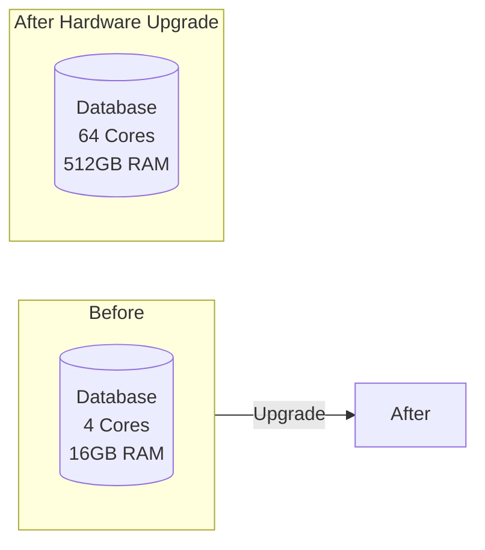

**SQL Read Scaling Options (Replication):**

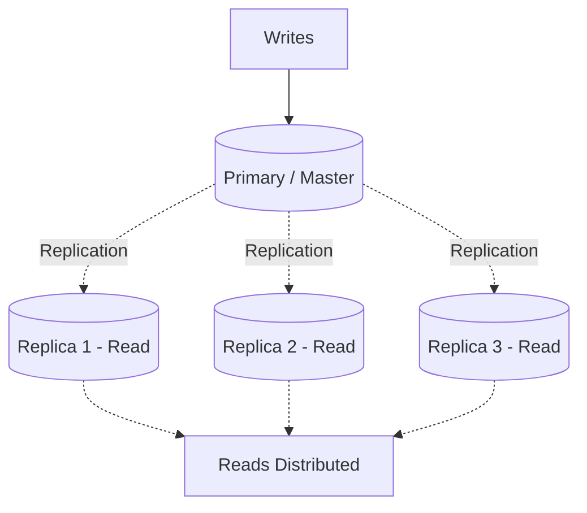

### Horizontal Scaling (NoSQL — Scale Out)

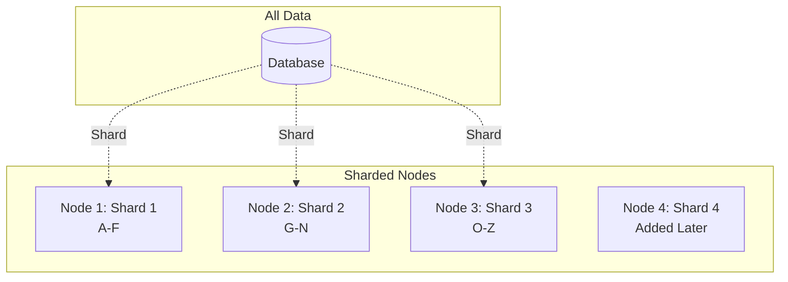

**Sharding Strategies:**
*   **Hash-Based:** `hash(user_id) % num_shards = shard_id`
*   **Range-Based:** A-F → Shard1, G-N → Shard2, etc.
*   **Geographic:** US → Shard1, EU → Shard2, Asia → Shard3

**Scaling Comparison Summary:**

```
Performance
    ▲
    │         NoSQL (horizontal)
    │        ╱
    │       ╱
    │      ╱         SQL (vertical)
    │     ╱         ╱
    │    ╱         ╱
    │   ╱         ╱  ← Hardware ceiling
    │  ╱         ╱ . . . . . . . . .
    │ ╱         ╱
    │╱         ╱
    └──────────────────────────────────► Scale
           Cost & Complexity
```

**Key Insights:**
- **SQL (Vertical):** Performance hits a hardware ceiling. You can't scale beyond the biggest server available.
- **NoSQL (Horizontal):** Performance scales linearly by adding more commodity servers. No hard ceiling.
- **Cost:** SQL breaks exponential cost curve. NoSQL maintains linear cost scaling.

---

## Deep Dive: ACID vs BASE

### ACID (SQL Databases)

```
┌─────────────────────────────────────────────────────────────┐
│                        ACID Properties                       │
├──────────────┬──────────────────────────────────────────────┤
│              │                                               │
│  Atomicity   │  All operations succeed, or ALL roll back.   │
│              │  "All or Nothing"                             │
│              │                                               │
│              │  BEGIN TRANSACTION;                           │
│              │    UPDATE accounts SET bal = bal - 100        │
│              │      WHERE id = 'Alice';                     │
│              │    UPDATE accounts SET bal = bal + 100        │
│              │      WHERE id = 'Bob';                       │
│              │  COMMIT;   ← Both happen, or neither does    │
│              │                                               │
├──────────────┼──────────────────────────────────────────────┤
│              │                                               │
│  Consistency │  Data moves from one valid state to another. │
│              │  All constraints, triggers, cascades hold.   │
│              │                                               │
│              │  Total money before = Total money after      │
│              │  Foreign keys always point to valid records   │
│              │                                               │
├──────────────┼──────────────────────────────────────────────┤
│              │                                               │
│  Isolation   │  Concurrent transactions don't interfere.    │
│              │  Each transaction sees a consistent snapshot. │
│              │                                               │
│              │  Isolation Levels:                            │
│              │    READ UNCOMMITTED (lowest)                  │
│              │    READ COMMITTED                             │
│              │    REPEATABLE READ                            │
│              │    SERIALIZABLE (highest)                     │
│              │                                               │
├──────────────┼──────────────────────────────────────────────┤
│              │                                               │
│  Durability  │  Once committed, data survives crashes.      │
│              │  Written to disk / WAL (Write-Ahead Log).    │
│              │                                               │
│              │  Power failure after COMMIT? Data is safe. ✓ │
│              │                                               │
└──────────────┴──────────────────────────────────────────────┘
```

### BASE (NoSQL Databases)

```
┌─────────────────────────────────────────────────────────────┐
│                        BASE Properties                       │
├──────────────────┬──────────────────────────────────────────┤
│                  │                                           │
│  Basically       │  The system guarantees availability.     │
│  Available       │  Every request gets a response           │
│                  │  (success or failure), even during        │
│                  │  partial system failures.                │
│                  │                                           │
├──────────────────┼──────────────────────────────────────────┤
│                  │                                           │
│  Soft State      │  The state of the system may change      │
│                  │  over time, even without new input,      │
│                  │  due to eventual consistency.            │
│                  │                                           │
│                  │  Node A: balance = $100  ←─┐             │
│                  │  Node B: balance = $200    │ Converging  │
│                  │  Node C: balance = $200  ──┘             │
│                  │                                           │
├──────────────────┼──────────────────────────────────────────┤
│                  │                                           │
│  Eventually      │  Given enough time and no new updates,  │
│  Consistent      │  all replicas will converge to the      │
│                  │  same value.                             │
│                  │                                           │
│                  │  t=0:  Write "balance=200" to Node A     │
│                  │  t=1:  Node A = 200, B = 100, C = 100   │
│                  │  t=2:  Node A = 200, B = 200, C = 100   │
│                  │  t=3:  Node A = 200, B = 200, C = 200 ✓ │
│                  │                                           │
└──────────────────┴──────────────────────────────────────────┘
```

### ACID vs BASE Comparison

```
                ACID                              BASE
          ┌───────────┐                     ┌───────────┐
          │ Strong    │                     │ Eventual  │
          │Consistency│                     │Consistency│
          │           │                     │           │
          │ ✓ Banking │                     │ ✓ Social  │
          │ ✓ Inventory│                    │   media   │
          │ ✓ Healthcare│                   │ ✓ Analytics│
          │           │                     │ ✓ Caching │
          │ Higher    │                     │ Higher    │
          │ Latency   │                     │ Throughput│
          └───────────┘                     └───────────┘
```

**When to Choose:**
*   **ACID:** Banking, Inventory, Healthcare systems (Higher Latency, guaranteed correctness)
*   **BASE:** Social media, Analytics, Caching systems (Higher Throughput, eventual correctness)

---

## Deep Dive: CAP Theorem

The CAP Theorem states that a distributed database can guarantee only **two out of three** properties simultaneously.

```
                          CAP THEOREM
                      (Choose 2 of 3 Properties)

                              ▲
                             ╱│╲
                            ╱ │ ╲
                           ╱  │  ╲
                          ╱   │   ╲
                         ╱    │    ╲
                        ╱  CP │ AP  ╲
                       ╱      │      ╲
                      ╱       │       ╲
                     ╱========●========╲
                    ╱    MongoDB     Cassandra
                   ╱     HBase      DynamoDB
                  ╱  Redis Cluster    CouchDB
                 ╱                          ╲
                ╱____________________________╲
        Consistency                   Availability
                      Partition Tolerance
                      (Always Present!)

⚠️  In distributed systems, network partitions WILL happen.
    You must choose between:
    
    CP: Sacrifice Availability → Reject writes during partition
    AP: Sacrifice Consistency → Serve stale data during partition
    
    CA: Single-node systems only (NOT viable in practice)
```

**CAP Choices Explained:**

```
┌──────────────────────────────────────────────────────────────┐
│  CP: Consistency + Partition Tolerance                       │
├──────────────────────────────────────────────────────────────┤
│  Examples: MongoDB, HBase, Redis (cluster)                  │
│                                                              │
│  Strategy: When network partition occurs, BLOCK writes      │
│  until partition heals. Ensures consistency.                │
│                                                              │
│  Tradeoff: Lower availability during network issues         │
│  Use Case: Financial systems, banking (↑ consistency)       │
└──────────────────────────────────────────────────────────────┘

┌──────────────────────────────────────────────────────────────┐
│  AP: Availability + Partition Tolerance                      │
├──────────────────────────────────────────────────────────────┤
│  Examples: Cassandra, DynamoDB, CouchDB                     │
│                                                              │
│  Strategy: When network partition occurs, ALLOW writes      │
│  on both sides. Data converges when partition heals.        │
│                                                              │
│  Tradeoff: Temporary inconsistency (eventual consistency)   │
│  Use Case: Social media, analytics (↑ availability)         │
└──────────────────────────────────────────────────────────────┘

┌──────────────────────────────────────────────────────────────┐
│  CA: Consistency + Availability (THEORETICAL)               │
├──────────────────────────────────────────────────────────────┤
│  Examples: Traditional RDBMS (single node), SQLite          │
│                                                              │
│  Reality: These are NOT partition tolerant because they     │
│  either crash or cannot replicate across networks.          │
│                                                              │
│  In modern cloud systems, CA doesn't exist in practice!     │
└──────────────────────────────────────────────────────────────┘
```

**⚠️ Important Insight:**

> In a distributed system, network partitions *will* happen. You cannot avoid the P in CAP. Therefore, the real-world choice is **CP vs AP**, not CA.

---

## Types of NoSQL Databases

### 1. Document Stores

*   **Structure:** JSON/BSON documents in collections
*   **Examples:** MongoDB, CouchDB, Firestore
*   **Best For:** Content management systems, User profiles, Product catalogs with varying attributes, Real-time analytics

```json
{ "_id": 1,
  "name": "iPhone 15",
  "specs": { "storage": "256GB" },
  "tags": ["smartphone", "apple"]
}
```

### 2. Key-Value Stores

*   **Structure:** Simple key → value pairs
*   **Examples:** Redis, DynamoDB, Memcached
*   **Best For:** Caching (sessions), Real-time leaderboards, Message queues, Rate limiting

| Key | Value |
| :--- | :--- |
| "user:1001" | "{name:'Alice', age:30}" |
| "cache:homepage" | "\<html>...\</html>" |

### 3. Wide-Column Stores

*   **Structure:** Rows with dynamic columns, grouped by column families. Optimized for writes.
*   **Examples:** Cassandra, HBase, ScyllaDB
*   **Best For:** Time-series data (IoT, metrics), Write-heavy workloads, Event logging

| Row Key | Column Family: "profile" | Column Family: "metrics" |
| :--- | :--- | :--- |
| user:1001 | name:"Alice", email:"a@ex.com" | logins: 452 |
| user:1002 | name:"Bob" | logins: 120 |

### 4. Graph Databases

*   **Structure:** Nodes (entities) + Edges (relationships)
*   **Examples:** Neo4j, Amazon Neptune
*   **Best For:** Social networks, Fraud detection, Recommendation engines

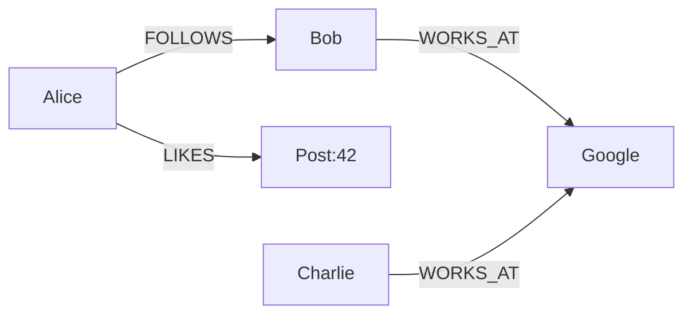

### NoSQL Types Comparison

| Factor | Document | Key-Value | Wide-Column | Graph |
| :--- | :--- | :--- | :--- | :--- |
| **Complexity** | Medium | Simple | Medium | Complex |
| **Query Power** | Rich | Minimal | Moderate | Very Rich |
| **Read Speed** | Fast | Fastest | Fast | Moderate |
| **Write Speed** | Fast | Fastest | Fastest | Moderate |
| **Scalability** | High | Very High | Very High | Moderate |
| **Flexibility** | Very High | Low | High | High |

---

## Query Language & Flexibility

### SQL: Standardized and Powerful

SQL is excellent for complex analytical queries, window functions, and recursive queries (CTEs).

```sql
SELECT 
    d.department_name,
    COUNT(e.id) AS employee_count,
    AVG(e.salary) AS avg_salary
FROM employees e
JOIN departments d ON e.department_id = d.id
WHERE e.status = 'active'
GROUP BY d.department_name
HAVING COUNT(e.id) > 5;
```

### NoSQL: Database-Specific

**MongoDB (Aggregation Pipeline):**
```javascript
db.orders.aggregate([
    { $match: { status: "completed" } },
    { $lookup: { from: "users", localField: "user_id", foreignField: "_id", as: "user" }},
    { $unwind: "$user" },
    { $group: { _id: "$user.country", totalRevenue: { $sum: "$amount" } }}
]);
```

**Redis (Simple KV & Structures):**
```python
redis.set("user:1001:session", session_token, ex=3600)  # TTL
redis.zadd("leaderboard", {"alice": 2500, "bob": 1800}) # Sorted Set
```

**Neo4j (Cypher for Relationships):**
```cypher
MATCH (user:Person {name: "Alice"})-[:FRIEND*1..3]-(fof:Person)
WHERE NOT (user)-[:FRIEND]-(fof) AND user <> fof
RETURN DISTINCT fof.name AS suggestion
```

---

## Performance Considerations

### Read Performance

| Scenario | SQL | NoSQL |
| :--- | :--- | :--- |
| **Simple Lookup** | ~1-5ms (indexed) | ~0.1-1ms (key-value) |
| **Complex Join / Aggregation** | ~50-500ms+ (Depends on JOINs) | ~10-100ms (Aggregation Pipeline) |
| **Full Table/Collection Scan** | ❌ Very slow | ❌ Very slow |
| **Optimizations** | Indexes, Query Planner, Materialized Views | Indexes, Denormalization, Caching |

### Write Performance

| Scenario | SQL | NoSQL |
| :--- | :--- | :--- |
| **Single Write** | ~1-10ms | ~1-5ms |
| **Batch Write (1000)** | ~50-200ms | ~10-50ms |
| **Bottlenecks** | Lock contention, Index maintenance, Constraints | Network limitations, Replication lag, Consistency overhead |

---

## SQL Database Limitations

Understanding SQL's limits helps you know when to reach for NoSQL.

### 1. Rigid Schema Problems

SQL databases enforce a **fixed set of columns per row**, which is great for consistent data but causes problems with highly variable data:

```
E-Commerce Products — Schema Problem:
┌──────────────────┬────────────────┬─────────────────┬──────────────┬──────────┐
│  product_id      │  name          │  screen_size    │  boot_size   │  RAM     │
├──────────────────┼────────────────┼─────────────────┼──────────────┼──────────┤
│  laptop_001      │  MacBook Pro   │  14 inch        │  NULL ← ❌   │  16 GB   │
│  boot_001        │  Hiking Boots  │  NULL ← ❌      │  Size 10     │  NULL ← ❌│
└──────────────────┴────────────────┴─────────────────┴──────────────┴──────────┘

→ Sparse data causes many NULL values → ambiguity (Is NULL "not applicable" or "unknown"?)
→ NoSQL Document DBs solve this: each product document has only its own relevant fields
```

### 2. Thousands of Tables Problem

SQL databases are optimized for **millions to billions of rows in a table**, but *not* for thousands of tables:

> ❌ If your schema requires an unknown or massive number of tables, SQL will behave weirdly and get very slow.

### 3. Sharding Nullifies SQL Advantages

**Sharding is the only solution** for SQL when handling massive data or write traffic — but it destroys what makes SQL special:

| SQL Advantage | What Sharding Does to It |
|:---|:---|
| **JOINs** | Difficult and expensive across shards |
| **Foreign Key constraints** | Unsupported across shards |
| **ACID transactions** | Impossible across shards (distributed transactions needed) |
| **Complex queries** | Require querying all shards and merging results |

> 💡 **Key Insight:** If you need to shard, you're likely better off with NoSQL from the start — it's designed for sharding natively.

---

## NoSQL Indexing & Query Mechanisms

### Document Databases (MongoDB) — Index Internals

```
MongoDB Index Structure (B+ Tree):
┌─────────────────────────────────────────────────────────┐
│              B+ Tree Index on "hashtag"                  │
├──────────────┬──────────────────┬───────────────────────┤
│  Index Key   │  Document Value  │  Document ID (→ shard) │
├──────────────┼──────────────────┼───────────────────────┤
│  "apple"     │  "Apple Inc"     │  doc_001              │
│  "design"    │  "UI Design"     │  doc_004              │
│  "tech"      │  "Technology"    │  doc_003              │
└──────────────┴──────────────────┴───────────────────────┘

→ Query by index key → Get matching Document IDs → Fetch full document
→ MongoDB auto-indexes document ID; other fields need manual index creation
```

**Querying without index = Full Collection Scan** (very slow for large collections!)

```javascript
// Slow: No index on "type" field
db.products.find({ type: "laptop" })

// Fast: After creating index
db.products.createIndex({ type: 1 })
db.products.find({ type: "laptop" })

// Slow: Compound query — needs both index + linear scan
db.messages.find({ group_id: "g123", timestamp: { $gt: "2024-01-01" } })
// → Index finds all docs with group_id="g123" → then linear scan by timestamp
```

> 🔑 **Document databases automatically index every attribute** (MongoDB does for doc ID). Other attributes require **manually created indexes**.

### UUID v4 — Client-Generated IDs

MongoDB's randomly generated UUID v4 allows the client to generate a unique ID **without hitting the database**, enabling massive write scalability:

```python
import uuid

# Generate on the client side — no DB round-trip needed!
new_doc_id = str(uuid.uuid4())  # e.g., "550e8400-e29b-41d4-a716-446655440000"

# Insert without checking for ID collisions
# (collision probability is astronomically low)
db.messages.insert_one({
    "_id": new_doc_id,
    "group_id": "g123",
    "content": "Hello!",
    "timestamp": "2024-06-15T10:30:00Z"
})
```

> ✅ UUID v4 scales to **trillions of documents** without ever needing a centralized ID counter.

---

## Column Family DB — Deep Dive

Column family databases (Cassandra, HBase) organize data in a unique way: **every row can have different columns**, making each row conceptually its own schema.

```
Column Family Database Structure:
┌──────────────────────────────────────────────────────────────────────┐
│  Row Key (Shard Key)  │  Column Family: "messages"                   │
├──────────────────────┼──────────────────────────────────────────────┤
│                      │  timestamp:content pairs (sorted by time)    │
│  group_id_123        │  2024-01-01T10:00 → "Hello!"                 │
│                      │  2024-01-01T10:05 → "How are you?"           │
│                      │  2024-01-01T10:10 → "Great thanks!"          │
├──────────────────────┼──────────────────────────────────────────────┤
│  group_id_456        │  2024-01-02T14:00 → "Meeting at 3pm"         │
│                      │  2024-01-02T14:30 → "Confirmed"              │
└──────────────────────┴──────────────────────────────────────────────┘

→ Sharding is automatic based on Row Key (e.g., group_id)
→ Each row is like a separate table with its own schema
→ Fetching recent K messages = very fast (sorted by timestamp)
```

### Twitter Hashtag Example — Column Family vs Document DB

This is a classic example illustrating why column family databases excel over document stores for certain patterns.

**Option 1 — Document Database (MongoDB):**

```
Problem: Slow compound queries
→ Index on hashtag + linear scan by timestamp = slow
→ For "Popular tweets" (sorted by likes): separate index needed
→ Challenge: Likes update frequently → massive index rewrites
```

**Option 2 — Column Family Database (Cassandra):**

```
Row Key = hashtag (e.g., "#Python")

Column Family: "recent_tweets"
  └─ Key: timestamp → Value: "tweet_content | tweet_id"
  (sorted by timestamp → fetch latest K tweets in O(1))

Column Family: "popular_tweets"
  └─ Key: zero_padded_likes + tweet_content → Value: tweet data
  (e.g., "0000001523 | Hello World" → sorted by likes count!)
  └─ Prefix match query: Get top tweets by likes prefix efficiently

Cron Job (every 10-60 min):
  → Re-insert popular tweets with updated like counts
  → Drop oldest entries if column exceeds 1000 values
```

```
Example Stored Values:
┌──────────────────┬──────────────────────────────────────────────┐
│  Row Key         │  popular_tweets column (sorted)              │
├──────────────────┼──────────────────────────────────────────────┤
│  #Python         │  "0000051234|tweet_abc" → {...}              │
│                  │  "0000023456|tweet_xyz" → {...}              │
│                  │  "0000001001|tweet_pqr" → {...}              │
└──────────────────┴──────────────────────────────────────────────┘
→ Prefix match on "000005" returns all tweets with 5xxx likes
→ Efficient "top tweets" queries without expensive sorts!
```

### Real-World Column Family Use Cases

| App | Row Key | Columns | Pattern |
|:----|:--------|:--------|:--------|
| **Facebook Messenger** | User ID | Timestamp → Message | Fetch recent chat history |
| **Twitter Hashtags** | Hashtag | Timestamp → Tweet | Latest posts per tag |
| **Uber Trip History** | Trip ID | Timestamp → Location | Driver route tracking |
| **IoT Sensors** | Device ID | Timestamp → Reading | Time-series sensor data |

---

## Sharding Key Selection Strategies

Choosing the right sharding key is **the most critical decision** in distributed systems design. A bad sharding key leads to hotspots, uneven load, and cross-shard query nightmares.

### The Golden Rules of Sharding Key Selection

```
Good Sharding Key Criteria:
✅ Even load distribution across shards
✅ Most frequent queries touch only ONE shard
✅ Minimizes cross-shard writes
✅ Avoids hotspots (no single "super popular" key)
✅ Granularity matches data volume (too coarse → hotspots, too fine → overkill)
```

### Example 1: Messaging App (WhatsApp DMs)

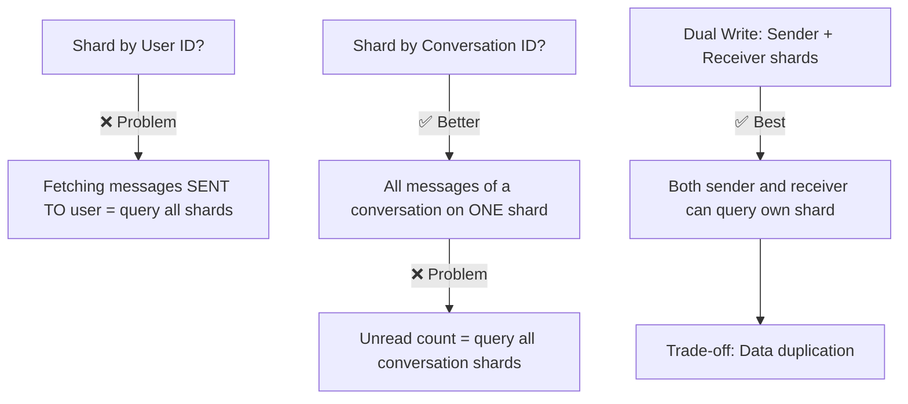

| Approach | ✅ Good For | ❌ Problem |
|:---|:---|:---|
| Shard by User ID | List a user's sent messages | Fetching messages received by user = all shards |
| Shard by Conversation ID | Conversation history | Unread count from many conversations = multiple shards |
| **Dual Write (Both shards)** | Both sender & receiver queries | Data duplication — acceptable trade-off |

### Example 2: Banking System (Transactions)

```
Sharding Key Options:
❌ Account ID    → Too granular; a user with many accounts is spread across shards
❌ City ID       → Users change cities → data migration nightmare + uneven load (big cities = hotspots)
✅ User ID       → Simple balance queries, transaction history all on ONE shard
```

```
Tricky Case: Transferring Money Between Users
  → Sender shard ≠ Receiver shard
  → Requires DISTRIBUTED TRANSACTION (see next section)
  → Solution: Application server acquires locks on both shards, executes, then releases
```

### Example 3: Ride-Sharing App (Uber)

```
Finding Nearby Drivers:
❌ Shard by User ID    → Driver could be anywhere; "find nearby drivers" = query all shards
❌ Shard by Driver ID  → Same problem as User ID
✅ Shard by City ID    → All drivers in Paris are on the Paris shard → one shard query!

Intercity Rides:
→ Only query the SOURCE city shard for drivers
→ Drivers must be AT the source city, not destination

Sharding Granularity:
→ Small cities (population 100K) → one shard for entire city
→ Large cities (Beijing, Mumbai) → multiple shards per city (based on back-of-envelope estimates)
```

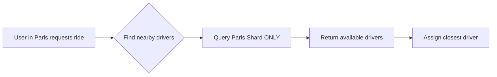

### Example 4: Ticket Booking (IRCTC)

```
Problem: Preventing Double Bookings
❌ Shard by User ID:
  → 2 users book the same train simultaneously
  → Both queries go to different user shards
  → NO coordination between shards → double booking!

❌ Shard by Date:
  → Today's / tomorrow's bookings overload the "date" shard
  → Hot shard problem

✅ Shard by Train ID:
  → All bookings for Train #12301 go to the SAME shard
  → Database handles concurrent booking locks automatically
  → No double booking possible within a shard!
```

**IRCTC Table Architecture (real scale: ~10M bookings/year):**

| Table | Sharding? | Why |
|:---|:---|:---|
| **Bookings** | ✅ Shard by Train ID | ~10M records/year; trains are the hotspot |
| **Users** | ❌ No sharding needed | Relatively small table |
| **Trains** | ❌ No sharding needed | Fixed set of trains |
| **Stations** | ❌ No sharding needed | Small static table |

### Sharding Key Decision Framework

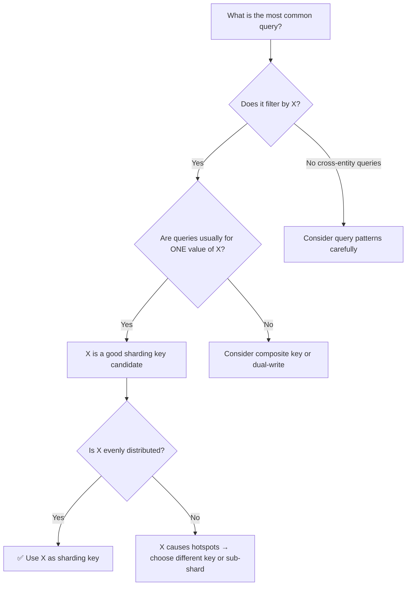

> 💡 **Back-of-Envelope:** Always estimate shard load. If one shard is expected to store 10× more data than others, you have a hotspot problem.

---

## Distributed Transactions & Cross-Shard Operations

### The Problem

When data related to one operation lives on **different shards**, maintaining ACID guarantees becomes the **developer's responsibility** — not the database's.

```
Cross-Shard Transaction Example (Banking):

Shard 1 (Alice's data):           Shard 2 (Bob's data):
┌────────────────────────┐         ┌────────────────────────┐
│  Alice: $1000          │         │  Bob: $500             │
└────────────────────────┘         └────────────────────────┘

Transfer $100 from Alice → Bob:
1. App Server: Lock Alice's row on Shard 1 ← acquire lock
2. App Server: Lock Bob's row on Shard 2   ← acquire lock
3. Deduct $100 from Alice → COMMIT Shard 1
4. Add $100 to Bob → COMMIT Shard 2
5. App Server: Release both locks

⚠️  If Step 4 fails after Step 3 committed → money vanishes!
    Developer must implement rollback logic manually.
```

### Distributed Transaction Approach

```
Two-Phase Commit (2PC):
Phase 1 — PREPARE:
  → Ask all shards: "Can you commit this change?"
  → Each shard locks data and replies YES/NO

Phase 2 — COMMIT (if all YES) / ABORT (if any NO):
  → All shards commit together
  → Or all shards roll back

⚠️  Drawbacks:
  → High latency (multiple network round-trips)
  → Single coordinator failure can leave shards in limbo (blocking protocol)
```

| Aspect | Within a Single Shard | Across Shards |
|:---|:---|:---|
| **Who handles consistency?** | Database (ACID built-in) | ❌ Developer's responsibility |
| **Locking** | DB handles automatically | App server must acquire locks manually |
| **Performance** | Low latency | High latency (network round-trips) |
| **Complexity** | Simple | Very complex — deadlock risk |

> 💡 **Best Practice:** Design your sharding key so that the most critical operations (like bookings, transfers) happen within a **single shard**, avoiding distributed transactions whenever possible.

---

## When to Use SQL

**✅ Choose SQL When:**
1.  **Data Integrity is Critical:** Banking, healthcare, financial transactions (ACID requirements).
2.  **Complex Queries & Reporting:** Business intelligence run aggregations across multiple tables.
3.  **Structured, Predictable Data:** Well-defined entities where schema rarely changes.
4.  **Moderate Scale:** Up to ~10TB or millions of records (not billions).
5.  **Strong Ecosystem Needed:** Mature ORMs, tooling, and huge talent pool.

**Real SQL Use Cases:** E-commerce orders, ERP/CRM, Healthcare records, Accounting.

---

## When to Use NoSQL

**✅ Choose NoSQL When:**
1.  **Massive Scale / High Throughput:** Billions of records, >100K ops/sec, globally distributed.
2.  **Flexible / Evolving Schema:** Rapid prototyping, varied record types in one collection.
3.  **Specific Data Access Patterns:** Time-series logs, graph traversals, simple KV caches.
4.  **High Availability Priority:** 99.999% uptime via partition tolerance over consistency.
5.  **Denormalized Read-Heavy Workloads:** User feeds, CMS, catalogs.

**Real NoSQL Use Cases:** Session management (Redis), IoT sensor data (Cassandra), Chat/messaging (Cassandra), Recommendation graphs (Neo4j).

---

## Real-World System Design Examples

### Example 1: E-Commerce Platform

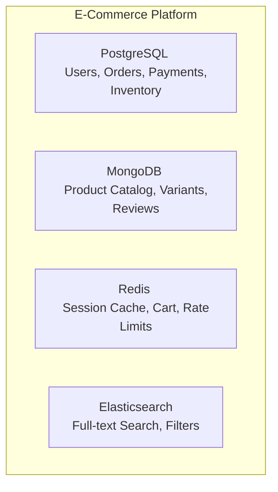

### Example 2: Social Media Platform (Twitter-like)

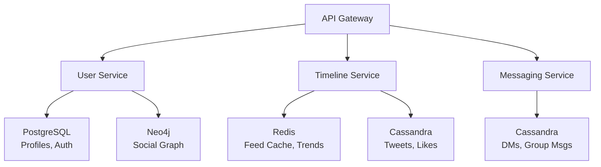

### Example 3: Uber-like Ride Sharing

| Component | Database | Why |
| :--- | :--- | :--- |
| User accounts & Payments | PostgreSQL | ACID, relations, compliance |
| Driver locations & Surge | Redis (GeoSets) | Real-time, O(1), highly volatile |
| Trip history & Analytics | Cassandra | Append-only, massive scale big-data |
| Route matching | Neo4j | Graph algorithms (A* routing) |
| Search (places) | Elasticsearch | Geo + text search |

---

## Group Chat Systems Architecture

Group chat systems (Slack, WhatsApp, Discord) present unique database and scalability challenges at scale.

### Data Model

```sql
-- Core tables for a group chat system
TABLE users         -- user_id, name, email, ...
TABLE groups        -- group_id, name, created_at, ...
TABLE group_members -- group_id, user_id, joined_at, ...
TABLE group_messages -- message_id (sharding key), group_id, sender_id, content, timestamp
TABLE message_reads  -- message_id, user_id, read_at  (tracks who saw what)
```

### Sharding Strategy for Group Messages

```
Shard by Group ID:
→ All messages for a group live on ONE shard → efficient pagination
→ No need to copy messages to each user's shard (even for groups with 100K members!)

Database Recommendation:
→ Column Family DB (Cassandra):
   Row Key = group_id
   Columns = timestamp → message_content (sorted by time → fetch recent K messages fast)
→ Document DB (MongoDB):
   Each message = one document with message_id as document ID
```

### Real-Time Delivery Architecture

```
When a message is sent to a group with 100,000 members:

Message → App Server → Queue (Kafka) → Consumers → WebSocket servers → Online users

Step-by-step:
1. Sender sends message via WebSocket
2. App server saves message to DB (shard by group_id)
3. App server publishes to Kafka topic
4. Consumer workers pull from Kafka and push to online members via WebSocket
5. Offline users fetch messages when they reconnect (paginated query on group_id shard)

⚠️ For groups with 1 BILLION subscribers (e.g., a celebrity):
→ Kafka acts as "shock absorber" — all notifications processed over hours, not seconds
```

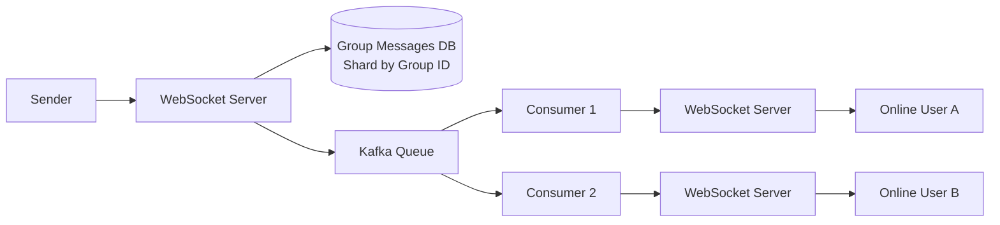

### Slack vs WhatsApp: Different Design Choices

| Behavior | Slack | WhatsApp |
|:---|:---|:---|
| **Leave group** | Cannot see ANY past messages | Past messages remain (stored on device) |
| **Message storage** | Centralized DB per group shard | Past msgs on device (client-side) + server for sync |
| **Max group size** | Up to 100,000 per channel | ~1,024 members |
| **Read receipts** | Per-message seen status in DB | On-device tracking |

---

## Caching Strategies

Caching stores frequently accessed data in a fast layer (usually Redis / in-memory) between the user and the database.

```
Without Cache:                     With Cache:
User → App Server → DB (slow)      User → App Server → Cache (fast!) ✓
                                                      ↑ miss
                                             App Server → DB → Update Cache
```

### Cache Hit vs Cache Miss

```python
def get_user(user_id):
    # Try cache first
    cached = redis.get(f"user:{user_id}")
    if cached:
        return cached  # ✅ Cache hit — fast!

    # Cache miss — query DB
    user = db.query("SELECT * FROM users WHERE id = ?", user_id)
    redis.set(f"user:{user_id}", user, ttl=3600)  # Store in cache
    return user
```

### Negative Caching

Cache **even when there are no results** — to avoid repeated expensive DB queries for missing data:

```python
def get_movie(movie_id):
    cached = redis.get(f"movie:{movie_id}")
    if cached == "NOT_FOUND":
        return None  # Negative cache hit — don't hit DB again!
    if cached:
        return cached

    movie = db.query("SELECT * FROM movies WHERE id = ?", movie_id)
    if movie is None:
        redis.set(f"movie:{movie_id}", "NOT_FOUND", ttl=300)  # Cache the miss!
        return None

    redis.set(f"movie:{movie_id}", movie, ttl=3600)
    return movie
```

> 💡 **Use Case:** Netflix caching unavailable content IDs. Without negative caching, millions of "Does movie X exist?" queries hit the DB even though the answer is always "No."

### Cache Write Strategies

```
Write-Through Cache:
  User → App Server → [DB + Cache simultaneously]
  ✅ Cache always up-to-date
  ❌ Higher write latency (must wait for both)

Write-Behind (Write-Back) Cache:
  User → App Server → [Cache immediately] → [DB later via background job]
  ✅ Lower write latency
  ❌ Risk of data loss if cache crashes before DB sync

Read-Through Cache:
  User → App Server → Cache → [on miss] → DB → update Cache
  ✅ Transparent to application
  ❌ First request is always slow (cold cache)

Cache-Aside (Lazy Loading): ← Most common
  Application manually checks cache, queries DB on miss, populates cache
  ✅ Flexibility — only cache what's needed
  ❌ Application code is responsible for cache consistency
```

| Strategy | Write Latency | Data Safety | Best For |
|:---|:---|:---|:---|
| **Write-Through** | Higher | ✅ Safe | Critical data, banking |
| **Write-Behind** | Lower | ⚠️ Risk | High-throughput, analytics |
| **Cache-Aside** | Standard | ✅ Controllable | General purpose — most common |

### Client-Side Caching

For reducing server/database load further:

```javascript
// React Query (TanStack Query) — client-side cache
const { data: notifications } = useQuery({
    queryKey: ['notifications', userId],
    queryFn: () => fetchNotifications(userId),
    staleTime: 60_000,       // Data fresh for 60 seconds
    cacheTime: 300_000,      // Keep in memory for 5 minutes
    refetchOnWindowFocus: false  // Don't refetch on every tab switch
});
// → Stored in-memory (or localStorage / IndexedDB)
// → Deduplicates multiple simultaneous requests automatically
```

### Read-Heavy vs Write-Heavy Scalability

```
Read-Heavy System (small data):
  → Add Cache Layer → Cache serves 90%+ of reads → DB load drops dramatically
  → Example: Netflix movie metadata, Twitter trending topics

Write-Heavy System (large data):
  → Sharding required to distribute write load across multiple nodes
  → Combine with replication for read scaling:
    Write → Master Shard → replicated to Slave Shards → Reads from slaves

Most Complex (but usually overkill):
  → Multiple shards, each with their own replicated cache layer
```

---

## Notification System Scaling

Notification systems have wildly different requirements depending on scale. Use **back-of-envelope estimates** to choose the right architecture.

### Scale Tier 1 — Small System (~1000 users)

```
Architecture: PostgreSQL (single table)
Table: notifications (notification_id, user_id, content, seen: bool, created_at)

→ Simple INSERT/UPDATE queries
→ WebSocket connection to push real-time notifications
→ No sharding, no Kafka needed
```

### Scale Tier 2 — Medium System (100K instructors, 10M students)

```
Scenario: Instructor updates course content → 300,000 students must be notified

Architecture:
  Instructor update → App Server → Kafka (producer)
               ↓
         [Kafka Topic: course-updates]
               ↓
  Consumer workers (read Kafka) → Push notifications to users
             → WebSocket for online users
             → DB for offline users (fetch on next login)
```

### Scale Tier 3 — Massive System (1M channels, 500M users, ~1000 subscriptions/user)

```
Back-of-Envelope:
  → Users: 500M
  → Avg subscriptions per user: 1000 channels
  → Notification page views: 10×/day per user
  → Events per day: 500M users × 10 views = 5 BILLION events/day

Architecture:
  → Shard notifications by user_id (each user's notifications in one place)
  → Kafka as event bus between services
  → WebSockets for real-time push (WhatsApp handles 2M+ connections per server)
  → "Shock absorber" pattern for viral content (notifications processed over time, not instantly)

WebSocket Tracking:
  → WebSocket alone is insufficient — must persist "seen" status to DB
  → Combine: WebSocket delivery + DB persistence (notification_id, user_id, seen_at)
```

---

## Hybrid Approaches (Polyglot Persistence)

Modern systems rarely use a single database. **Polyglot Persistence** means using the right database for each specific need.

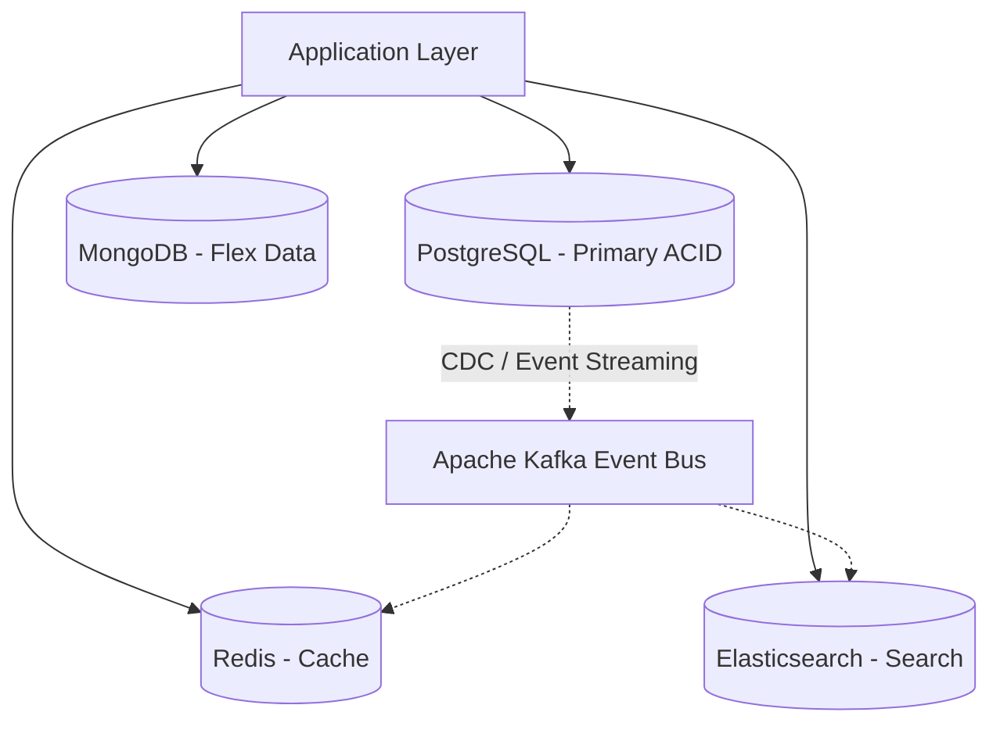

**Common Synchronization Patterns:**
1. **Change Data Capture (CDC):** PostgreSQL → Debezium → Kafka → Elasticsearch / Redis.
2. **Dual Writes:** App writes to PostgreSQL and Redis (Requires caution for consistency).
3. **Event Sourcing:** Event Bus (Kafka) acts as source of truth and pipes read model to SQL/NoSQL.

---

## Migration Strategies

**SQL → NoSQL Migration Phases:**

1.  **Identify Pain Points:** Scaling limits? Complex Schema changes?
2.  **Data Modeling Change:** Shift from Normalized (linking tables) to Denormalized (embedding array of addresses into user document).
3.  **Gradual Rollout:**
    *   Phase 1: Shadow writes (write to both SQL and NoSQL)
    *   Phase 2: Shadow reads (validate NoSQL against SQL)
    *   Phase 3: Switch reads to NoSQL
    *   Phase 4: Stop writes to SQL / Decommission.

---

## Decision Framework Flowchart

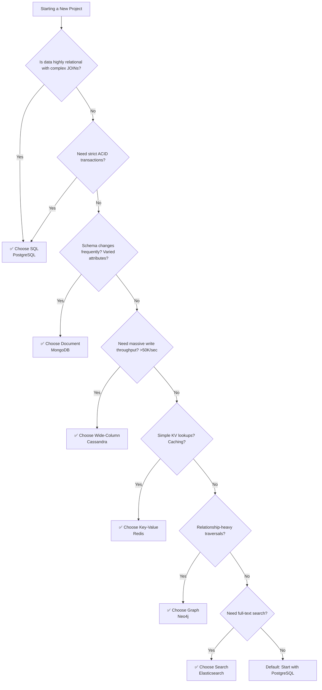

---

## Common Interview Questions

**Q1: "How would you choose between SQL and NoSQL for a new project?"**
*   **Understand Data:** Structured vs Semi-structured? Schema evolution?
*   **Understand Access Patterns:** Read vs Write heavy? Simple lookups vs Complex Joins?
*   **Understand Scale:** GBs vs TBs vs PBs? Growth projections?
*   **Understand Constraints:** Consistency (Strong vs Eventual), team expertise.
*   **Default:** Start with PostgreSQL, add Redis for caching. Polyglot Persistence.

**Q2: "Can you use SQL at massive scale?"**
*   **YES**: Read replicas, Connection Pooling (PgBouncer), Partitioning, Sharding (Citus), Caching layers, Denormalization.
*   Examples: Instagram (PostgreSQL for billions of rows), Shopify (MySQL).

**Q3: "What are the drawbacks of NoSQL?"**
*   No standardized query language (steep learning curves).
*   Application-level JOINs equal application complexity.
*   Data integrity is entirely the developer's responsibility.
*   Over-engineering risk (Using NoSQL when PG would suffice).

**Q4: "Design a URL shortener — which database?"**
*   **Primary Store:** PostgreSQL or DynamoDB (if expecting massive global scale).
*   **Caching Layer:** Redis (Top 20% URLs serve 80% traffic).
*   **Analytics:** Cassandra (append-only click logging).

---

## Summary & Cheat Sheet

| Feature | SQL | NoSQL |
| :--- | :--- | :--- |
| **Data Model** | Tables | Doc/KV/Col/Graph |
| **Schema** | Fixed (on-write) | Flexible (on-read) |
| **Consistency** | Strong (ACID) | Eventual (BASE) |
| **Scalability** | Vertical | Horizontal |
| **JOINs** | Native | Application-level |
| **Best For** | Complex relations, integrity | Scale, flexibility |
| **Top Picks** | PostgreSQL ⭐, MySQL | MongoDB, Redis, Cassandra |

**Golden Rules:**
1. *"When in doubt, start with PostgreSQL."* (Handles 80% of use cases).
2. *"Use the right tool for the job."* Polyglot Persistence is the norm.
3. *"Understand your access patterns FIRST."* NoSQL is query-driven; SQL is model-driven.
4. *"Consistency vs. Availability."* Banking? Choose CP/SQL. Social feed? Choose AP/NoSQL.

---

## 🤖 Orchestrators & Managing Hardware

<p align="center">
  
</p>

An **Orchestrator** is the "Manager" of a distributed system. It knows exactly which servers are alive, dead, or idle, and routes traffic accordingly to prevent bottlenecks.

### Orchestrator vs Kubernetes

| Responsibility | Orchestrator | Kubernetes |
|:---|:---|:---|
| **Purpose** | Data management (sharding, replication, routing) | Infrastructure management (spinning up VMs, health checks) |
| **Actions** | Adds/removes shards, assigns data, creates routing tables | Spins up/removes cloud nodes, monitors container health |
| **Awareness** | Knows which shard has which data | Knows which machine is running which container |

### Replicas vs Hot Copies

*   **Replica:** A backup worker copying data (stateful). If a hard drive crashes, we don't lose user data.
*   **Hot Copy:** A manager-in-training (stateless). Has no hard drive data but perfect memory of the Orchestrator's internal state. If the Orchestrator crashes, the Hot Copy takes over instantly (< 1 second lag).
*   **Idle Machine:** Spare machine assigned as extra replica with a "reclaim contract" — can be taken back to replace a failed machine anytime.

### Orchestrator Responsibilities (Full Lifecycle)

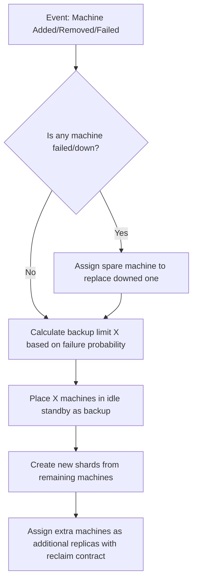

**Why keep backups?** If you selfishly create new shards using *all* available servers, the next time a server's hard drive breaks, you'll have **zero** replacements — immediate data loss.

### Machine Addition Protocol

```
Scenario: 3 shards (S1, S2, S3), replication factor = 3, 3 new machines arrive

Step 1: Replace any downed machines first (highest priority)
Step 2: Calculate backup limit X = 1.5 × avg machines normally down (based on history)
Step 3: Place X machines in idle standby
Step 4: If remaining machines ≥ replication factor (3) → create new shard
Step 5: Any leftover machines become extra replicas of existing shards (reclaim contract)

Minimum requirement: Need at least 3 machines (replication factor) to create 1 new shard.
```

> ⚠️ **Stateless machines** (load balancers, app servers) don't need replicas — just health checks + auto-restart. **Stateful machines** (database nodes) require replicas to prevent data loss.

---

## Consistent Hashing & Load Distribution

Consistent hashing is the algorithm that determines **which shard stores which data** in a distributed database.

```
Traditional Hashing Problem:
  hash(user_id) % 3 shards = shard assignment
  → Add a 4th shard: hash(user_id) % 4 ≠ same as % 3
  → EVERY key remaps to a different shard → massive data movement!

Consistent Hashing Solution:
  → Place shards and data keys on a virtual "ring" (0 → 2^32)
  → hash(user_id) → point on ring → assigned to nearest shard clockwise
  → Add new shard: only keys between new shard and previous shard remapped
  → Remove shard: only that shard's keys move to next shard clockwise
```

```
Consistent Hash Ring:
        0
       /   \
 Shard3     Shard1
    \       /
     Shard2
      360°

User A (hash=90°) → Shard1
User B (hash=200°) → Shard2
User C (hash=310°) → Shard3

Add Shard4 at 150°:
→ Only users between 90°-150° move to Shard4 (minimal disruption!)
```

### Consistent Hashing + Replication

```
For replication factor = 3:
→ Each key is stored on the 3 nearest clockwise shards
→ Writes go to all 3 (based on tunable consistency settings)
→ Reads can come from any of the 3

Orchestrator maintains routing table:
  key range → [primary shard, replica1, replica2]
```

---

## Hot Shard Detection & Capacity Planning

### Identifying Hot Shards

A **hot shard** is a shard receiving disproportionately more traffic than others, causing performance degradation.

```
Detection Signals:
→ Memory/disk utilization > threshold (e.g., 80%) on one shard
→ Write latency spikes on specific shard
→ CPU consistently high on one machine vs. others

Response:
[Hot Shard Detected] → Split shard into 2 → Assign new server to one half
```

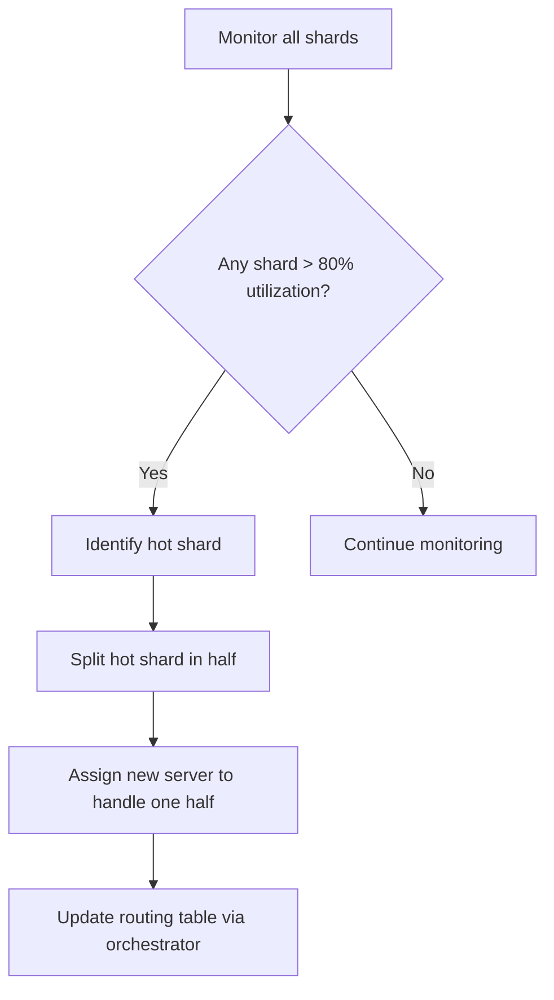

### Proactive Capacity Planning

> ❌ **Don't** react to peak load — it's too late.
> ✅ **Do** preemptively add servers based on historical load trends and projections.

```
Good Capacity Planning:
1. Monitor memory/disk utilization trends over weeks/months
2. Identify growth pattern (linear? exponential?)
3. Add servers BEFORE you hit 70% threshold — allows time for data migration
4. Plan sharding granularity based on data volume projections:
   → Small city (100K users) → 1 shard
   → Large city (10M users) → multiple shards
   → Use back-of-envelope: 1 shard ≈ 1TB data → project growth → plan shards
```

---

## Multi-Master Replication & Tunable Consistency

### Master-Slave vs Multi-Master Architecture

```
Master-Slave Architecture:
  → One designated MASTER handles all writes
  → Slaves replicate from master and serve reads
  → Failover: if master dies, promote a slave to master
  → Used by: MySQL, PostgreSQL, MongoDB (default)

  ✅ Simple, easy to reason about
  ❌ Master is bottleneck for writes
  ❌ Failover causes brief downtime

Multi-Master Architecture (Cassandra, DynamoDB):
  → Every node can accept writes (all are "master")
  → Writes replicated to neighbors on consistent hash ring
  → No single point of failure for writes
  → Used by: Cassandra, DynamoDB, CouchDB

  ✅ No write bottleneck, truly distributed
  ✅ Higher availability (no master election needed)
  ❌ Conflict resolution needed (concurrent writes to same record)
  ❌ More complex to reason about consistency
```

### Tunable Consistency: The R+W Quorum System

Cassandra and DynamoDB allow you to configure **how many replicas must respond** for a read or write to be considered successful.

```
Configuration:
  X = Replication Factor (number of copies of data)
  W = Write Quorum (minimum replicas that must confirm a write)
  R = Read Quorum (minimum replicas that must respond to a read)

Rule for Strong Consistency: R + W > X
```

**Example:** Replication factor X = 3

| W | R | R + W | Consistency | Trade-off |
|:-:|:-:|:-----:|:---|:---|
| 3 | 2 | 5 > 3 | ✅ Strong | Slower writes (wait for all 3) |
| 2 | 2 | 4 > 3 | ✅ Strong | Balanced |
| 1 | 1 | 2 < 3 | ⚠️ Eventual | Fast, but may read stale data |
| 1 | 3 | 4 > 3 | ✅ Strong | Slow reads, fast writes |

```
Strong Consistency Guarantee (R + W > X):
  → When reading R replicas, at least one MUST have the latest write
  → Even if some replicas are lagging, the quorum overlap guarantees freshness

Example: X=10, W=6, R=5 → R+W=11 > 10
  → Any 5 nodes we read from MUST include at least 1 of the 6 nodes we wrote to
  → Guaranteed to see the latest data ✅

Eventual Consistency (R + W ≤ X):
  Example: X=3, W=1, R=1
  → Write goes to 1 node
  → Read might hit a DIFFERENT node (not yet replicated)
  → Stale read possible — data becomes consistent "eventually"
```

**Conflict Resolution in Multi-Master:**

```
When two clients write to the same key simultaneously:
  → Last Write Wins (LWW): Cassandra uses wall-clock timestamps
    → If different servers return different values, the one with the LATEST timestamp wins
  → Vector Clocks: Track causality (more complex, more correct)
  → Application-Level Merge: App decides how to combine conflicting values
```

> ⚙️ **Cassandra Configuration:** X, R, and W values are set in the Cassandra cluster **configuration file** when spinning up the cluster — not in application code.

### Read from Multiple Replicas Pattern

```python
# Read from R=3 replicas, take the value with the latest timestamp
responses = await asyncio.gather(
    read_from_replica(key, node_1),
    read_from_replica(key, node_2),
    read_from_replica(key, node_3),
)
# Merge: pick response with highest timestamp
latest = max(responses, key=lambda r: r.timestamp)
return latest.value
```

---

## Write-Ahead Logs (WAL)

Write-Ahead Logs are a fundamental mechanism that databases use to ensure **durability** and **atomicity** — a crucial concept that appears in both SQL and NoSQL systems.

### How WAL Works

```
Without WAL:
  → DB modifies data structures on disk directly
  → Power failure mid-operation → inconsistent state!

With WAL:
  → ALL changes are first written to the WAL (append-only log on disk)
  → THEN applied to actual data structures
  → If power fails during write → replay WAL on restart → consistent state ✓
```

```
WAL Entry Structure:
┌─────────────────────────────────────────────────────────────┐
│  LSN (Log Sequence Number) │  Transaction ID │  Operation   │
│  Timestamp                 │  Table/Key      │  Before/After│
├─────────────────────────────────────────────────────────────┤
│  001  │  txn_42  │  UPDATE accounts SET balance=900        │
│       │          │  WHERE id='alice' [before: 1000]        │
│  002  │  txn_42  │  UPDATE accounts SET balance=1100       │
│       │          │  WHERE id='bob'   [before: 1000]        │
│  003  │  txn_42  │  COMMIT                                 │
└─────────────────────────────────────────────────────────────┘
→ If crash after 002, before COMMIT → rollback both changes on restart
→ If crash after COMMIT → replay both changes on restart → consistent!
```

### WAL Use Cases

| Use Case | How WAL Helps |
|:---|:---|
| **ACID Atomicity** | All or nothing — incomplete transactions rolled back on crash recovery |
| **Durability** | Completed transactions survive power failures (WAL flushed to disk before COMMIT) |
| **Replication** | Primary streams WAL to replicas — they replay WAL to stay in sync |
| **Data Migration** | During shard migration, WAL captures writes that occurred after initial copy began |
| **Performance** | SQLite and others use WAL to make writes faster (append to log vs. random disk writes) |

### WAL in Shard Migration

```
Two-Phase Data Migration uses WAL to prevent data loss:

Phase 1 — STAGING (background copy):
  → Orchestrator simulates new shard's key range
  → Starts copying existing data to new shard (background)
  → New shard NOT yet serving requests
  → All writes still go to old shard → captured in write-ahead log

Phase 2 — CUTOVER (go live):
  → Initial data copy complete
  → New shard added to consistent hash ring → starts serving requests
  → Replay WAL entries (writes that happened during Phase 1) to sync new shard
  → Brief period of potentially stale data → WAL replay catches up
  → New shard fully in sync ✅
```

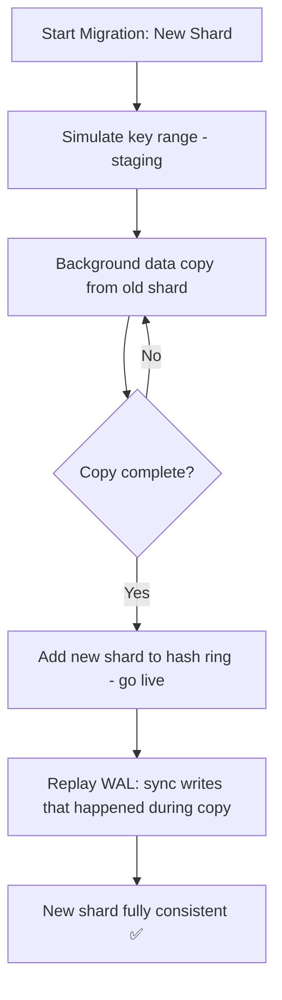

---

## Data Migration Process (Two-Phase)

When adding new shards or resharding, data must be migrated with **zero downtime and zero data loss**.

### The Two-Phase Migration

```
Phase 1: STAGING
┌────────────────────────────────────────────────────────┐
│ 1. Orchestrator calculates new shard's key range       │
│ 2. Begins copying data from source shard (background)  │
│ 3. New shard NOT advertised to clients yet             │
│ 4. All client reads/writes continue to old shard       │
│ 5. New writes during copy → captured in WAL            │
└────────────────────────────────────────────────────────┘

Phase 2: CUTOVER
┌────────────────────────────────────────────────────────┐
│ 1. Initial data copy complete                          │
│ 2. New shard added to routing table (consistent ring)  │
│ 3. New shard starts serving requests immediately       │
│ 4. WAL replay: apply writes from Phase 1 to new shard  │
│ 5. Brief stale reads possible (WAL replaying in bg)    │
│ 6. Once WAL fully replayed → full consistency          │
└────────────────────────────────────────────────────────┘
```

### Stateless vs Stateful Machine Failover

```
Stateless Machines (Load Balancers, App Servers):
→ No persistent data → no replica needed
→ Health check detects failure → spin up new instance (< 30 seconds)
→ Example: if a web server crashes, auto-scaling brings up a replacement

Stateful Machines (Database Nodes):
→ Persistent data → must copy data to replacement
→ Hot copy: Another machine has the SAME in-memory state
  → Failover in < 1 second (no cold start)
→ Warm replica: Has disk data but not in-memory state
  → Failover takes seconds to minutes (load data from disk to memory)
→ Cold backup: Just disk data, no memory state
  → Slowest failover — must copy data then load
```

---

## Architecture Evolution Principles

Real systems don't get built perfectly from day one. Here's how to think about evolving your database architecture over time.

### Why Requirements Change

```
Common triggers for re-architecture:
→ Data volume 10×-100× growth
→ New query patterns (e.g., adding analytics to a transactional system)
→ User behavior changes (write-heavy → read-heavy, or vice versa)
→ Geographic expansion (need geo-sharding)
→ Regulatory requirements (data residency)
```

### When to Re-Architect

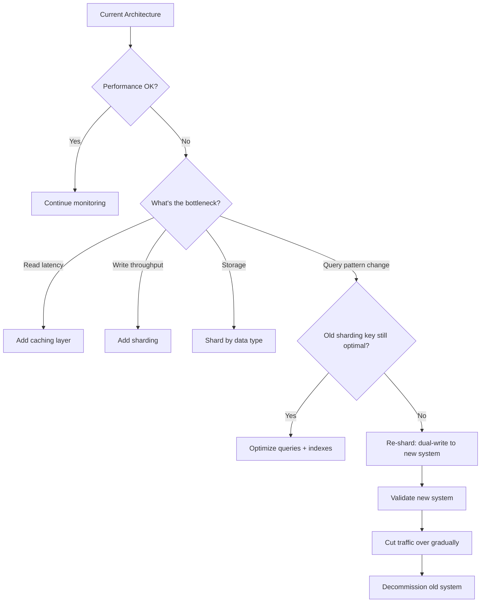

### The Dual-Write Migration Pattern

When changing sharding keys or moving between databases:

```
Step 1: Dual-write — new writes go to BOTH old and new system
Step 2: Backfill — copy historical data from old to new
Step 3: Validate — compare queries on old vs new
Step 4: Gradual traffic shift — 1% → 10% → 50% → 100% to new system
Step 5: Decommission old system
```

### Key Principles

1. **Start simple.** Start with PostgreSQL. Add complexity only when needed.
2. **Back-of-envelope first.** Always estimate before architecting: how many users? How much data? How many writes/second?
3. **Optimize for the common case.** Design sharding key for the most frequent query, not the edge case.
4. **Avoid cross-shard operations.** Design data model so critical transactions happen within one shard.
5. **Anticipate changes.** When designing, think: "What if this data 10×? What if we add feature Y?" — plan escape hatches.
6. **Don't over-engineer.** A notification system for 1000 users does NOT need Kafka + sharding. Match complexity to scale.

> 🎓 **Developer Mindset:** As an engineer, the discipline is knowing *when* to use Postgres vs Redis vs MongoDB vs Cassandra vs Elasticsearch — not knowing every internal detail of each.

---

## References & Further Reading

| Resource | Description |
|----------|-------------|
| **Designing Data-Intensive Applications** | Martin Kleppmann's definitive book on distributed systems and database design |
| **CAP Theorem Explained** | IBM's comprehensive guide to the CAP theorem and its practical implications |
| **PostgreSQL Documentation** | Official PostgreSQL docs covering all features, configuration, and best practices |
| **MongoDB University** | Free MongoDB courses and certifications for hands-on learning |
| **Redis University** | Free Redis courses covering caching, data structures, and cluster management |
| **System Design Primer** | Comprehensive open-source guide to system design interviews and architecture patterns |
| **SQL vs NoSQL — Video Series (Noiz)** | YouTube videos covering sharding strategies, NoSQL internals, and orchestrators |

