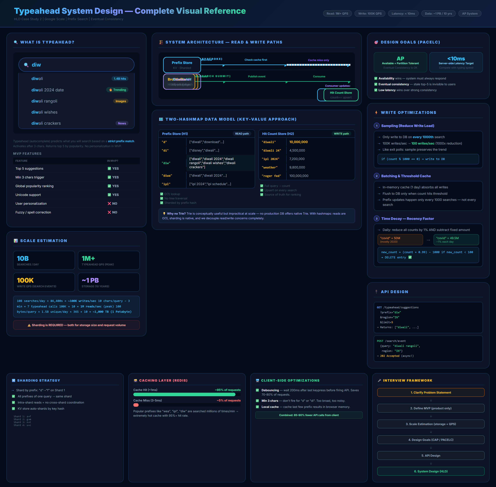

# 🔍 Typeahead System Design — The Ultimate HLD Guide

> **Last Updated:** February 2026
> **Author:** System Design Study Notes (Scaler Academy — HLD Module)
> **Instructor:** Tarun Malhotra (Software Engineer at Google)
> **Topics:** Typeahead, Autocomplete, Trie, Hashmap, Prefix Search, Sharding, Caching, Debouncing, Sampling, Time Decay

---

## 📋 Table of Contents

### Part 1: Introduction & Context
1. [What is Typeahead?](#-what-is-typeahead)
2. [Real-World Examples](#-real-world-examples)
3. [How System Design Interviews Work](#-how-system-design-interviews-work)

### Part 2: Requirements Gathering (MVP)
4. [Functional Requirements](#-functional-requirements)
5. [Non-Functional Requirements / Design Goals](#-non-functional-requirements--design-goals)
6. [Out of Scope (for MVP)](#-out-of-scope-for-mvp)

### Part 3: Capacity Estimation
7. [Traffic Estimation](#-traffic-estimation)
8. [Data Size Estimation](#-data-size-estimation)
9. [Read vs Write Analysis](#-read-vs-write-analysis)

### Part 4: Design Goals
10. [Availability vs Consistency](#-availability-vs-consistency)
11. [Latency Requirements](#-latency-requirements)

### Part 5: API Design
12. [Read API (Typeahead Suggestions)](#-read-api-typeahead-suggestions)
13. [Write API (Search Event)](#-write-api-search-event)

### Part 6: High-Level Architecture
14. [Overall System Architecture](#-overall-system-architecture)
15. [Write Path — Async Pipeline](#-write-path--async-pipeline)
16. [Read Path — Prefix Lookup](#-read-path--prefix-lookup)

### Part 7: Data Structures
17. [Option A — Trie Approach](#-option-a--trie-approach)
18. [Option B — Hashmap Approach (Preferred)](#-option-b--hashmap-approach-preferred)
19. [Trie vs Hashmap Comparison](#-trie-vs-hashmap-comparison)

### Part 8: Optimizations
20. [Sharding Strategy](#-sharding-strategy)
21. [Sampling to Reduce Write Load](#-sampling-to-reduce-write-load)
22. [Batching Prefix Updates](#-batching-prefix-updates)
23. [Caching Layer](#-caching-layer)
24. [Time Decay — Handling Recency](#-time-decay--handling-recency)
25. [Debouncing on the Client](#-debouncing-on-the-client)

### Part 9: Summary & Interview Prep
26. [Quick Reference Cheatsheet](#-quick-reference-cheatsheet)
27. [Practice Questions & Solutions](#-practice-questions--solutions)
28. [References & Resources](#-references--resources)

---

# PART 1: INTRODUCTION & CONTEXT

---

## 🔍 What is Typeahead?

> **Typeahead** (also called **Autocomplete** or **Search Suggestion**) is a feature where the system predicts and displays possible completions for the user's partial input **in real-time as they type**.

Every time you type a character into a search bar, the system fires a request and returns a ranked list of suggestions — before you have even finished typing.

```
User types: "diw"
                │
                ▼
┌─────────────────────────────────────┐
│  🔍 diw                             │
├─────────────────────────────────────┤
│  🔍 diwali                          │
│  🔍 diwali 2024 date                │
│  🔍 diwali rangoli designs          │
│  🔍 diwali wishes in hindi          │
│  🔍 diwali crackers                 │
└─────────────────────────────────────┘
```

The core goal is to **reduce the number of characters a user needs to type** to reach their desired search query — improving speed, accuracy, and user experience.

### Why Typeahead Matters at Scale

| Platform | Typeahead Volume |
|----------|-----------------|
| Google Search | ~10 billion searches/day → 70 billion typeahead queries/day |
| Amazon | Millions of product searches |
| YouTube | Every search bar interaction |
| URL bar (Chrome) | Every URL you type |

> 💡 Each character typed generates a **separate API request** to the typeahead service. A 10-letter search = ~7 typeahead API calls (system activates after 3 characters).

---

## 🌍 Real-World Examples

### Google Search Typeahead

```
User starts typing "ipl"
─────────────────────────────────────
Char 1: "i"         → No suggestions (< 3 chars)
Char 2: "ip"        → No suggestions (< 3 chars)
Char 3: "ipl"       → Suggestions appear:
                        • ipl 2024
                        • ipl points table
                        • ipl teams
                        • ipl schedule
Char 4: "ipl "      → Refined suggestions
Char 5: "ipl 2"     → More refined
... and so on
```

### Amazon Product Typeahead

```
User types: "airp"
─────────────────────────────────────
• airpods                    ← product name
• airpods pro                ← product variant
• airpods max                ← product variant
• airpods case               ← accessory
• airpods 3rd generation     ← specific generation
```

> ⚠️ **Important Distinction:** Typeahead ≠ Search Results.
> - **Typeahead** shows *query suggestions* (what to search for)
> - **Search Results** show *actual results* (products, links, pages)
> They are **two completely separate systems**.

### Difference: Google vs Amazon Typeahead

| Platform | Typeahead Shows | Example |
|----------|----------------|---------|
| **Google** | Related search queries | "diwali recipes", "diwali 2024" |
| **Amazon** | Product names & categories | "airpods pro", "airpods case" |
| **YouTube** | Video-related queries | "ipl 2024 highlights" |
| **URL bar** | Previously visited URLs | "https://github.com/..." |

---

## 🎯 How System Design Interviews Work

Before jumping into the design, it is critical to understand **how HLD interviews are structured**. The instructor emphasized this strongly.

### The Structured HLD Interview Flow

```
┌─────────────────────────────────────────────────────────────┐
│              HLD INTERVIEW FRAMEWORK                         │
├─────────────────────────────────────────────────────────────┤
│  STEP 1: Clarify the Problem                                 │
│    → Ask clarifying questions to narrow scope                │
│    → Understand the product deeply                           │
│                                                              │
│  STEP 2: Define MVP (Functional Requirements)                │
│    → What features MUST the system support?                  │
│    → Keep scope reasonable for a 45-min interview            │
│                                                              │
│  STEP 3: Estimate Scale                                      │
│    → Users, Queries Per Second, Data Size                    │
│    → Helps decide: sharding? caching? replication?           │
│                                                              │
│  STEP 4: Define Design Goals (Non-Functional)                │
│    → Latency? Consistency? Availability?                     │
│    → These guide architectural decisions                     │
│                                                              │
│  STEP 5: API Design                                          │
│    → What endpoints does the system expose?                  │
│                                                              │
│  STEP 6: High-Level Design                                   │
│    → Draw the architecture                                   │
│    → Explain data flow (read path, write path)               │
│                                                              │
│  STEP 7: Deep Dive & Optimizations                           │
│    → Drill into critical components                          │
│    → Discuss trade-offs                                      │
└─────────────────────────────────────────────────────────────┘
```

> ⚠️ **Key interview insight:** Your job as a **system architect** is to **execute and build** the vision — not to ideate features. If you start suggesting new features the interviewer didn't ask for, you signal poor focus. Ask product questions to clarify scope, then build it.

---

### 🎬 Visual Overview — Typeahead System Design Complete Reference



> *The diagram above shows the complete typeahead system design reference — covering MVP requirements, scale estimation, system architecture (read & write paths), the two-hashmap data model, write optimizations (sampling, batching, time decay), and the full interview framework — all on a single poster.*

---

# PART 2: REQUIREMENTS GATHERING (MVP)

---

## ✅ Functional Requirements

These are the **user-facing features** of the MVP. They describe what the system *does*, not *how* it does it.

```
┌──────────────────────────────────────────────────────────────┐
│               TYPEAHEAD MVP — FUNCTIONAL REQUIREMENTS         │
├──────────────────────────────────────────────────────────────┤
│                                                              │
│  FR1: Show top suggestions as user types                     │
│       → Suggestions appear after the user types ≥ 3 chars   │
│       → Return top 5 suggestions                            │
│                                                              │
│  FR2: Suggestions ranked by global popularity                │
│       → Most frequently searched queries appear first        │
│       → No personalization for MVP                           │
│                                                              │
│  FR3: Region-based suggestions                               │
│       → Suggest queries popular in the user's region         │
│       → E.g., "diwali" trends differently in India vs US     │
│                                                              │
│  FR4: No results = No suggestions                            │
│       → If prefix has no popular completions, show nothing   │
│       → Don't show irrelevant suggestions                    │
│                                                              │
│  FR5: Handle misspellings gracefully                         │
│       → Long or garbled queries may return zero results      │
│       → This is acceptable for MVP                           │
│                                                              │
└──────────────────────────────────────────────────────────────┘
```

### Clarifying Questions to Ask in Interview

These are the questions you should **proactively ask** the interviewer:

| Question | Why it Matters |
|----------|---------------|
| How many suggestions to show? | Affects storage (top N per prefix) |
| After how many characters do we show suggestions? | Affects query volume |
| Do we need personalization? | Massive complexity if yes |
| Multi-language support? | Affects character encoding and data size |
| Real-time ranking updates or batch? | Affects write architecture |
| Region-specific or global? | Affects data partitioning |

### MVP Decision Table

| Feature | In MVP? | Reason |
|---------|---------|--------|
| Global popularity ranking | ✅ YES | Core feature |
| Show top 5 suggestions | ✅ YES | Standard UX |
| Min 3 characters to trigger | ✅ YES | Reduces noise |
| Region-based suggestions | ✅ YES | Important for relevance |
| Personalization by user | ❌ NO | Too complex for MVP |
| Spell correction | ❌ NO | Separate ML system |
| Real-time trending (sub-second) | ❌ NO | Eventual consistency is fine |
| Multi-language (Unicode) | ✅ YES | Global system |

---

## 🎯 Non-Functional Requirements / Design Goals

Design goals describe **how the system behaves**, not what it does. They guide architectural decisions.

```
┌──────────────────────────────────────────────────────────────┐
│            TYPEAHEAD — DESIGN GOALS (Non-Functional)          │
├──────────────────────────────────────────────────────────────┤
│                                                              │
│  DG1: LATENCY — Ultra-low read latency                       │
│       → Suggestions must appear within 10ms of each keypress │
│       → User types faster than suggestions should lag        │
│                                                              │
│  DG2: AVAILABILITY — Highly available                        │
│       → System must always return suggestions                │
│       → Prefer availability over strict consistency          │
│                                                              │
│  DG3: EVENTUAL CONSISTENCY — Stale data acceptable           │
│       → Ranking updates can lag by minutes/hours             │
│       → A slightly stale top-5 list is perfectly fine        │
│                                                              │
│  DG4: SCALABILITY — Handle 10B+ queries/day                  │
│       → Peak load of 1M+ typeahead requests/second           │
│       → Must scale horizontally                              │
│                                                              │
│  DG5: FAULT TOLERANCE                                        │
│       → Single machine failure must not bring down typeahead │
│       → Replicate data across availability zones             │
│                                                              │
└──────────────────────────────────────────────────────────────┘
```

> 💡 **Key Design Goal Insight from Lecture:**
> Latency is the *most critical* design goal for typeahead.
> The suggestions must appear *faster than the user can type* — ideally under **10 milliseconds** for the server-side response.
> If suggestions lag behind typing speed, users stop looking at them entirely.

---

## ❌ Out of Scope (for MVP)

| Feature | Why Out of Scope |
|---------|-----------------|
| Spell correction / fuzzy matching | Separate ML pipeline |
| Personalized suggestions per user | Requires user history & complex ranking |
| Search result pages | Different system entirely |
| Voice search | Different input modality |
| Trending / real-time viral queries | Can be added post-MVP |
| Image/video suggestions in dropdown | Rich media = separate feature |

---

# PART 3: CAPACITY ESTIMATION

---

## 📊 Traffic Estimation

### Step 1: Establish Baseline

```
Given:
  Daily Active Users (DAU) = 500 million (Google scale)
  Searches per user per day = ~20
  ─────────────────────────────────────
  Total searches per day = 500M × 20 = 10 Billion searches/day
```

### Step 2: Typeahead Multiplier

Every search query generates multiple typeahead requests:

```
A typical search query = ~10 characters
Typeahead activates after 3rd character
→ Characters that trigger typeahead = 10 - 3 = 7 characters
→ So: 1 search = 7 typeahead API calls

Total typeahead requests/day = 10B × 7 = 70 Billion/day
```

### Step 3: Convert to Queries Per Second (QPS)

```
Seconds in a day = 24 × 60 × 60 = 86,400 seconds

Average typeahead QPS = 70,000,000,000 / 86,400 ≈ 800,000 QPS

Peak QPS (assume 2-3x average) ≈ 2,000,000 QPS (2M/sec)
```

```
TRAFFIC SUMMARY:
┌─────────────────────────────────────────────────────────┐
│  Metric                    │         Value               │
├────────────────────────────┼─────────────────────────────┤
│  Daily searches            │  10 Billion/day             │
│  Typeahead multiplier      │  7x per search              │
│  Total typeahead requests  │  70 Billion/day             │
│  Average Read QPS          │  ~800,000 QPS               │
│  Peak Read QPS             │  ~2,000,000 QPS             │
│  Write QPS (search events) │  ~100,000 QPS               │
└─────────────────────────────────────────────────────────┘
```

> 💡 **Why write QPS is lower**: Writes happen only on full search submissions, not on every keypress. So 10B searches/day ÷ 86,400 = ~100K writes/second.

---

## 💾 Data Size Estimation

### What Data Do We Store?

For each unique search query, we store:

```
Row = { query_string, hit_count }

- query_string: avg 30-32 characters (includes multi-language, spaces, Unicode)
- hit_count:    8 bytes (to hold billions of hits — we need more than 4 bytes)
- overhead:     ~60 bytes (metadata, indices, etc.)
─────────────────────────────────────────
Total per row ≈ 100 bytes
```

### How Many Unique Queries?

```
Total daily searches       = 10 Billion
Unique queries (≈ 15%)     = 10B × 0.15 = 1.5 Billion unique queries/day

Note: ~85% of daily searches are REPEAT queries
(e.g., "weather today", "ipl score" are searched millions of times daily)
```

### Total Storage Required

```
Data per day = 1.5 Billion unique queries × 100 bytes
             = 150 Billion bytes
             = 150 GB/day of NEW unique queries

BUT: Most queries persist across days (they accumulate)
Accumulation over 1 year ≈ 150 GB × 365 = ~55 TB
(manageable with sharding)
```

### Prefix Storage (for Hashmap approach)

Each stored query also generates prefix entries:

```
Query "diwali" (6 chars) → prefixes: "diw", "diwa", "diwal", "diwali"
Average query (10 chars) → ~7 prefix entries

Prefix storage multiplier ≈ 7x
Total prefix data ≈ 150 GB × 7 = ~1 TB/day of prefix entries
```

> ⚠️ **This is why sharding is essential** — 1 TB/day of prefix data cannot be managed by a single machine.

---

## 📈 Read vs Write Analysis

```
SYSTEM CHARACTERIZATION:
──────────────────────────────────────────────────────────
  READ QPS  : ~800,000 - 2,000,000 per second  ← READ HEAVY
  WRITE QPS : ~100,000 per second               ← Write moderate

  READ : WRITE ratio = ~8:1 to 20:1

  Verdict: This is a READ-HEAVY, I/O-BOUND system
           → Optimize heavily for read performance
           → Use caching aggressively
           → Accept eventual consistency to reduce write complexity
──────────────────────────────────────────────────────────
```

---

# PART 4: DESIGN GOALS

---

## ⚖️ Availability vs Consistency

Applying CAP Theorem to the typeahead problem:

```
Question: If two users search from different regions simultaneously,
is it acceptable that one user sees "diwali 2024" in top 5
while another user sees "diwali greetings" in top 5?

Answer: YES — absolutely acceptable!
```

**Reasoning:**

| Property | Decision | Reason |
|----------|----------|--------|
| **Availability** | ✅ PRIORITIZE | System must ALWAYS return suggestions. Going down = terrible UX |
| **Consistency** | ❌ RELAX | Stale top-5 list (off by 1-2%) is completely invisible to users |
| **Partition Tolerance** | ✅ REQUIRED | Distributed system — partitions will happen |

> **Typeahead is an AP system** — Available + Partition Tolerant.
> We accept **eventual consistency**: rankings may lag by minutes or even hours, and that is perfectly acceptable.

### Why Consistency Doesn't Matter Much Here

```
If "diwali" has been searched:
  Actual count : 10,000,000 times
  Our cached count: 9,985,000 times (0.15% off)

Does this change the top 5 suggestions? Almost never.
Does the user notice? Never.

Conclusion: Minor inconsistency in hit counts = zero user impact.
```

---

## ⚡ Latency Requirements

```
Typeahead latency budget:
┌──────────────────────────────────────────────┐
│  User types a key                            │
│         │                                    │
│         ▼ (debounce: wait for pause)         │
│  Client sends API request                    │
│         │                                    │
│         ▼                                    │
│  Network transit to server    ≈ 5-10ms       │
│         │                                    │
│         ▼                                    │
│  Server processes + DB lookup ≈ 1-5ms        │  ← Our target
│         │                                    │
│         ▼                                    │
│  Response travels back        ≈ 5-10ms       │
│         │                                    │
│         ▼                                    │
│  Browser renders suggestions  ≈ 1-2ms        │
│                                              │
│  TOTAL: ~15-30ms end-to-end                  │
│         SERVER SIDE TARGET: < 10ms           │
└──────────────────────────────────────────────┘
```

> 🎯 **Server-side target: < 10ms per typeahead lookup**
> This means we CANNOT do complex DB queries. We need a **cache-first** read path.

---

# PART 5: API DESIGN

---

## 📡 Read API (Typeahead Suggestions)

```
GET /typeahead/suggestions

Query Parameters:
  prefix   (string, required)  — The partial query typed by user (min 3 chars)
  region   (string, optional)  — User's region code (e.g., "IN", "US")
  limit    (integer, optional) — Number of suggestions (default: 5)

Response:
{
  "prefix": "diw",
  "suggestions": [
    "diwali",
    "diwali 2024 date",
    "diwali rangoli",
    "diwali wishes",
    "diwali crackers"
  ],
  "region": "IN"
}
```

**Protocol choice: HTTP/REST with long-polling or WebSocket**

| Protocol | Latency | Notes |
|----------|---------|-------|
| REST/HTTP | ✅ Good | Simple, cacheable, widely supported |
| WebSocket | ✅ Better | Persistent connection, no handshake overhead per key |
| gRPC | ✅ Best (internal) | Use for service-to-service communication |

> For users → REST is fine. Between internal services → gRPC preferred.

---

## 📝 Write API (Search Event)

When a user **submits** a search (hits Enter or clicks a result), we record this event:

```
POST /search/event

Request Body:
{
  "query": "diwali rangoli designs",
  "user_id": "u12345",      (for logging — not used in ranking for MVP)
  "region": "IN",
  "timestamp": 1708700000
}

Response:
{
  "status": "accepted",
  "message": "Search event queued for processing"
}
```

> ⚠️ **This API is asynchronous!** The response is immediate ("accepted"), but the actual update to hit counts happens via an async pipeline. The user does not wait for the ranking to update.

---

# PART 6: HIGH-LEVEL ARCHITECTURE

---

## 🏗️ Overall System Architecture

```
                    ┌──────────────────────────────────────────────┐
                    │                  CLIENTS                     │
                    │           (Browser / Mobile App)             │
                    └───────────────────┬──────────────────────────┘
                                        │
                          ┌─────────────▼─────────────┐
                          │     GATEWAY / CDN /        │
                          │     LOAD BALANCER          │
                          │  (SSL, Rate Limiting,      │
                          │   Request Routing)         │
                          └──────┬────────────┬────────┘
                                 │            │
                    ┌────────────▼──┐    ┌────▼──────────────┐
                    │  TYPEAHEAD    │    │   SEARCH           │
                    │  SERVICE      │    │   SERVICE          │
                    │  (Read API)   │    │   (Write API)      │
                    └──────┬────────┘    └────┬───────────────┘
                           │                  │
               ┌───────────▼──┐         ┌─────▼──────────────┐
               │   CACHE       │         │   MESSAGE QUEUE     │
               │   (Redis)    │         │   (Kafka)           │
               │  prefix→top5 │         │   (async pipeline)  │
               └──────┬────────┘         └────┬───────────────┘
                      │                       │
           ┌──────────▼────────────┐    ┌─────▼───────────────┐
           │   PREFIX STORE        │    │   CONSUMER SERVICE   │
           │   (Key-Value DB)      │    │   (updates counts,   │
           │   prefix → top5 list  │    │    recalculates top5)│
           └───────────────────────┘    └─────┬───────────────┘
                                              │
                                   ┌──────────▼──────────────┐
                                   │   HIT COUNT STORE        │
                                   │   (Key-Value DB)         │
                                   │   query → hit_count      │
                                   └─────────────────────────┘
```

The system has **two separate paths**:

| Path | Trigger | Goal |
|------|---------|------|
| **Read Path** | User types a character | Return top 5 suggestions in < 10ms |
| **Write Path** | User submits a search | Update hit counts and recalculate rankings (async) |

---

## ✍️ Write Path — Async Pipeline

```
Step 1: User submits search "diwali rangoli designs"
         │
         ▼
Step 2: Search Service receives event
         │
         ▼
Step 3: Search Service publishes message to Kafka topic: "search-events"
         {query: "diwali rangoli designs", region: "IN", timestamp: ...}
         │
         ▼
Step 4: Consumer reads from Kafka (batch or per-message)
         │
         ├─► Upsert HIT COUNT STORE: "diwali rangoli designs" → count+1
         │
         └─► Every N updates (sampling - see Section 8.2):
              Update PREFIX STORE for all prefixes of this query:
              "diw"   → recalculate top 5
              "diwa"  → recalculate top 5
              "diwal" → recalculate top 5
              ... etc.
```

### Why Kafka/Async?

Without async processing, every search hit would require:
1. Updating the hit count (1 write)
2. Updating all prefix entries (~7 writes)
3. Total: ~8 synchronous writes per search

At 100,000 searches/sec → **800,000 synchronous writes/second** — unsustainable!

With Kafka:
- Search service: just publish to queue → done (< 1ms)
- Consumer: processes messages at its own pace
- Write load is decoupled from read load

---

## 📖 Read Path — Prefix Lookup

```
Step 1: User types "diw"

Step 2: Client fires: GET /typeahead/suggestions?prefix=diw&region=IN

Step 3: Typeahead Service checks Redis Cache:
         key = "IN:diw"
         → CACHE HIT? → Return immediately ✅ (< 1ms)
         → CACHE MISS? → Go to Prefix Store

Step 4: Prefix Store lookup:
         key = "diw"
         → Returns: ["diwali", "diwali 2024", "diwali rangoli", ...]

Step 5: Return top 5 to client

Step 6: Populate cache for next time:
         Redis: "IN:diw" → ["diwali", "diwali 2024", ...]  TTL = 5 min
```

```
READ PATH LATENCY BREAKDOWN:
┌─────────────────────────────────────────────────────────┐
│  Cache Hit Path:   < 1ms (Redis in-memory lookup)       │
│  Cache Miss Path:  3-5ms (goes to Prefix Store)         │
│  Target:           < 10ms total server-side             │
└─────────────────────────────────────────────────────────┘
```

> 🎯 **Cache hit rate for typeahead is very high** — popular prefixes like "diw", "ipl", "wea" are searched millions of times per minute. Once cached, the same prefix is served from Redis for TTL duration.

---

# PART 7: DATA STRUCTURES

---

## 🌳 Option A — Trie Approach

A **Trie** (also called a **Prefix Tree**) is a tree data structure where each node represents one character, and paths from root to nodes represent prefixes.

```
Inserted queries: "diwali", "diwa", "dawn", "day"

TRIE STRUCTURE:

         (root)
           │
           d
           │
       ┌───┴───┐
       i       a
       │       │
       w    ┌──┴──┐
       │    w     y
    ┌──┴──┐ │     │
    a     (end) n  (end)
    │           │
 ┌──┴──┐      (end)
 l    (end)
 │
 i
 │
(end) ← "diwali" complete
```

### Trie Node Structure

```python
class TrieNode:
    character: str           # the character this node represents
    is_terminal: bool        # True if this node ends a complete query
    hit_count: int           # frequency of this query (if terminal)
    top5: List[str]          # top 5 suggestions reachable from this node
    children: Dict[str, TrieNode]   # child nodes (one per next character)
```

### How Reads Work in a Trie

```
Read Query: prefix = "diw"

Step 1: Start at root
Step 2: Navigate → 'd' → 'i' → 'w'
Step 3: Return the top5 stored at the "diw" node
        → ["diwali", "diwali 2024", "diwali rangoli", ...]

Time Complexity: O(len(prefix)) — very fast!
```

### How Writes Work in a Trie

```
Write: "diwali" gets +1 hit

Step 1: Navigate to "diwali" terminal node
Step 2: Increment hit_count at "diwali" node
Step 3: Walk BACK UP the tree, updating top5 at each ancestor:
         → Update "diwal" node's top5
         → Update "diwa" node's top5
         → Update "diw" node's top5
         → Update "di" node's top5
         → Update "d" node's top5
         → Update root's top5

Time Complexity: O(len(query)) for traversal + O(N log 5) for top5 recalc
```

### Trie Problems at Scale

```
❌ Problem 1: Memory — A full trie for all Google queries cannot fit in RAM
              → Must be stored on disk → slow lookups

❌ Problem 2: Single-machine trie → hot spot, no distribution

❌ Problem 3: Write amplification — one query update touches ALL ancestor nodes
              → For "diwali rangoli designs" (23 chars) → updates 23 nodes
              → At 100K writes/sec → millions of node updates/sec

❌ Problem 4: Row locking on every write → read concurrency is blocked

✅ Trie is GREAT for interviews to explain concept
   Use HASHMAP approach for production
```

---

## 🗺️ Option B — Hashmap Approach (Preferred)

Instead of a tree structure, use **two separate hashmaps** (implemented as key-value stores):

```
HASHMAP 1: PREFIX STORE
─────────────────────────────────────────────────────────
Key: prefix string (e.g., "diw")
Value: ordered list of top 5 suggestions

  "d"    → ["divorce", "diwali", "download", "drive", "dubai"]
  "di"   → ["disney", "diwali", "diet", "diamond", "discord"]
  "diw"  → ["diwali", "diwali 2024", "diwali rangoli", "diwali wishes", "diwali songs"]
  "diwa" → ["diwali", "diwali 2024", "diwali rangoli", "diwali puja", "diwali songs"]
  ...


HASHMAP 2: HIT COUNT STORE
─────────────────────────────────────────────────────────
Key: full search query (e.g., "diwali")
Value: hit count (number of times this exact query was searched)

  "diwali"               → 10,000,000
  "diwali 2024"          → 4,500,000
  "diwali rangoli"       → 2,300,000
  "diwali wishes"        → 1,800,000
  "diwali puja vidhi"    → 900,000
  ...
```

### Read Query — How It Works

```
User types "diw":

  1. Typeahead Service: lookup PREFIX STORE["diw"]
  2. PREFIX STORE returns: ["diwali", "diwali 2024", ...]
  3. Return to user immediately

Time: O(1) hash lookup — extremely fast!
No tree traversal needed.
```

### Write Query — How It Works

```
Search event: query = "diwali"

Step 1: Update HIT COUNT STORE:
         "diwali" → current_count + 1   (upsert)

Step 2: Recalculate top 5 for ALL prefixes of "diwali":
         prefixes = ["d", "di", "diw", "diwa", "diwal", "diwali"]

         For each prefix p:
           → Get current top5[p] from PREFIX STORE
           → Check if "diwali"'s new count bumps into the top 5
           → If yes: update PREFIX STORE[p] with new top 5 list
           → If no: no update needed (optimization!)
```

### Two-Hashmap Architecture Diagram

```
┌──────────────────────────────────────────────────────────────────┐
│                     KEY-VALUE STORES                              │
│                                                                  │
│  ┌──────────────────────────────────────────────────────────┐   │
│  │              PREFIX STORE (Read-optimized)                │   │
│  │                                                          │   │
│  │   "diw"  ─────────────► ["diwali", "diwali 2024", ...]  │   │
│  │   "ipl"  ─────────────► ["ipl 2024", "ipl teams", ...]  │   │
│  │   "wea"  ─────────────► ["weather", "weather today",...]│   │
│  │                                                          │   │
│  │   READ: O(1)  |  Used by: Typeahead Service              │   │
│  └──────────────────────────────────────────────────────────┘   │
│                                                                  │
│  ┌──────────────────────────────────────────────────────────┐   │
│  │           HIT COUNT STORE (Write-optimized)               │   │
│  │                                                          │   │
│  │   "diwali"            ─► 10,000,000                      │   │
│  │   "diwali 2024"       ─► 4,500,000                       │   │
│  │   "ipl 2024 schedule" ─► 7,200,000                       │   │
│  │                                                          │   │
│  │   WRITE: O(1)  |  Used by: Consumer Service              │   │
│  └──────────────────────────────────────────────────────────┘   │
└──────────────────────────────────────────────────────────────────┘
```

---

## ⚖️ Trie vs Hashmap Comparison

| Property | Trie | Hashmap (Key-Value) |
|----------|------|---------------------|
| **Read speed** | O(len prefix) — fast | O(1) — faster |
| **Write complexity** | Traverse + update all ancestors | Compute prefixes independently |
| **Memory footprint** | High (tree overhead) | Lower (flat keys) |
| **Sharding** | Very hard (tree can't split) | Easy (key-based shard) |
| **Distribution** | Hard to distribute | Native in KV stores |
| **Production use** | ❌ Not ideal at Google scale | ✅ Preferred |
| **Interview explanation** | ✅ Great for conceptual talk | ✅ Final answer |

---

# PART 8: OPTIMIZATIONS

---

## 🔀 Sharding Strategy

### Why We Need Sharding

```
Total data in PREFIX STORE:
  ~1 TB/day of prefix entries
  → Cannot fit on one machine
  → Cannot be served from one machine at 800K QPS

Solution: SHARD by prefix
```

### Sharding by Prefix

```
SHARDING STRATEGY: Prefix-based partitioning

  Shard 1 ─► all prefixes starting with "a" → "e"
  Shard 2 ─► all prefixes starting with "f" → "j"
  Shard 3 ─► all prefixes starting with "k" → "o"
  Shard 4 ─► all prefixes starting with "p" → "t"
  Shard 5 ─► all prefixes starting with "u" → "z"

When user types "diw":
  → Hash("d") → routes to Shard 1
  → Only ONE shard is hit per read request → intrashard query ✅

When consumer updates "diwali":
  → All prefixes ("d","di","diw",...) go to the SAME shard
  → Because all start with "d" → all in Shard 1
  → Consistent, no cross-shard coordination needed ✅
```

### Hot Shard Problem

```
⚠️ Problem: Letters like "s", "a", "t", "b" are more common
             → Shards for these letters get more traffic

Solution:
  1. Sub-shard hot letters: "s" → "sa"-"sm" on Shard A, "sn"-"sz" on Shard B
  2. Add more replicas for hot shards
  3. Cache aggressively for hot prefixes
```

---

## 🎲 Sampling to Reduce Write Load

### The Problem

At 100,000 searches/second for "diwali", we'd need:
- 100,000 HIT COUNT updates/second for just "diwali"
- 100,000 × 6 = 600,000 PREFIX STORE updates/second for "diwali" prefixes

This is catastrophically expensive. **Row locking** during updates means reads are blocked!

### The Sampling Solution

> **Key Insight:** We don't need the EXACT count of "diwali" searches. We just need to know it's MORE POPULAR than "diwali 2024". The relative ranking is what matters.

```
WITHOUT SAMPLING:
  Every search for "diwali" → write to DB
  100,000 searches/sec → 100,000 writes/sec

WITH SAMPLING (sample every 1000th):
  Only 1 in 1000 searches triggers a write to DB
  100,000 searches/sec → 100 writes/sec

  The count stored = actual_count / 1000
  But relative rankings remain EXACTLY the same ✅

Analogy: Exit polls sample 1000 voters to predict a 100M election
         The sample still reveals the winner accurately
```

### Sampling Implementation

```python
def handle_search_event(query: str):
    # Increment local in-memory counter (cheap)
    in_memory_cache[query] += 1

    # Only write to DB every N-th search
    SAMPLE_RATE = 1000
    if in_memory_cache[query] % SAMPLE_RATE == 0:
        # Write to HIT COUNT STORE
        db.upsert(query, in_memory_cache[query])
        # Update all prefix entries in PREFIX STORE
        update_prefix_store(query)
```

---

## 📦 Batching Prefix Updates

### The Problem

Even with sampling, updating prefix stores is expensive:

```
Query "diwali rangoli designs" (23 chars) → 20 prefix updates
  "d", "di", "diw", "diwa", ... "diwali rangoli design", "diwali rangoli designs"

But we also use sampling → prefix update happens every 1000th write

So: 1 prefix scan per query type per 1000 events
    = much more manageable
```

### Optimization: Skip Prefix Update if Not in Top 5

```
When updating prefix for "diw" because "diwali" got +1000 hits:

  1. Read current top5["diw"] from PREFIX STORE
  2. Is "diwali" already in top5["diw"]? YES
  3. Is "diwali"'s new count still enough to stay in top 5? YES
  4. No change to PREFIX STORE needed → SKIP THE WRITE ✅

This dramatically reduces actual writes to the prefix store
(only write when a new entry enters or exits the top 5)
```

### Write Amplification Reduction

```
WITHOUT batching + sampling:
  100K searches/sec × 20 prefixes = 2M prefix writes/sec

WITH sampling (1/1000) + skip-if-unchanged optimization:
  Only ~200 meaningful prefix updates/sec → 10,000x reduction ✅
```

---

## 🗃️ Caching Layer

### Redis Cache in Front of Prefix Store

```
┌────────────────────────────────────────────────────────────┐
│                     CACHE STRATEGY                          │
├────────────────────────────────────────────────────────────┤
│                                                            │
│  Cache: Redis (in-memory key-value)                        │
│  Key format: "{region}:{prefix}"  (e.g., "IN:diw")        │
│  Value: JSON array of top 5 suggestions                    │
│  TTL: 5-10 minutes (stale is fine for typeahead)           │
│                                                            │
│  Cache Hit  → return immediately, ~0.1ms                   │
│  Cache Miss → fetch from Prefix Store (~3-5ms)             │
│              → populate cache for future requests          │
│                                                            │
│  Cache Hit Rate: ~95%+ for popular prefixes                │
│  (most users type similar prefixes — "wea", "ipl"          │
│   are searched millions of times per minute)               │
│                                                            │
└────────────────────────────────────────────────────────────┘
```

### Cache Invalidation

When the PREFIX STORE is updated (a new query enters top 5):
```
  1. Consumer updates PREFIX STORE["diw"] with new top 5
  2. Consumer also deletes/updates Redis cache entry for "diw"
  3. Next request fetches fresh data from PREFIX STORE
  4. Cache repopulated

OR: Let TTL expire naturally (acceptable because slight staleness is fine)
```

---

## ⏰ Time Decay — Handling Recency

### The Problem

A query that trended in 2020 (e.g., "covid vaccine") still has millions of historical hits. In 2024, it may no longer be relevant.

```
Pure frequency ranking:
  "covid vaccine"          → 50,000,000 hits (mostly from 2020-2021)
  "covid vaccine 2024"     → 100,000 hits
  
  Top result would show "covid vaccine" even if nobody searches it now.
  This is stale and wrong!
```

### Solution: Time Decay (Decay Factor)

> **Decay**: Periodically reduce all hit counts slightly to allow newer queries to rise naturally.

```
DECAY ALGORITHM (runs periodically, e.g., every hour):

For every query in HIT COUNT STORE:
  new_count = (current_count × 0.99) - fixed_amount

Example:
  "covid vaccine"      : 50,000,000 → 50,000,000 × 0.99 - 1000 = 49,499,000
  "diwali rangoli 2024": 100,000    → 100,000 × 0.99 - 1000 = 98,000
  "some old query"     : 500        → 500 × 0.99 - 1000 = -505 → DELETE ✅

THRESHOLD: If count drops below 100, remove entry from the store
→ This auto-cleans garbage/spam/one-off queries
```

### Why Multiply AND Subtract?

```
Multiply by 0.99 (1% decay):
  → Proportional reduction — popular queries lose more points, but stay popular
  → "diwali" at 10M loses 100K; "rare query" at 1K loses 10

Subtract fixed amount (e.g., 1000):
  → Acts as a minimum activity floor
  → Queries with low activity eventually hit zero and get cleaned up

Together: recent popular queries rise, old stale queries decay and vanish ✅
```

---

## 🖱️ Debouncing on the Client

### The Problem

A fast typist can type 10 characters in under a second:

```
Without debouncing:
  User types "diwali" quickly (6 chars in 300ms)
  → 6 API requests fired to server
  → Server processes all 6 simultaneously
  → Only the last one matters!
  → Wasteful: 5 out of 6 requests are irrelevant
```

### Solution: Debouncing

```
WITH DEBOUNCING (wait for 200ms pause in typing):

  t=0ms:   User types "d"    → start timer (200ms)
  t=50ms:  User types "i"    → reset timer (200ms)
  t=100ms: User types "w"    → reset timer (200ms)
  t=150ms: User types "a"    → reset timer (200ms)
  t=200ms: User types "l"    → reset timer (200ms)
  t=250ms: User types "i"    → reset timer (200ms)
  t=450ms: TIMER FIRES       → send request for "diwali" ✅

  Result: 1 API request instead of 6 (83% reduction!)
```

### Debounce + Min-Character Combined

```javascript
// Client-side pseudocode
let debounceTimer = null;

function onKeyPress(inputValue) {
  clearTimeout(debounceTimer);

  if (inputValue.length < 3) {
    clearSuggestions();  // less than 3 chars → no suggestions
    return;
  }

  debounceTimer = setTimeout(() => {
    fetchSuggestions(inputValue);  // fire API after 200ms pause
  }, 200);
}
```

| Technique | What it Does | Reduces Load By |
|-----------|-------------|-----------------|
| **Minimum 3 chars** | Don't fire for "d", "di" | ~30% |
| **Debouncing** | Only fire after a pause in typing | ~70-80% |
| **Combined** | Both applied together | ~85-90% |

---

# PART 9: SUMMARY & INTERVIEW PREP

---

## 📋 Quick Reference Cheatsheet

```
┌──────────────────────────────────────────────────────────────┐
│              TYPEAHEAD SYSTEM — CHEATSHEET                    │
├──────────────────────────────────────────────────────────────┤
│                                                              │
│  SCALE:                                                      │
│    10B searches/day → 70B typeahead requests/day             │
│    ~800K Read QPS, ~100K Write QPS                           │
│    Data: ~100 bytes/query × 1.5B unique = ~150 GB/day        │
│                                                              │
│  CAP CHOICE: AP System                                       │
│    Availability > Consistency (stale top-5 is fine)          │
│    Eventual consistency for rankings                         │
│                                                              │
│  LATENCY TARGET: < 10ms server-side                          │
│    Achieved via: Redis cache (95%+ hit rate)                 │
│                                                              │
│  DATA STRUCTURES:                                            │
│    Prefix Store   (KV): prefix → top5 list                   │
│    HitCount Store (KV): full_query → count                  │
│                                                              │
│  WRITE OPTIMIZATIONS:                                        │
│    1. Async via Kafka (decouple writes from reads)           │
│    2. Sampling (1/1000) — reduce write volume by 1000x       │
│    3. Skip-if-unchanged prefix updates                       │
│    4. Time decay — auto-remove stale queries                 │
│                                                              │
│  CLIENT OPTIMIZATIONS:                                       │
│    1. Min 3 characters to trigger typeahead                  │
│    2. Debouncing — wait 200ms after last keypress            │
│                                                              │
│  SHARDING: By prefix (prefix → shard mapping)               │
│    All prefixes of a query go to the same shard ✅           │
│                                                              │
└──────────────────────────────────────────────────────────────┘
```

---

## 🎯 Practice Questions & Solutions

### Conceptual Questions

**Q1.** What is the difference between typeahead and search results? Give a real-world example.

**Q2.** Why do we activate typeahead suggestions only after 3 characters are typed? What happens at 1 or 2 characters?

**Q3.** Should a typeahead system be CP or AP? Justify your answer with reasoning.

**Q4.** What is debouncing? Why is it critical for typeahead performance?

**Q5.** Explain the two-hashmap approach for typeahead. What does each hashmap store and when is each used?

**Q6.** Why is the Trie not ideal for a production-scale typeahead system like Google's?

**Q7.** What is "write amplification" in the context of typeahead? How do sampling and batching reduce it?

**Q8.** What is time decay? Why is it needed in a typeahead system? Give an example.

**Q9.** How would you shard a typeahead system? What is your sharding key and why?

**Q10.** If two users simultaneously search for "diwali" from different regions, they might see slightly different top-5 lists. Is this a problem? Why or why not?

---

### System Design Application Questions

**Q11.** Design the typeahead system for Amazon. How does it differ from Google's typeahead?

**Q12.** Your typeahead system's HIT COUNT STORE is getting overwhelmed. Walk through 3 techniques to reduce write load.

**Q13.** A new trending event (e.g., IPL final) causes a query to spike from 1,000 hits to 10,000,000 hits in one hour. How does your typeahead system pick this up and display it?

**Q14.** How would you handle a query that is suddenly trending negatively (e.g., a brand scandal where you want to suppress suggestions)? This is a content moderation question.

**Q15.** Estimate the storage needed for a typeahead system serving 500M DAU with 20 searches per user per day, each query averaging 10 characters.

---

## 📝 Solutions

### Q1 — Typeahead vs Search Results

**Typeahead** shows *query suggestions* — it predicts what the user is about to type.
**Search Results** show *actual content* (pages, products, videos) matching the submitted query.

Example (Google):
- Typeahead: User types "diw" → sees ["diwali", "diwali 2024", ...]
- Search Results: User hits Enter → sees Wikipedia article on Diwali, news articles, images

These are **completely separate systems** with different architectures, databases, and latency requirements.

---

### Q2 — Why 3 Characters Minimum?

- At 1-2 characters, the prefix is too broad → the suggestions would be irrelevant and noisy
  - Typing "d" → suggestions: "download", "discord", "divorce", "dubai", "diwali" (all meaningless)
  - Typing "di" → still very broad
  - Typing "diw" → now clearly Diwali-related → useful!
- Fewer characters = more queries to the server (every keystroke fires a request)
- 3-char minimum reduces unnecessary API calls and improves suggestion quality

---

### Q3 — CP vs AP for Typeahead

**Answer: AP (Available + Partition Tolerant)**

- If the system is down, users get NO suggestions → terrible UX (like Google breaking entirely)
- If the ranking is 2% stale (shows "diwali wishes" instead of "diwali greetings"), users don't notice
- The cost of unavailability is much higher than the cost of slight inconsistency
- Therefore: prioritize **availability** and accept **eventual consistency** for rankings

---

### Q4 — Debouncing

Debouncing is waiting for a "pause" in typing before firing an API request. Without it, every keystroke fires a request — wasting server resources on incomplete prefixes the user will type past in milliseconds.

Example: User types "diwali" in 300ms without debouncing → 6 API requests. With 200ms debounce → typically 1-2 API requests.

---

### Q5 — Two-Hashmap Approach

**Hashmap 1 — PREFIX STORE:**
- Key: prefix string (e.g., "diw")
- Value: top 5 full queries for that prefix (e.g., ["diwali", "diwali 2024", ...])
- Read by: Typeahead Service on every keypress
- Optimized for: fast reads

**Hashmap 2 — HIT COUNT STORE:**
- Key: full query string (e.g., "diwali")
- Value: integer hit count
- Written by: Consumer Service when a search event is processed
- Optimized for: fast writes and upserts

They are separate to avoid read-write contention on the same data structure.

---

### Q7 — Write Amplification & Optimizations

**Write amplification** = one logical write (1 search event) causing many physical writes.

Example: Query "diwali rangoli designs" (23 chars) → updates hit count + 20 prefix entries = 21 writes for 1 search.

**Solutions:**
1. **Sampling**: Only write every 1000th search → 1000x fewer DB writes
2. **Skip-if-unchanged**: When recalculating top5 for a prefix, if the ordering didn't change, skip the write entirely
3. **Batching via Kafka**: Buffer many events and process them in bulk rather than one-by-one

---

### Q12 — HIT COUNT STORE Overwhelmed

Three techniques to reduce write load:

1. **Sampling:** Only update HIT COUNT STORE every N searches (N = 100 or 1000). The relative ranking stays accurate because all queries are sampled at the same rate.

2. **In-memory Buffering with Threshold:** Keep a local in-memory counter per query. Only flush to DB when the local counter reaches a threshold (e.g., 500). This batches 500 writes into 1.

3. **Time-windowed aggregation via Kafka:** Consume from Kafka in micro-batches (e.g., every 10 seconds). For each batch, aggregate all counts for the same query before writing once. Instead of 100K individual writes/batch → far fewer aggregated writes.

---

### Q15 — Storage Estimation

```
Given:
  DAU = 500M
  Searches per user = 20/day
  Avg query length = 10 chars

Total searches/day    = 500M × 20 = 10B
Unique queries (15%)  = 10B × 0.15 = 1.5B unique queries/day
Storage per query     = 30 bytes (query) + 8 bytes (count) + overhead ≈ 100 bytes

Storage per day       = 1.5B × 100 bytes = 150 GB/day

Prefix entries (7x multiplier) = 150 GB × 7 = 1.05 TB/day

Cumulative (1 year, with decay removing old entries):
  Active dataset ≈ 5-10 TB (manageable with 10-20 shards)
```

---

## 📚 References & Resources

### Lecture Reference
- **HLD Case Study 2 — Typeahead (Session 8)**
  - Instructor: Tarun Malhotra (Software Engineer at Google)
  - Platform: Scaler Academy HLD Module
  - [YouTube Lecture](https://www.youtube.com/watch?v=p6x8QdWA-NU)

### Academic & Technical References
- **Trie Data Structure** — Original concept by Edward Fredkin (1960)
  - Also known as "Prefix Tree" or "Digital Tree"
- **Consistent Hashing** — Karger et al. (1997) — for shard routing
- **Apache Kafka** — [kafka.apache.org](https://kafka.apache.org/) — for async write pipeline

### System Design Resources
- [Designing Data-Intensive Applications — Martin Kleppmann](https://dataintensive.net/)
  - Chapter 3: Storage and Retrieval
  - Chapter 11: Stream Processing (for Kafka patterns)
- [System Design Primer (GitHub)](https://github.com/donnemartin/system-design-primer)
- [ByteByteGo — Typeahead Design](https://blog.bytebytego.com/)

### Related Production Systems
- [Elasticsearch Prefix Search](https://www.elastic.co/guide/en/elasticsearch/reference/current/query-dsl-prefix-query.html)
- [Redis Sorted Sets for Top-K](https://redis.io/docs/data-types/sorted-sets/)
- [Google Suggest API (historical)](https://suggestqueries.google.com/complete/search)

---

> 📌 **Key Takeaway:** Typeahead is a deceptively simple feature with immense engineering depth at scale.
> The core insight is: **optimize ruthlessly for reads** (sub-10ms latency), **relax consistency** (eventual is fine),
> and **reduce write amplification** (sampling + batching + decay).
> The two-hashmap approach elegantly separates read concerns from write concerns, enabling independent scaling of each path.
