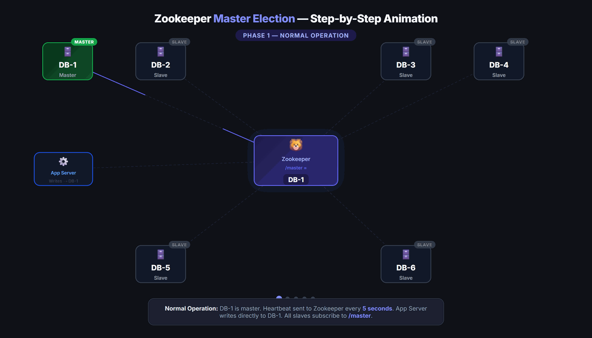
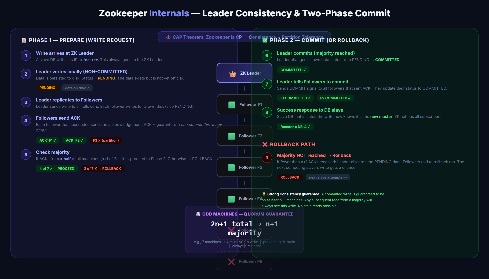
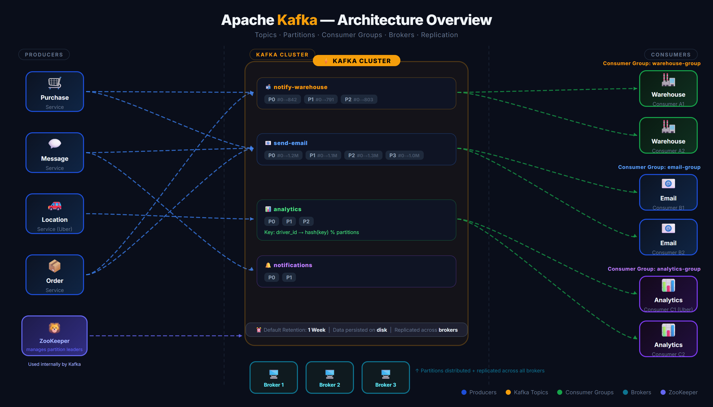

# 🦁 Zookeeper + Kafka — The Ultimate HLD Guide

> **Last Updated:** March 2026
> **Author:** System Design Study Notes (Scaler Academy — HLD Module)
> **Topics:** Zookeeper, Master Election, Ephemeral Nodes, Kafka, Topics, Partitions, Consumer Groups, Persistent Queues, Pub-Sub

---

## 📋 Table of Contents

### Part 1: The Problem — Maintaining State Consistently
1. [Why Master Tracking is Hard](#-why-master-tracking-is-hard)
2. [Naive Approach — Dedicated Tracker Machine](#-naive-approach--dedicated-tracker-machine)
3. [Problems with the Naive Approach](#-problems-with-the-naive-approach)

### Part 2: Zookeeper — Architecture & Data Model
4. [What is Zookeeper?](#-what-is-zookeeper)
5. [Zookeeper's File System Model](#-zookeepers-file-system-model)
6. [Types of ZK Nodes](#-types-of-zk-nodes)
7. [Ephemeral Nodes — How They Work](#-ephemeral-nodes--how-they-work)

### Part 3: Master Election with Zookeeper
8. [Master Election Flow](#-master-election-flow)
9. [Solving the Extra Hop — Watch Mechanism](#-solving-the-extra-hop--watch-mechanism)
10. [The Two-Way Connection](#-the-two-way-connection)
11. [Network Partition Scenarios](#-network-partition-scenarios)

### Part 4: Zookeeper Internal Architecture
12. [Zookeeper as a Distributed System](#-zookeeper-as-a-distributed-system)
13. [Leader-Follower Architecture](#-leader-follower-architecture)
14. [Two-Phase Commit in Zookeeper](#-two-phase-commit-in-zookeeper)
15. [Odd Number of Machines & Quorum](#-odd-number-of-machines--quorum)
16. [CAP Theorem — Zookeeper is CP](#-cap-theorem--zookeeper-is-cp)
17. [Zookeeper Leader Failure](#-zookeeper-leader-failure)

### Part 5: The Problem — Async Tasks & Latency
18. [Synchronous vs Asynchronous Tasks](#-synchronous-vs-asynchronous-tasks)
19. [Persistent Queues as Shock Absorbers](#-persistent-queues-as-shock-absorbers)

### Part 6: Kafka — Architecture & Core Concepts
20. [What is Kafka?](#-what-is-kafka)
21. [Topics — Categorizing Events](#-topics--categorizing-events)
22. [Partitions — Scaling Within a Topic](#-partitions--scaling-within-a-topic)
23. [Message Structure in Kafka](#-message-structure-in-kafka)
24. [Event Retention Period](#-event-retention-period)
25. [Partition Assignment — Round-Robin vs Key-Based](#-partition-assignment--round-robin-vs-key-based)

### Part 7: Kafka — Consumer Groups & Fault Tolerance
26. [Consumer Groups](#-consumer-groups)
27. [Consumer Offset — FIFO Order](#-consumer-offset--fifo-order)
28. [Kafka Brokers & Replication](#-kafka-brokers--replication)
29. [Talking to Any Kafka Broker](#-talking-to-any-kafka-broker)

### Part 8: Summary & Interview Prep
30. [Quick Reference Cheatsheet](#-quick-reference-cheatsheet)
31. [Practice Questions](#-practice-questions)

---

# PART 1: THE PROBLEM — MAINTAINING STATE CONSISTENTLY

---

## 🤔 Why Master Tracking is Hard

In a **master-slave database architecture**, all writes go exclusively to the master node. This creates one fundamental requirement:

> **Every app server must always know who the current master is.**

```
MASTER-SLAVE WRITE FLOW:
─────────────────────────────────────────────────────────────
  App Server  →  "Who is master?"  →  needs to know before write
       │
       ▼
  Write Request → MASTER DB ✅
       │                           (writes replicate to slaves)
       └──────────────────────────► SLAVE 1 (read only)
                                   SLAVE 2 (read only)
─────────────────────────────────────────────────────────────

  ❌ If App Server writes to a SLAVE by mistake → CHAOS
  ❌ If two App Servers disagree on who master is → DATA CORRUPTION
```

The tricky part: **the master is not static**. When a master dies, one of the slaves is elected as the new master. The entire system must instantly agree on the new master's identity.

---

## 🏗️ Naive Approach — Dedicated Tracker Machine

The simplest idea: **a single dedicated machine** whose only job is to track who the current master is.

```
NAIVE SOLUTION:
─────────────────────────────────────────────────────────────

  App Server  ──┐
  App Server  ──┤──► DEDICATED TRACKER ──► MASTER DB
  App Server  ──┘         │
                           └──► "Current master IP = X.X.X.X"

─────────────────────────────────────────────────────────────
```

- Every app server **pings the tracker** before each write
- The tracker replies with the master's IP
- The app server then talks directly to the master

---

## ❌ Problems with the Naive Approach

| Problem | Description |
|---------|-------------|
| **Extra Hop** | Every single write requires an extra round-trip to the tracker |
| **Single Point of Failure** | If the tracker goes down, the entire system loses master awareness |

**Fix attempt:** Use multiple tracker machines instead of one.

```
MULTI-TRACKER ATTEMPT:

  App Server ──► TRACKER CLUSTER ──► MASTER DB
                 [T1] [T2] [T3]

  ❌ New Problem: How do all trackers agree on who the master is?
     → We've recreated the SAME problem at a smaller scale!
```

> 💡 **Key Insight:** The cluster-of-trackers problem is *smaller* than the original problem — because master changes happen rarely (once a month), and we have fewer machines. This is exactly the problem Zookeeper solves.

---

# PART 2: ZOOKEEPER — ARCHITECTURE & DATA MODEL

---

## 🦁 What is Zookeeper?

Apache Zookeeper is a **centralized service** for:
- Maintaining **configuration information**
- **Naming** services
- Providing **distributed synchronization**
- Providing **group services**

> *"Zookeeper tracks configuration data in a strongly consistent manner, ensuring all machines in a distributed system agree on that configuration."*

```
ZOOKEEPER USE CASES:
─────────────────────────────────────────────────────────────
  ✅ Who is the master database node?
  ✅ Environment variables / configuration across machines
  ✅ Service discovery (which services are online?)
  ✅ Distributed locks (only one machine does a task at a time)
  ✅ Leader election in any distributed system
─────────────────────────────────────────────────────────────
```

---

## 🌳 Zookeeper's File System Model

Zookeeper stores data exactly like a **file system** — with directories and files.

```
ZOOKEEPER FILE SYSTEM:

  /  (root)
  ├── /master                    ← stores current master's IP
  ├── /config/
  │   ├── /config/aws-key        ← persistent configuration
  │   ├── /config/db-ip          ← persistent configuration
  │   └── /config/pool-size      ← persistent configuration
  └── /services/
      ├── /services/payment      ← which payment servers are live
      └── /services/auth         ← which auth servers are live
```

> ⚠️ **Terminology Alert:** In Zookeeper, files are called **nodes** (or ZNodes / ZK Nodes).
> Don't confuse with "server nodes" — here a node = a file in Zookeeper's filesystem.

---

## 📁 Types of ZK Nodes

Zookeeper has two fundamental types of nodes:

```
┌─────────────────────────────────────────────────────────────┐
│                  ZOOKEEPER NODE TYPES                        │
├──────────────────────┬──────────────────────────────────────┤
│   PERSISTENT NODES   │        EPHEMERAL NODES               │
├──────────────────────┼──────────────────────────────────────┤
│ • Data stays until   │ • Data exists only while the         │
│   explicitly deleted │   OWNER machine is alive             │
│                      │                                      │
│ • Like a normal file │ • Owner = the machine that wrote it  │
│                      │                                      │
│ USE CASES:           │ • Deleted automatically when         │
│ • AWS keys           │   heartbeat from owner stops         │
│ • DB connection pool │                                      │
│ • Environment vars   │ USE CASES:                           │
│ • Any stable config  │ • /master (who is current master?)   │
│                      │ • Service health tracking            │
│                      │ • Any volatile / machine-dependent   │
│                      │   data                               │
└──────────────────────┴──────────────────────────────────────┘
```

---

## ⚡ Ephemeral Nodes — How They Work

```
EPHEMERAL NODE LIFECYCLE:

  Machine M writes IP → /master (ephemeral node)
        │
        ▼
  Machine M sends heartbeat every 5 seconds ──► Zookeeper
        │                                            │
        │                                     [Data stays alive]
        │
  Machine M goes down / network breaks
        │
        ▼
  Heartbeat stops → Zookeeper waits → Heartbeat timeout exceeded
        │
        ▼
  Zookeeper DELETES data from /master → sets value to null
        │
        ▼
  All subscribers notified: "Master is now null"
```

> 💡 **Heartbeat configuration:** The timeout is configurable. Default example: every 5 seconds. If no heartbeat within 5 seconds → data is deleted.

> ⚠️ **Heartbeat ≠ Data:** The machine writes data ONCE. Then it repeatedly sends heartbeats (small pings). The heartbeats say "I'm alive, keep my data." Heartbeats do NOT rewrite the data.

---

# PART 3: MASTER ELECTION WITH ZOOKEEPER

---

## 🗳️ Master Election Flow



```
INITIAL STATE (Cold Start):
─────────────────────────────────────────────────────────────
  Master DB (M1) writes IP "1" → /master in Zookeeper
  /master = "1"
  M1 keeps sending heartbeats → Zookeeper

MASTER FAILS:
─────────────────────────────────────────────────────────────
  Step 1: M1 crashes → heartbeats stop
  Step 2: Zookeeper detects heartbeat timeout
  Step 3: Zookeeper resets /master = null
  Step 4: Zookeeper notifies ALL subscribers

RE-ELECTION (Fastest Finger First):
─────────────────────────────────────────────────────────────
  All slaves race to write their IP to /master

  Slave M2 tries to write "2" ──┐
  Slave M3 tries to write "3" ──┼──► Zookeeper acquires LOCK
  Slave M4 tries to write "4" ──┘    Only ONE write is allowed

  Winner (let's say M4) → /master = "4"
  M2 and M3 write attempts FAIL

  Step 5: Zookeeper notifies ALL subscribers → master is now "4"
  Step 6: M4 starts sending heartbeats → data persists
─────────────────────────────────────────────────────────────
```

> 💡 **Selection is first-come-first-served**, not based on data freshness. A lock inside Zookeeper ensures only one slave succeeds.

---

## 👁️ Solving the Extra Hop — Watch Mechanism

The naive approach required an extra hop per request. Zookeeper solves this with **subscriptions (watches)**:

```
SUBSCRIPTION / WATCH MECHANISM:
─────────────────────────────────────────────────────────────

  On Startup (one-time read):
  ─────────────────────────
  App Servers  ──READ──► /master → gets IP = "1"
  Slave DBs    ──READ──► /master → gets IP = "1"
  All                SUBSCRIBE to /master

  Normal Operation:
  ─────────────────
  App Server stores master IP in memory → writes DIRECTLY to master
  NO extra hop per request ✅

  On Master Change:
  ─────────────────
  /master changes (null or new IP)
        │
        ▼
  Zookeeper PUSHES notification to ALL subscribers IMMEDIATELY
        │
        ├──► App Server receives: "Master is now null" → stop writes
        ├──► Slave M2 receives: "Master is null" → race to write IP
        └──► Slave M3 receives: "Master is null" → race to write IP

  After election:
  ───────────────
  /master = "4" → Zookeeper PUSHES: "Master is now 4"
        │
        └──► App Server receives → resumes writes to M4 ✅
─────────────────────────────────────────────────────────────
```

> 💡 This is the **Observer pattern** — Zookeeper is the Observable, app servers and slaves are Observers.

> ⏱️ **How often does this trigger?** Master failure is rare — perhaps once a month. The subscription notification mechanism does NOT create high load.

---

## 🔌 The Two-Way Connection

Zookeeper maintains a **persistent, bidirectional connection** with every server.

```
TWO-WAY CONNECTION:

  App Server ◄────────────────────► Zookeeper
              (Bidirectional link)
              App Server → "I'm alive" (heartbeat)
              Zookeeper  → "Master changed" (notification)

  ✅ If Zookeeper detects the connection broke:
     → Zookeeper knows the app server is unreachable

  ✅ If App Server detects the connection broke:
     → App Server IMMEDIATELY stops all write requests
     → Reason: "I cannot verify who the master is"
```

**Why this matters — the catastrophic scenario avoided:**

```
WITHOUT TWO-WAY CONNECTION (dangerous):
─────────────────────────────────────────────────────────────
  1. Old Master dies
  2. Zookeeper tries to notify App Server → notification LOST
     (network partition between App Server and Zookeeper)
  3. App Server still thinks old master is alive
  4. App Server happily WRITES to the old (dead) master ❌
  5. New master is elected → data is split across two "masters"
  → CATASTROPHIC DATA CORRUPTION

WITH TWO-WAY CONNECTION (safe):
─────────────────────────────────────────────────────────────
  1. Connection between App Server and Zookeeper breaks
  2. App Server immediately detects connection is gone
  3. App Server STOPS all write requests immediately ✅
  4. No writes happen until connection to Zookeeper is restored
─────────────────────────────────────────────────────────────
```

> ⚠️ **Rule:** The moment an app server loses its Zookeeper connection OR receives a "master = null" notification, it MUST stop serving all write requests. This brief downtime (1-5 seconds) is acceptable to prevent catastrophic data corruption.

---

## 🌐 Network Partition Scenarios

```
SCENARIO: Master dies + network partition affects some slaves

  Zookeeper sends "master = null" to all slaves:
  ─────────────────────────────────────────────
    Slave M2 → receives ✅ → participates in election
    Slave M3 → receives ✅ → participates in election
    Slave M5 → LOST (partition) ❌ → DOES NOT participate
    Slave M6 → LOST (partition) ❌ → DOES NOT participate

  RESULT: M5 and M6 don't participate → NOT a critical problem
  M2 or M3 wins the election → system continues

  Zookeeper sends "master = M2" to all slaves:
  ─────────────────────────────────────────────
    Slave M3 → receives ✅ → syncs from M2
    Slave M5 → LOST (partition) ❌ → still thinks old master
    Slave M6 → LOST (partition) ❌ → still thinks old master

  WHEN M5/M6 RECONNECT:
  ─────────────────────
    M5 reads /master from Zookeeper → "master = M2" ✅
    M5 starts replicating from M2
    Whatever data M5 has is STALE but not wrong — it just
    needs to catch up by syncing from M2
```

---

# PART 4: ZOOKEEPER INTERNAL ARCHITECTURE

---

## 🏭 Zookeeper as a Distributed System

Zookeeper itself cannot be a single machine (that's a SPOF). Internally, Zookeeper runs as a **cluster of machines**.

```
ZOOKEEPER CLUSTER (Internal View):

         ┌─────────────────┐
         │  ZK LEADER      │  ← all writes go here
         │  (elected)      │
         └────────┬────────┘
                  │ replicates to majority
         ┌────────┴─────────────────────┐
         │                              │
  ┌──────▼──────┐              ┌────────▼──────┐
  │ ZK Follower │              │ ZK Follower   │
  │     F1      │              │     F2        │
  └─────────────┘              └───────────────┘
         │                              │
  ┌──────▼──────┐              ┌────────▼──────┐
  │ ZK Follower │              │ ZK Follower   │
  │     F3      │              │     F4        │
  └─────────────┘              └───────────────┘

  Total: 2n+1 machines (e.g., 7 machines → n=3, majority = 4)
```

---

## 👑 Leader-Follower Architecture

| Operation | Behavior |
|-----------|----------|
| **Write** | Goes to **leader only** |
| **Read** | Can be served by **any follower** |
| **Write success condition** | Written to **majority (n+1) of servers** |
| **Leader failure** | Followers elect a new leader; writes forbidden during transition; reads continue |

```
WRITE FLOW IN ZOOKEEPER:
─────────────────────────────────────────────────────────────
  Slave DB writes IP to ZK leader
        │
        ▼
  ZK Leader writes to itself (non-committed)
        │
        ├──► Replicates to Follower F1 ──► F1 acknowledges
        ├──► Replicates to Follower F2 ──► F2 acknowledges
        ├──► Replicates to Follower F3 ──► (partition - no ack)
        └──► Replicates to Follower F4 ──► F4 acknowledges

  Got 3 acks (leader + F1 + F2 + F4) out of 7 total
  Need majority = 4 acks → ✅ SUCCESS → commit
─────────────────────────────────────────────────────────────
```

---

## 🔄 Two-Phase Commit in Zookeeper



```
PHASE 1 — PREPARE:
───────────────────
  ZK Leader receives write request
  Leader writes data to its own disk (NON-COMMITTED state)
  Leader sends write request to all followers
  Each follower writes to disk (NON-COMMITTED state)
  Each follower sends ACK: "Written on disk, ready to commit"

PHASE 2 — COMMIT:
──────────────────
  If majority ACKs received:
    Leader commits data → changes status to COMMITTED
    Leader tells all followers: "Please commit"
    Followers commit their data

  If majority ACKs NOT received:
    Leader ROLLS BACK the write
    Leader tells followers: "Roll back"
    Write is marked as FAILED → next slave gets a chance
```

> 💡 **Non-committed state guarantee:** When a follower acknowledges, it's promising: "I have this on disk. If you tell me to commit later, I WILL be able to commit it."

---

## 🎲 Odd Number of Machines & Quorum

**Why Zookeeper uses an odd number of machines (2n+1):**

```
SPLIT-BRAIN PROBLEM (even number):
─────────────────────────────────────────────────────────────
  4 machines, network partition splits them 2-2:
    Group A says: "Master IP = 1.1.1.1"
    Group B says: "Master IP = 2.2.2.2"
  → Which group do you believe? IMPOSSIBLE to decide ❌

ODD NUMBER SOLUTION (2n+1):
─────────────────────────────────────────────────────────────
  7 machines, any partition results in:
    One group has ≥ 4 machines (MAJORITY)
    Other group has ≤ 3 machines (MINORITY)
  → Always trust the MAJORITY group ✅
  → Split-brain is impossible
─────────────────────────────────────────────────────────────

QUORUM TABLE:
  Total Machines (2n+1)  →  Majority Needed (n+1)  →  Can tolerate failure of
  ─────────────────────────────────────────────────────────────────────────────
  3 machines             →   2 required            →  1 machine failure
  5 machines             →   3 required            →  2 machine failures
  7 machines             →   4 required            →  3 machine failures
```

---

## ⚖️ CAP Theorem — Zookeeper is CP

```
CAP THEOREM:
  Choose 2 of 3: Consistency, Availability, Partition Tolerance

  Zookeeper chooses: C + P → "CP System"
  ─────────────────────────────────────────────────────────────
  ✅ Consistency:         All reads reflect the latest write
  ✅ Partition Tolerance: System continues when network splits
  ❌ Availability:        If majority is unavailable → system halts

  IMPLICATION:
  If 4 out of 7 ZK machines go down → ZK is unavailable
  → Writes to ZK are forbidden (can't elect a new master)
  → Reads from ZK still work (followers serve reads)
  → The system's DB master/slave continues working as-is
    (no NEW master election possible, but existing master works)
```

---

## 💔 Zookeeper Leader Failure

```
WHEN ZK LEADER GOES DOWN:
─────────────────────────────────────────────────────────────
  ❌ Writes to Zookeeper are forbidden
  ✅ Reads from Zookeeper still work (followers serve reads)
  ✅ DB reads and writes continue normally!
     (DB servers know who master is → cached from last read)
  ❌ DB master RE-ELECTION cannot happen
     (slaves need to write to ZK leader → leader is down)
  ✅ ZK followers communicate → elect new ZK leader
  ✅ Once new ZK leader is elected → DB re-election resumes

  KEY INSIGHT: ZK going down for ~20 seconds is NOT a disaster
  because ZK only manages master discovery — the actual data
  processing (DB reads/writes) continues uninterrupted.
─────────────────────────────────────────────────────────────
```

---

# PART 5: THE PROBLEM — ASYNC TASKS & LATENCY

---

## ⚡ Synchronous vs Asynchronous Tasks

Consider a messaging app that needs to do many things when a message is received:

```
MESSAGE RECEIVED — ALL TASKS:
─────────────────────────────────────────────────────────────
  Task                    Time      Synchronous?  Why?
  ──────────────────────────────────────────────────────────
  Store in database       ~50ms     ✅ SYNC       User cares about this
  Return success          ---       ✅ SYNC       Return ASAP after above

  Send notification       ~2s       ❌ ASYNC      User doesn't need to wait
  Update analytics count  ~200ms    ❌ ASYNC      Internal, user doesn't care
  Run safety/AI check     ~200ms    ❌ ASYNC      Internal, user doesn't care
  Generate invoice        ~500ms    ❌ ASYNC      Can happen later
─────────────────────────────────────────────────────────────

  Total if synchronous: ~3 seconds per message → terrible UX ❌
  Total if async-optimized: ~50ms for success response ✅
```

**The Core Principle:**

> 🎯 **Return success as soon as synchronous tasks are done. But ensure async tasks ALWAYS happen — without failure.**

The challenge: how do you guarantee async tasks will happen if the app server might crash after returning success but BEFORE triggering the async task?

**Solution: Persistent Queues.**

---

## 🛡️ Persistent Queues as Shock Absorbers

Persistent queues serve two purposes:

```
PURPOSE 1 — ASYNC TASK GUARANTEE:
─────────────────────────────────────────────────────────────
  1. Message arrives at App Server
  2. App Server stores in DB ✅
  3. App Server pushes event to Persistent Queue ✅
  4. App Server returns SUCCESS to user ✅
     (user gets instant response)
  5. Async consumers read from queue and process tasks
     (notification, analytics, safety checks, etc.)

  Even if App Server crashes after step 4:
  → Event is already in the queue (persistent on disk)
  → Consumers will still process it eventually ✅

PURPOSE 2 — TRAFFIC SHOCK ABSORBER:
─────────────────────────────────────────────────────────────
  Normal traffic:    Queue processes events as fast as they arrive
  Traffic spike:     Events pile up in queue → DB processes at its pace
  After spike:       Queue drains → system returns to normal

  No requests lost! Queue absorbs the spike ✅
─────────────────────────────────────────────────────────────
```

---

# PART 6: KAFKA — ARCHITECTURE & CORE CONCEPTS

---

## 🎯 What is Kafka?



Apache Kafka is the most widely used **persistent message queue / message broker**.

```
KAFKA KEY PROPERTIES:
─────────────────────────────────────────────────────────────
  ✅ Persistent Storage    → Data stored on disk (not in-memory)
  ✅ Replicated            → Data replicated across machines
  ✅ High Throughput       → Handles millions of events/second
  ✅ Durable               → Data not lost even if consumers are down
  ✅ Multi-Consumer        → Same event consumed by multiple consumers
  ✅ Scalable              → Add brokers, add partitions, add consumers
  ✅ Zookeeper-backed      → Uses ZK internally for master tracking
─────────────────────────────────────────────────────────────
```

> 💡 Kafka uses Zookeeper internally to manage which broker is the leader — this is transparent to you.

---

## 📬 Topics — Categorizing Events

A single Kafka queue handles millions of events of many different types. **Topics** let you categorize events into sub-queues.

```
WITHOUT TOPICS (noisy):
─────────────────────────────────────────────────────────────
  All events → ONE BIG QUEUE → all consumers read everything
  Warehouse consumer has to skip invoice/email/analytics events
  → Wasteful, noisy, inefficient ❌

WITH TOPICS (clean):
─────────────────────────────────────────────────────────────
  Purchase event → topic: "notify-warehouse"  → warehouse consumer ✅
  Purchase event → topic: "generate-invoice"  → invoice consumer ✅
  Purchase event → topic: "send-email"        → email consumer ✅
  Purchase event → topic: "analytics"         → analytics consumer ✅

  Each consumer only sees events relevant to it ✅
─────────────────────────────────────────────────────────────
```

**Example — Flipkart:**

```
FLIPKART KAFKA TOPICS:
─────────────────────────────────────────────────────────────
  User action: BUY PRODUCT
    → "notify-warehouse"   → warehouse updates inventory
    → "generate-invoice"   → invoice service creates PDF
    → "send-email"         → email service sends receipt
    → "analytics"          → analytics service logs purchase

  User action: MESSAGE SUPPLIER
    → "vendor-email"       → email sent to vendor
    → "vendor-follow-up"   → trigger follow-up call if no reply in 2 days
    → "reputation-update"  → update supplier reputation score
─────────────────────────────────────────────────────────────
```

---

## 🔢 Partitions — Scaling Within a Topic

A topic can receive billions of events. A single consumer cannot handle this. **Partitions** split a topic for parallel processing.

```
TOPIC: "send-email" (1 billion events/day)
─────────────────────────────────────────────────────────────

                        KAFKA TOPIC: "send-email"
                   ┌─────────────────────────────────┐
  PRODUCERS        │  Partition 0: [E1, E5, E9, ...]  │ ◄── Consumer A
  (App Servers) ──►│  Partition 1: [E2, E6, E10, ...] │ ◄── Consumer B
                   │  Partition 2: [E3, E7, E11, ...] │ ◄── Consumer C
                   │  Partition 3: [E4, E8, E12, ...] │ ◄── Consumer D
                   └─────────────────────────────────┘

  Each consumer processes its partition independently → PARALLEL ✅
─────────────────────────────────────────────────────────────
```

**Rules:**
- Every **consumer is tied to exactly ONE partition**
- One partition can be consumed by **multiple consumers** (via consumer groups)
- Number of consumers ≤ Number of partitions in a topic
- Adding more partitions later is **painful** — plan ahead!

---

## 📦 Message Structure in Kafka

Every Kafka message (event) contains:

```
KAFKA MESSAGE STRUCTURE:
─────────────────────────────────────────────────────────────
  Field               Type        Notes
  ─────────────────────────────────────────────────────────
  key                 binary      Optional. Used for partition assignment.
  value               binary      The actual event data (can be compressed)
  compression_type    enum        none / gzip / snappy / lz4 / zstd
  partition           int         Which partition this message belongs to
  offset              long        Incremental position within partition
  timestamp           long        When the message was produced
  headers             key-value[] Optional metadata pairs
─────────────────────────────────────────────────────────────
```

> 💡 **Value is compressed:** The value can be any binary data (JSON, Avro, Protobuf, etc.) and can be compressed to save storage and bandwidth.

---

## ⏰ Event Retention Period

Data in Kafka is **NOT deleted when consumed**. It is deleted after the retention period expires.

```
RETENTION PERIOD:
─────────────────────────────────────────────────────────────
  Default: 1 WEEK (configurable per topic)

  Event E1 produced on Monday
  Consumer A reads E1 on Monday at 2pm ✅
  E1 still exists in Kafka until NEXT Monday
  Consumer B reads E1 on Wednesday ✅ (same event, second consumer)
  E1 finally deleted on next Monday (retention expires)

  KEY POINT: Consumption does NOT delete the event.
             Only the retention period expiry deletes events.
─────────────────────────────────────────────────────────────
```

This enables the same event to be consumed by **multiple different consumer groups** at their own pace.

---

## 🔀 Partition Assignment — Round-Robin vs Key-Based

**Default — Round-Robin:**
```
ROUND-ROBIN (Default):
  Event 1 → Partition 0
  Event 2 → Partition 1
  Event 3 → Partition 2
  Event 4 → Partition 0  (wraps around)
  ...
  ✅ Good for: emails, notifications (order doesn't matter per entity)
  ❌ Bad for: ordered processing per entity (e.g., driver locations)
```

**Key-Based Assignment:**
```
KEY-BASED (specify a key per message):
  partition = hash(key) % num_partitions

  Example: Uber driver location updates
  Driver ID 10 → hash(10) % 4 = 2 → always Partition 2
  Driver ID 25 → hash(25) % 4 = 1 → always Partition 1
  Driver ID 10 location update 2 → Partition 2 ✅ (same partition!)

  ✅ All events for one driver ALWAYS go to the same partition
  ✅ One consumer handles all of one driver's locations → ordered ✅
```

> ⚠️ This is much simpler than consistent hashing. Consistent hashing handles machine failures; this key-hash approach is just for routing messages to partitions.

---

# PART 7: KAFKA — CONSUMER GROUPS & FAULT TOLERANCE

---

## 👥 Consumer Groups

Consumer groups allow **multiple consumers to work together** to process a topic, while ensuring **each message is processed exactly once per group**.

```
TOPIC: "analytics" (4 partitions)
─────────────────────────────────────────────────────────────

  CONSUMER GROUP A ("analytics-group"):
  ┌─────────────────────────────────────────┐
  │  Partition 0 ──► Consumer A1            │
  │  Partition 1 ──► Consumer A2            │
  │  Partition 2 ──► Consumer A3            │
  │  Partition 3 ──► Consumer A4            │
  │                                         │
  │  Each message consumed ONCE within A ✅ │
  └─────────────────────────────────────────┘

  CONSUMER GROUP B ("notification-group"):
  ┌─────────────────────────────────────────┐
  │  Partition 0 ──► Consumer B1            │
  │  Partition 1 ──► Consumer B2            │
  │  Partition 2 ──► Consumer B1 (shared)   │
  │  Partition 3 ──► Consumer B2 (shared)   │
  │                                         │
  │  Each message consumed ONCE within B ✅ │
  └─────────────────────────────────────────┘

  SAME EVENT processed once by Group A AND once by Group B ✅
─────────────────────────────────────────────────────────────
```

**How consumers register with Kafka:**
```python
# Consumer tells Kafka two things:
consumer = KafkaConsumer(
    topic="analytics",        # which topic to consume from
    group_id="analytics-group"  # which consumer group I belong to
)
# Kafka internally assigns partitions to this consumer
```

> 💡 Kafka internally tracks the **offset** each consumer group has consumed up to, ensuring no duplicates within a group.

---

## 📖 Consumer Offset — FIFO Order

```
HOW KAFKA MAINTAINS ORDER:
─────────────────────────────────────────────────────────────
  Every message gets an INCREMENTING OFFSET when written:
    Message 1 → offset 0
    Message 2 → offset 1
    Message 3 → offset 2
    ...
    Message N → offset N-1

  OFFSETS NEVER REPEAT — even after messages are deleted
  (monotonically increasing forever)

  Consumer tracks its position:
    "I have consumed up to offset 47"
    "Give me the next message after offset 47"

  Kafka returns message at offset 48 → FIFO guaranteed ✅
─────────────────────────────────────────────────────────────
```

**Sizing your consumers correctly:**

```
HOW MANY CONSUMERS/PARTITIONS DO I NEED?
─────────────────────────────────────────────────────────────
  Given:
    Events per second = 1,000
    Each consumer processes 1 event in 100ms = 10 events/sec

  Minimum consumers needed = 1,000 / 10 = 100 consumers
  Add 25% buffer → 125 consumers + 125 partitions
─────────────────────────────────────────────────────────────
```

---

## 🛡️ Kafka Brokers & Replication

Each Kafka machine is called a **broker**. Data is replicated across brokers for fault tolerance.

```
KAFKA CLUSTER LAYOUT:
─────────────────────────────────────────────────────────────
  Given: 4 topics, each with 2 partitions, replication factor = 2
  Total items = 4 × 2 × 2 = 16 partitions to distribute across brokers

  BROKER 1:              BROKER 2:              BROKER 3:
  ────────────────       ────────────────       ────────────────
  Topic A, Part 0        Topic A, Part 0 (rep)  Topic A, Part 1
  Topic B, Part 1        Topic B, Part 0        Topic B, Part 1 (rep)
  Topic C, Part 0 (rep)  Topic C, Part 1        Topic C, Part 0
  Topic D, Part 1 (rep)  Topic D, Part 0        Topic D, Part 1
  Topic A, Part 1 (rep)  Topic C, Part 1 (rep)  Topic B, Part 0 (rep)
  Topic D, Part 0 (rep)  ...                    ...

  If Broker 2 fails → data is safe on Broker 1 or Broker 3 ✅
─────────────────────────────────────────────────────────────
```

> 💡 Kafka uses Zookeeper internally to track which broker holds which partition and who the partition leader is.

---

## 🔀 Talking to Any Kafka Broker

```
SMART ROUTING IN KAFKA:
─────────────────────────────────────────────────────────────
  Producer wants to write to Topic "analytics", Partition 2

  Producer talks to BROKER 1 (any broker, doesn't matter)
       │
       ▼
  BROKER 1: "Topic analytics, Partition 2 is on BROKER 3"
       │
       ▼
  BROKER 1 internally redirects request to BROKER 3 ✅
       │
  OR alternatively:
       ▼
  Producer gets metadata → connects directly to BROKER 3

  KEY BENEFIT: App servers don't need to know which broker
  holds which partition. Talk to any broker → Kafka handles it.
─────────────────────────────────────────────────────────────
```

---

# PART 8: SUMMARY & INTERVIEW PREP

---

## 📊 Quick Reference Cheatsheet

### Zookeeper

| Concept | Key Detail |
|---------|-----------|
| **Purpose** | Centralized config management + distributed synchronization |
| **CAP** | CP — Consistency + Partition Tolerance |
| **Node types** | Persistent (until deleted) vs Ephemeral (tied to heartbeat) |
| **Heartbeat timeout** | Configurable (e.g., 5 seconds default) |
| **Write quorum** | Must write to majority: n+1 of 2n+1 machines |
| **Machine count** | Always ODD (2n+1) to prevent split-brain |
| **Watch/Subscribe** | Push-based notification when ZNode data changes |
| **Connection type** | Bidirectional — both sides detect disconnection |
| **Leader failure** | Writes forbidden; reads continue; ZK re-elects internally |
| **Use cases** | Master election, service discovery, distributed locks, config storage |

### Kafka

| Concept | Key Detail |
|---------|-----------|
| **Purpose** | Persistent message queue / event streaming |
| **Topic** | Category/sub-queue for events (e.g., "send-email") |
| **Partition** | Sub-division of a topic for parallel processing |
| **Consumer Group** | Group of consumers, each consuming from one partition |
| **Consumer offset** | Monotonically increasing position; enables FIFO; never reused |
| **Retention period** | Default 1 week; deletion based on time, NOT consumption |
| **Default routing** | Round-robin across partitions |
| **Key-based routing** | hash(key) % partitions → same key → same partition |
| **Broker** | A single Kafka machine |
| **Replication** | Partitions replicated across brokers for fault tolerance |
| **Zookeeper use** | Kafka uses ZK internally to track partition leaders |

---

## 🔄 Complete Architecture Diagram

```
┌─────────────────────────────────────────────────────────────────────┐
│                    FULL SYSTEM WITH ZOOKEEPER + KAFKA                │
└─────────────────────────────────────────────────────────────────────┘

   CLIENT
     │ HTTP Request
     ▼
  APP SERVER(s) ──────────────────────────────► ZOOKEEPER CLUSTER
     │  (reads /master ZNode on startup,         [ZK Leader + Followers]
     │   subscribes to /master for changes)      [Maintains: who is DB master]
     │
     │ Writes to master DB
     ▼
  MASTER DB ─────────────────────────────────► SLAVE DB(s)
     │                                           (replication)
     │
     │ Also pushes async events
     ▼
  KAFKA CLUSTER                                  ZOOKEEPER
  [Brokers 1..N]  ──────────────────────────►   [tracks Kafka partition leaders]
     │
     │ Topics: [notify-warehouse] [send-email] [analytics] [invoice]
     │ Each topic: multiple partitions
     │
     ▼
  CONSUMERS (per topic)
  [Warehouse Consumer] [Email Consumer] [Analytics Consumer] [Invoice Consumer]
```

---

## 🎯 Comparison: When to Use What

```
┌─────────────────────────────────────────────────────────────────────┐
│              ZOOKEEPER vs KAFKA — WHAT TO USE WHEN                   │
├──────────────────────────────┬──────────────────────────────────────┤
│         ZOOKEEPER            │              KAFKA                    │
├──────────────────────────────┼──────────────────────────────────────┤
│ • Who is the master?         │ • Decouple producers from consumers  │
│ • Which services are online? │ • Async task processing              │
│ • Distributed locking        │ • Event streaming at scale           │
│ • Config management          │ • Traffic spike absorption           │
│ • Leader election            │ • Multiple consumers for same event  │
│ • Group membership tracking  │ • Ordered processing (with keys)     │
├──────────────────────────────┼──────────────────────────────────────┤
│ CAP: CP                      │ CAP: AP (high availability)          │
│ Data: tiny config values     │ Data: event payloads (can be large)  │
│ Writes: very rare            │ Writes: millions per second          │
│ Storage: temporary/config    │ Storage: up to 1 week (configurable) │
└──────────────────────────────┴──────────────────────────────────────┘
```

---

## ❓ Practice Questions

**Zookeeper:**
1. Why does Zookeeper use an odd number of machines? What problem does this solve?
2. What is a ZNode? How is it different from a regular file?
3. Explain the difference between persistent and ephemeral nodes with a real-world use case for each.
4. A slave DB loses its connection to Zookeeper. What happens? Is this a problem?
5. What happens to DB read/write operations when Zookeeper's leader goes down?
6. Why is the two-way connection between Zookeeper and app servers critical?
7. Zookeeper is CP — what does this mean in practice for a system using it?
8. Walk me through the complete master re-election flow using Zookeeper.

**Kafka:**
1. What is a topic? Why are topics necessary in Kafka?
2. What is the difference between a topic and a partition?
3. A consumer in Group A has consumed a message. Will Consumer Group B also see that message? Why?
4. How does Kafka guarantee FIFO ordering within a partition?
5. You're building an Uber-like system. How do you ensure all location updates from driver D always go to the same consumer?
6. How many partitions and consumers do you need for a topic receiving 5,000 events/second, where each consumer can handle 50 events/second?
7. What happens to events in Kafka after they are consumed?
8. What is the default event retention period in Kafka and how does it work?
9. How does Kafka handle a broker going down — what prevents data loss?
10. Explain the Pub-Sub model and how Kafka implements it.

---

## 📚 References & Resources

- [Apache Zookeeper Official Docs](https://zookeeper.apache.org/)
- [Apache Kafka Official Docs](https://kafka.apache.org/documentation/)
- [Kafka Consumer Groups Deep Dive](https://kafka.apache.org/documentation/#intro_consumers)
- [Two-Phase Commit Protocol](https://en.wikipedia.org/wiki/Two-phase_commit_protocol)
- [Kafka Message Format](https://kafka.apache.org/documentation/#messageformat)


---

> 💡 **Quick Memory Aid:**
> - **Zookeeper** = *Zoo of distributed machines, all agreeing on the same configuration*
> - **Kafka** = *Post office with named pigeonholes (topics), sorted slots (partitions), and multiple delivery staff (consumers)*
